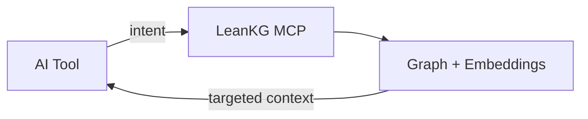

<p align="center">
  
</p>

<h1 align="center">LeanKG</h1>

<p align="center">
  <strong>Local-first knowledge graph for AI coding tools</strong>
</p>

<p align="center">
  Index your codebase. Query blast radius, call graphs, and semantic context.<br>
  Expose everything over MCP — no cloud, no external database.
</p>

<p align="center">
  <a href="https://github.com/FreePeak/LeanKG/blob/main/LICENSE"></a>
  <a href="https://www.rust-lang.org/"></a>
  <a href="https://crates.io/crates/leankg"></a>
  <a href="https://hub.docker.com/r/freepeak/leankg"></a>
  <a href="https://github.com/FreePeak/LeanKG/actions"></a>
  <a href="https://safeskill.dev/scan/freepeak-leankg"></a>
</p>

<p align="center">
  <a href="#installation">Install</a> ·
  <a href="#quick-start">Quick Start</a> ·
  <a href="#features">Features</a> ·
  <a href="#mcp--ai-tools">MCP</a> ·
  <a href="https://leankg.onrender.com">Live Demo</a> ·
  <a href="#documentation">Docs</a>
</p>

---

## Why LeanKG?

AI coding assistants default to grep and full-file dumps. That burns tokens and still misses structure: who calls this function, what breaks if it changes, which tests cover it.

LeanKG builds a **local knowledge graph** over your repo and serves precise subgraphs to Cursor, Claude Code, OpenCode, and other MCP clients.



| Without LeanKG | With LeanKG |
|----------------|-------------|
| Grep → open many files → large context | Query the graph → minimal, relevant subgraph |
| No blast-radius awareness | Impact radius with confidence + severity |
| Keyword-only search | Keyword + semantic (HNSW) + ontology |

---

## Screenshots

<p align="center">
  
</p>

<p align="center">
  <em>Force-directed graph, WebGL rendering, community clustering, and linked source view.</em>
</p>

<p align="center">
  
</p>

More UI details: [docs/web-ui.md](docs/web-ui.md) · Live demo: **https://leankg.onrender.com**

---

## Installation

### One-line setup (recommended)

```bash
curl -fsSL https://raw.githubusercontent.com/FreePeak/LeanKG/main/scripts/install.sh | bash -s -- <target>
```

| Target | What gets installed |
|--------|---------------------|
| `cursor` | Binary + MCP + skill + AGENTS.md + session hook |
| `claude` | Binary + MCP + plugin + skill + CLAUDE.md + hooks |
| `opencode` | Binary + MCP + plugin + skill + AGENTS.md |
| `gemini` / `kilo` / `antigravity` | Binary + MCP + skill + agent docs |
| `docker` | Hub image + index + embed + MCP HTTP (no Rust) |

```bash
curl -fsSL https://raw.githubusercontent.com/FreePeak/LeanKG/main/scripts/install.sh | bash -s -- cursor
curl -fsSL https://raw.githubusercontent.com/FreePeak/LeanKG/main/scripts/install.sh | bash -s -- docker
```

### Cargo / from source

```bash
cargo install leankg
# or
git clone https://github.com/FreePeak/LeanKG.git && cd LeanKG && cargo build --release
```

### Docker (teams — no Rust toolchain)

```bash
curl -fsSL https://raw.githubusercontent.com/FreePeak/LeanKG/main/scripts/docker-up.sh | bash
curl http://localhost:9699/health
```

Point your MCP client at `http://localhost:9699/mcp`. Multi-project mounts and RocksDB options: [AGENTS.md](AGENTS.md).

> Published Hub tags currently target `linux/arm64`. On `linux/amd64`, build with `docker compose -f docker-compose.rocksdb.yml up --build`.

---

## Quick Start

```bash
leankg init
leankg index ./src
leankg status
leankg impact src/main.rs --depth 3
leankg web                          # UI at http://localhost:8080
leankg mcp-stdio --watch            # local AI tools
# or
leankg mcp-http --port 9699         # HTTP/SSE for Docker / remote clients
```

Useful extras:

```bash
leankg path "FastAPI" "ModelField"  # shortest path between symbols
leankg explain "APIRouter"          # definition, cluster, neighbors
leankg detect-clusters              # functional communities (Leiden)
leankg embed --init && leankg embed # semantic search (needs --features embeddings)
```

Full CLI: [docs/cli-reference.md](docs/cli-reference.md)

---

## Features

- **MCP-native** — 85+ tools for search, impact, call graphs, ontology, and team knowledge
- **Impact radius** — blast radius before you change code, with confidence and severity
- **Dependency graph** — `IMPORTS`, `CALLS`, `TESTED_BY`, `HTTP_CALLS`, tunnels, and more
- **Semantic search** — CozoDB HNSW over dense embeddings (`--features embeddings`; Docker includes it)
- **Community detection** — Leiden clusters with per-cluster skill context
- **Multi-language** — Go, TypeScript, Python, Rust, Java, Kotlin, Dart, Android XML, Terraform, CI YAML
- **Local-first** — SQLite by default; RocksDB for multi-project / team deploy
- **Token-aware** — targeted subgraphs + TOON responses (~40% smaller MCP payloads)
- **Team knowledge** — incidents, env conflicts, service topology, Obsidian sync
- **Graph export** — Mermaid, DOT, HTML, SVG, GraphML, Neo4j, portable snapshots

Architecture and data model: [docs/architecture.md](docs/architecture.md)

---

## MCP & AI Tools

| Tool | Auto-setup | Notes |
|------|------------|--------|
| Cursor | Yes | Per-project install; session hook |
| Claude Code | Yes | Plugin + full lifecycle hooks |
| OpenCode | Yes | Plugin + skill |
| Gemini CLI / Antigravity / Kilo / Codex | Yes | MCP + skill / agent docs |
| Docker MCP HTTP | Yes | Shared RocksDB; multi-repo mounts |

```bash
leankg setup    # configure MCP + Claude hooks
```

Setup details: [docs/agentic-instructions.md](docs/agentic-instructions.md) · Tool catalog: [docs/mcp-tools.md](docs/mcp-tools.md)

---

## Performance

Load test (~100K nodes):

| Operation | Throughput |
|-----------|------------|
| Insert elements | ~57k / sec |
| Insert relationships | ~67k / sec |
| Retrieve elements | ~419k / sec |
| Cache speedup (cold → warm) | 345–461× |

Unified A/B (19 cases vs grep baseline): **~30% input token savings**, **~3× tokens/result efficiency**.

```bash
cargo build --release
target/release/leankg benchmark-unified --project .
```

Reports: [docs/benchmark.md](docs/benchmark.md)

---

## Documentation

| Doc | Description |
|-----|-------------|
| [docs/cli-reference.md](docs/cli-reference.md) | All CLI commands |
| [docs/mcp-tools.md](docs/mcp-tools.md) | MCP tool reference |
| [docs/agentic-instructions.md](docs/agentic-instructions.md) | AI tool setup & auto-trigger |
| [docs/architecture.md](docs/architecture.md) | System design & data model |
| [docs/web-ui.md](docs/web-ui.md) | Web UI |
| [src/embeddings/EMBEDDINGS.md](src/embeddings/EMBEDDINGS.md) | Embeddings / HNSW internals |
| [INSTRUCTION.md](INSTRUCTION.md) | Memory tuning & ops playbook |
| [docs/roadmap.md](docs/roadmap.md) | Roadmap |
| [AGENTS.md](AGENTS.md) | Agent / Docker deployment notes |

---

## Update

```bash
leankg update
# or
curl -fsSL https://raw.githubusercontent.com/FreePeak/LeanKG/main/scripts/install.sh | bash -s -- update
```

---

## Troubleshooting

| Issue | Fix |
|-------|-----|
| High RAM on macOS | `export LEANKG_MMAP_SIZE=134217728` and `LEANKG_CACHE_MAX_TOKENS=100000` — see [INSTRUCTION.md](INSTRUCTION.md) |
| `database is locked` | `leankg proc kill` (stop web/MCP before re-index) |
| Embeddings / cold embed | [src/embeddings/EMBEDDINGS.md](src/embeddings/EMBEDDINGS.md) |

---

## Requirements

- Rust 1.75+ (for building from source)
- macOS or Linux
- Docker optional (recommended for teams)

---

## Contributing

Issues and PRs are welcome. For larger changes, open an issue first so we can align on design.

1. Fork and create a feature branch (prefer a git worktree for isolation)
2. Update docs when behavior changes (`docs/prd.md` / task tracker as needed)
3. `cargo build --release && cargo test`
4. Open a PR with a clear summary and test plan

---

## License

[Apache License 2.0](LICENSE)

---

## Star History

<a href="https://www.star-history.com/?repos=FreePeak%2FLeanKG&type=date&legend=top-left">
  <picture>
    <source media="(prefers-color-scheme: dark)" srcset="https://api.star-history.com/chart?repos=FreePeak/LeanKG&type=date&theme=dark&legend=top-left" />
    <source media="(prefers-color-scheme: light)" srcset="https://api.star-history.com/chart?repos=FreePeak/LeanKG&type=date&legend=top-left" />
    
  </picture>
</a>
