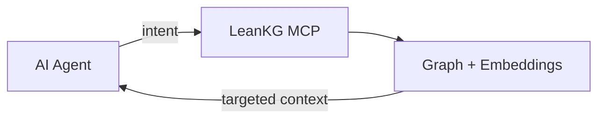
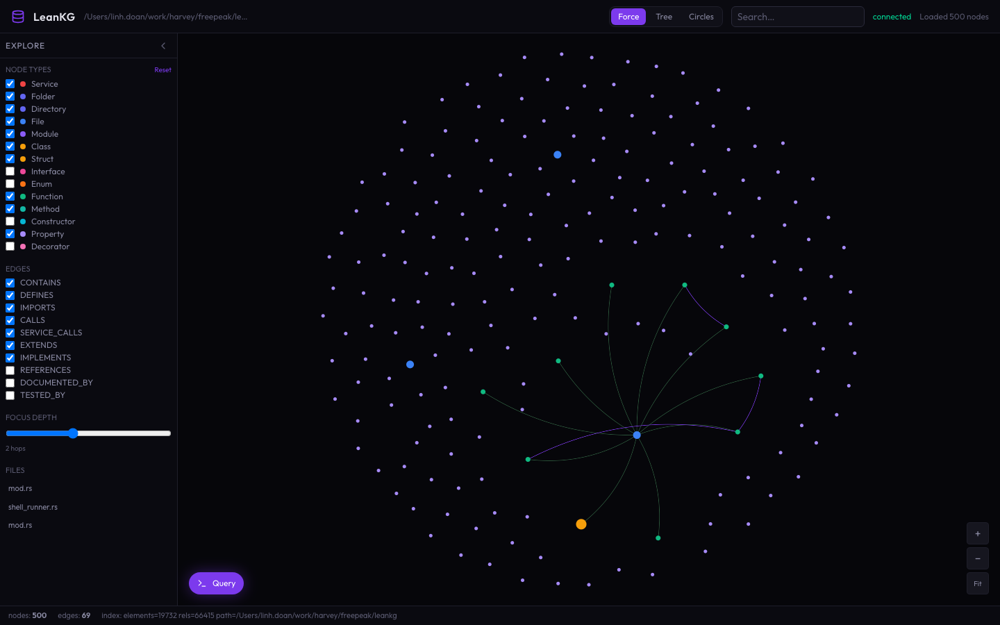
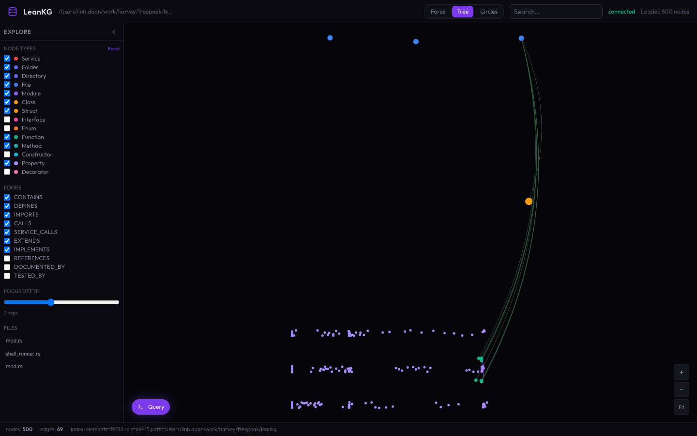
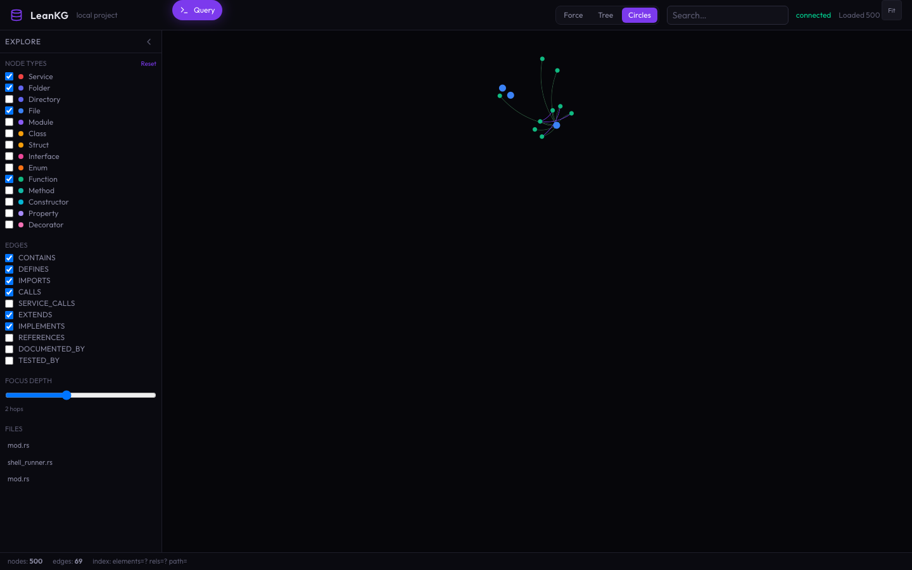
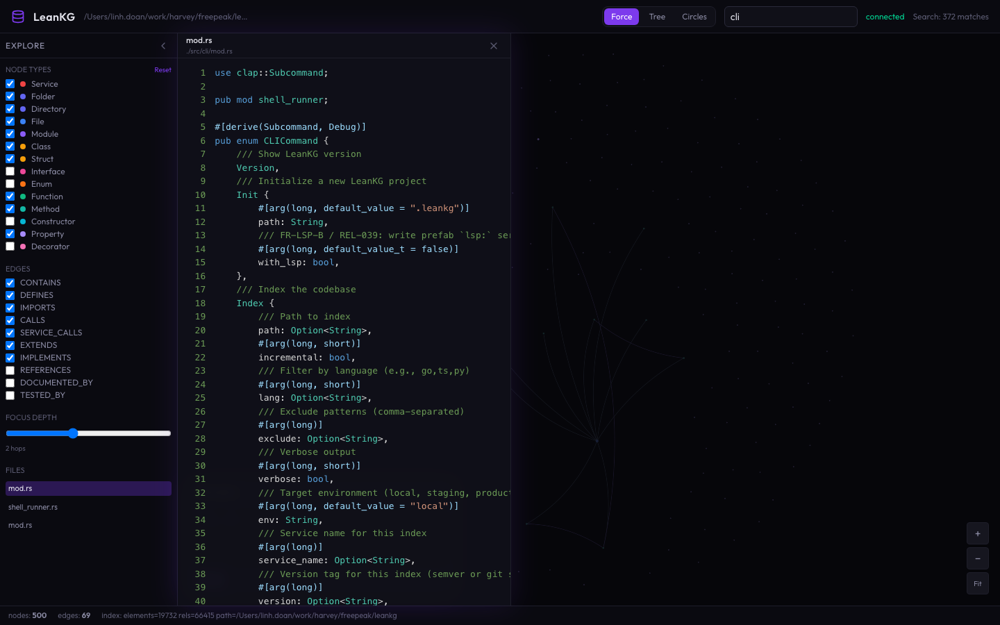
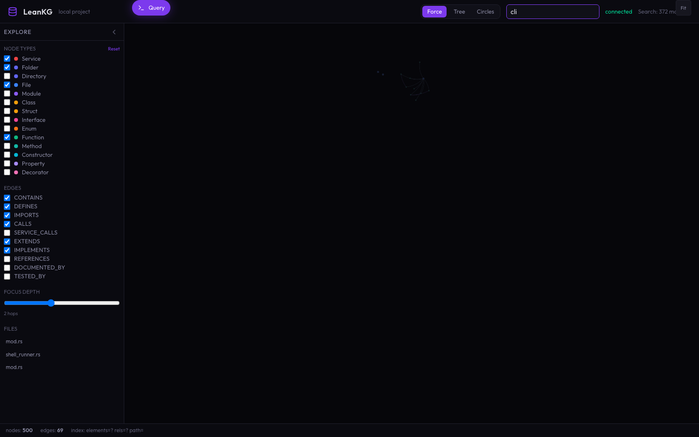
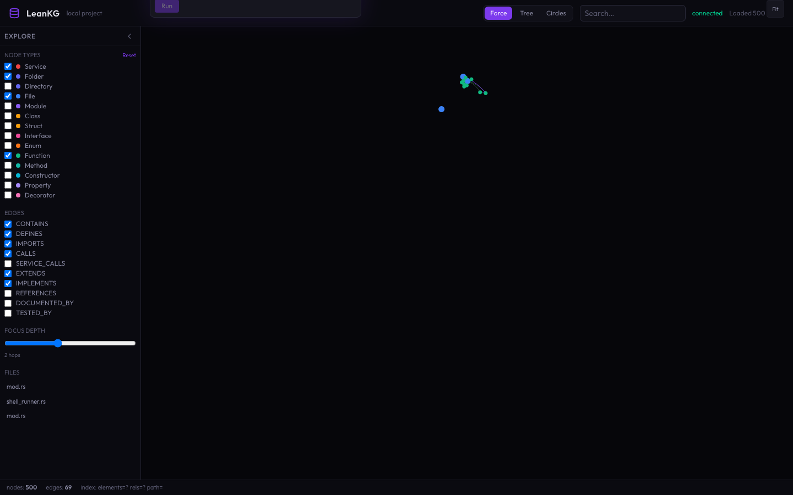
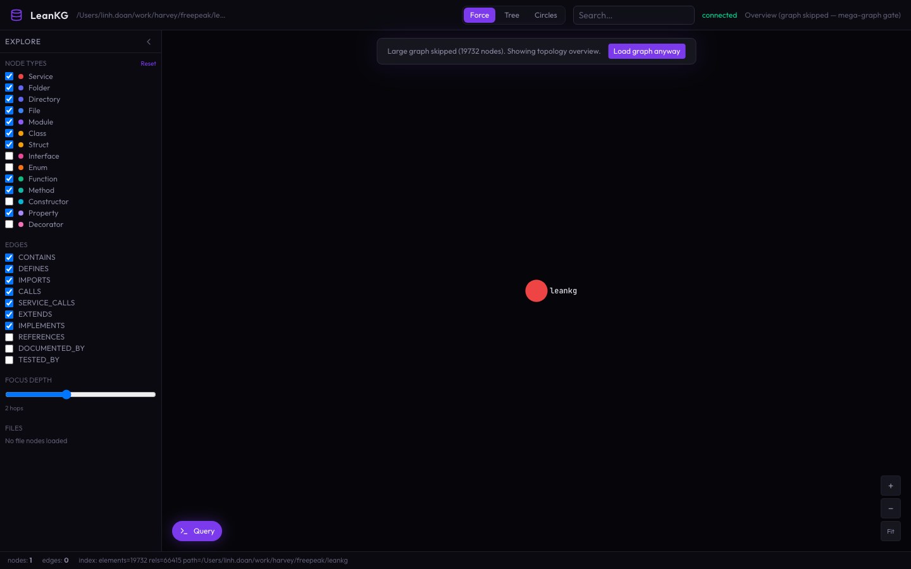

<p align="center">
  
</p>

<h1 align="center">LeanKG</h1>

<p align="center">
  <strong>Local-first code knowledge graph for AI coding agents</strong>
</p>

<p align="center">
  Surgical context · fewer tool calls · blast-radius awareness · 100% local
</p>

<p align="center">
  Pre-index your repo. Serve precise subgraphs over MCP to Cursor, Claude Code, OpenCode, and more — no cloud, no external database.
</p>

<p align="center">
  <a href="https://leankg.onrender.com"><strong>Live Demo →</strong></a>
  ·
  <a href="https://github.com/FreePeak/LeanKG/blob/main/docs/cli-reference.md">Docs</a>
  ·
  <a href="https://hub.docker.com/r/freepeak/leankg">Docker Hub</a>
</p>

<p align="center">
  <a href="https://github.com/FreePeak/LeanKG/blob/main/LICENSE"></a>
  <a href="https://www.rust-lang.org/"></a>
  <a href="https://crates.io/crates/leankg"></a>
  <a href="https://hub.docker.com/r/freepeak/leankg"></a>
  <a href="https://github.com/FreePeak/LeanKG/actions"></a>
  <a href="https://safeskill.dev/scan/freepeak-leankg"></a>
</p>

<p align="center">
  
  
  
</p>

<p align="center">
  
  
  
  
  
  
  
</p>

---

## Contents

- [Get Started](#get-started)
- [Why LeanKG?](#why-leankg)
- [Measured Results](#measured-results)
- [Key Features](#key-features)
- [Screenshots](#screenshots)
- [How It Works](#how-it-works)
- [MCP & Agents](#mcp--agents)
- [Language Support](#language-support)
- [CLI Quick Reference](#cli-quick-reference)
- [Documentation](#documentation)
- [Troubleshooting](#troubleshooting)
- [Contributing](#contributing)
- [License](#license)
- [Star History](#star-history)

---

## Get Started

### 1. Install the CLI

**One command** — binary, MCP wiring, and agent docs for your tool of choice:

```bash
# macOS / Linux
curl -fsSL https://raw.githubusercontent.com/FreePeak/LeanKG/main/scripts/install.sh | bash -s -- <target>
```

| Target | What you get |
|--------|----------------|
| `cursor` | Binary + MCP + skill + AGENTS.md + session hook |
| `claude` | Binary + MCP + plugin + skill + CLAUDE.md + hooks |
| `opencode` | Binary + MCP + plugin + skill + AGENTS.md |
| `gemini` / `kilo` / `antigravity` | Binary + MCP + skill + agent docs |
| `docker` | Hub image + index + embed + MCP HTTP (**no Rust**) |

```bash
curl -fsSL https://raw.githubusercontent.com/FreePeak/LeanKG/main/scripts/install.sh | bash -s -- cursor
```

<details>
<summary>Prefer Cargo or build from source?</summary>

```bash
cargo install leankg
# or
git clone https://github.com/FreePeak/LeanKG.git && cd LeanKG && cargo build --release
```

</details>

<details>
<summary>Teams / Docker (no Rust toolchain)</summary>

```bash
curl -fsSL https://raw.githubusercontent.com/FreePeak/LeanKG/main/scripts/docker-up.sh | bash
curl http://localhost:9699/health
```

Point your MCP client at `http://localhost:9699/mcp`. Multi-project RocksDB mounts: [AGENTS.md](AGENTS.md).

> Published Hub tags currently target `linux/arm64`. On `linux/amd64`, build with `docker compose -f docker-compose.rocksdb.yml up --build`.

</details>

### 2. Wire up your agent(s)

Installing the binary alone does **not** connect your agent. Run setup (or use an install target above) so MCP is registered:

```bash
leankg setup
```

This configures Cursor, Claude Code, OpenCode, Gemini, and other supported clients with LeanKG’s MCP server, skills, and hooks where available.

### 3. Index each project

```bash
cd your-project
leankg init
leankg index ./src
leankg status
```

Optional: enable watch mode so the graph stays fresh while you and your agent edit code:

```bash
leankg mcp-stdio --watch
```

### 4. Ask better questions

```bash
leankg impact src/main.rs --depth 3
leankg path "Handler" "Repository"
leankg explain "APIRouter"
leankg graph-query "what connects auth to the database?"
leankg web    # UI at http://localhost:8080
```

Upgrade anytime:

```bash
leankg update
```

---

## Why LeanKG?

When an AI agent needs to understand code, it usually discovers structure the slow way: grep, glob, and Read — one file at a time — rebuilding call paths and dependencies by hand. That is a pile of tool calls and round-trips before the real work starts.

**LeanKG hands the agent the exact subgraph it needs.** It indexes symbols, edges, tests, docs, and (optionally) embeddings into a local knowledge graph, then exposes them over MCP. Instead of crawling the tree, the agent asks one question and gets back callers, dependents, blast radius, and targeted source — **surgical context, not a file-by-file search**.



| Without LeanKG | With LeanKG |
|----------------|-------------|
| Grep → open many files → large context | Query the graph → minimal, relevant subgraph |
| No blast-radius awareness | Impact radius with confidence + severity |
| Keyword-only search | Keyword + semantic (HNSW) + ontology |
| Stale mental model of the repo | Index + optional `--watch` incremental updates |

> **On cost:** LeanKG’s win on every codebase is **precision and speed** — fewer tool calls, faster answers. Token savings are real and **scale-dependent**: modest on small repos, material on large monorepos multiplied by team-wide agent usage.

### Company ROI vs grep and Graphify

For engineering managers choosing a team-wide stack: [LeanKG vs Graphify — Company ROI Brief](docs/reports/leankg-vs-graphify-company-roi-2026-07-21.md) (token/tool-call floors, multi-repo Docker TCO, mega-graph safety, ops/traceability). The primary adoption lever is always-on graph-first install (`curl …/install.sh | bash -s -- cursor` or `claude`) so agents query the graph before grep.

---

## Measured Results

Vector-engine A/B gate (100 tasks, synthetic agent workload vs grep/cat-style baseline) — see [`docs/benchmarks/vector_engine_gate_results.json`](docs/benchmarks/vector_engine_gate_results.json):

| Metric | Result | Floor |
|--------|--------|-------|
| Token reduction | **−65.0%** | ≥ 60% |
| Tool-call reduction | **−84.6%** | ≥ 80% |
| Speedup | **2.50×** | ≥ 2× |
| 1M SQ8 ANN P95 | **~0.055 ms** | &lt; 50 ms |

Unified agent A/B (19 cases vs grep baseline): **~30% input token savings**, **~3× tokens/result efficiency**.

Load test (~100K nodes):

| Operation | Throughput |
|-----------|------------|
| Insert elements | ~57k / sec |
| Insert relationships | ~67k / sec |
| Retrieve elements | ~419k / sec |
| Cache speedup (cold → warm) | 345–461× |

```bash
cargo build --release
target/release/leankg benchmark-unified --project .
cargo bench --bench vector_engine_ab
```

Full methodology: [docs/benchmark.md](docs/benchmark.md)

---

## Key Features

- **MCP-native** — 85+ tools for search, impact, call graphs, ontology, architecture, and team knowledge
- **Procedural ontology auto-update** — edit `ontology/workflows.yaml` while serving; watcher re-syncs so `kg_trace_workflow` returns corrected steps without restart
- **Impact radius** — blast radius before you change code, with confidence and severity
- **Dependency graph** — `imports`, `calls`, `tested_by`, `http_calls`, `service_calls`, tunnels, and more
- **Semantic search** — CozoDB HNSW over dense embeddings (`--features embeddings`; included in Docker)
- **Community detection** — Leiden clusters with per-cluster skill context
- **Local-first storage** — SQLite by default; RocksDB for multi-project / team deploy
- **Token-aware payloads** — targeted subgraphs + TOON responses (~40% smaller MCP payloads)
- **Team knowledge** — incidents, env conflicts, service topology, Obsidian vault sync
- **Graph export** — Mermaid, DOT, HTML, SVG, GraphML, Neo4j, portable snapshots
- **Web UI (v2)** — explorer shell adapted from [GitNexus](https://github.com/abhigyanpatwari/GitNexus) `gitnexus-web` (Force / Tree / Circles, filters, search, code panel); data plane is LeanKG `/api/*` (`ui-v2/` + `leankg serve`)

Architecture: [docs/architecture.md](docs/architecture.md) · MCP catalog: [docs/mcp-tools.md](docs/mcp-tools.md) · UI v2: [ui-v2/README.md](ui-v2/README.md)

---

## Screenshots

<p align="center">
  <strong>UI v2</strong> uses the <a href="https://github.com/abhigyanpatwari/GitNexus">GitNexus</a> web exploring shell (layout modes, 3-pane chrome, Sigma) with LeanKG’s REST graph API.
</p>

<p align="center">
  
</p>

<p align="center">
  <em>UI v2 — Force layout (Sigma), filters, and status bar against <code>leankg serve</code>.</em>
</p>

<p align="center">
  
  &nbsp;
  
</p>

<p align="center">
  <em>Tree and Circles layouts on the same subgraph.</em>
</p>

<p align="center">
  
</p>

<p align="center">
  <em>Node select opens syntax-highlighted source via <code>/api/file</code>.</em>
</p>

<p align="center">
  
  &nbsp;
  
</p>

<p align="center">
  <em>Header search (<code>/api/search</code>) and Query FAB (<code>/api/query</code>).</em>
</p>

<p align="center">
  
</p>

<p align="center">
  <em>Mega-graph skip gate with “Load graph anyway”.</em>
</p>

Full set: [docs/reports/ui-v2-screenshots-2026-07-20.md](docs/reports/ui-v2-screenshots-2026-07-20.md) · App notes: [ui-v2/README.md](ui-v2/README.md) · Live demo: **https://leankg.onrender.com** · Shell provenance: [GitNexus](https://github.com/abhigyanpatwari/GitNexus)
---

## How It Works

1. **Extract** — tree-sitter (and language-specific extractors) turn source into `CodeElement` nodes and typed relationships.
2. **Store** — CozoDB over SQLite (local) or RocksDB (multi-project / Docker) holds the graph + optional HNSW vectors.
3. **Serve** — MCP stdio (editor agents) or HTTP/SSE (Docker / remote) answers tools like `get_impact_radius`, `search_code`, `semantic_search`, `get_architecture`.
4. **Refresh** — `--watch` and incremental index keep code edges fresh; ontology YAML watch keeps procedural workflows aligned.

```text
Repo ──► Indexer ──► Knowledge Graph ──► MCP Tools ──► AI Agent
              │              │
              └─ embeddings ─┘ (optional)
```

---

## MCP & Agents

| Agent | Auto-setup | Notes |
|-------|------------|--------|
| Cursor | Yes | Per-project install; always-on graph-first rule + session hook; skill `using-leankg` |
| Claude Code | Yes | Plugin + full lifecycle hooks (PreToolUse nudge) |
| OpenCode | Yes | Plugin + skill |
| Gemini CLI | Yes | MCP + skill / agent docs |
| Codex / Antigravity / Kilo | Yes | MCP + skill / agent docs |
| Docker MCP HTTP | Yes | Shared RocksDB; multi-repo mounts |

```bash
curl -fsSL https://raw.githubusercontent.com/FreePeak/LeanKG/main/scripts/install.sh | bash -s -- cursor
leankg mcp-stdio --watch     # local AI tools
leankg mcp-http --port 9699  # HTTP/SSE for Docker / remote
```

### Three verbs (path · explain · query)

When `:9699` health is OK, lead with these cheap connection tools before grep or full-file Read:

| Verb | Question | MCP tool |
|------|----------|----------|
| **path** | How does A connect to B? | `shortest_path` |
| **explain** | What is this symbol and its neighborhood? | `explain_node` |
| **query** | NL subgraph / "what connects X to Y?" | `query_graph` |

Then discover: `get_overview_context` → `concept_search` → `semantic_search` → `search_code` → `get_context` / impact / deps. Docker MCP: pass container `project=` (`/workspace`); override with `LEANKG_MCP_PROJECT`.

### Procedural ontology (auto-update)

While `mcp-http` / `mcp-stdio` / `leankg serve` runs, LeanKG watches `ontology/concepts.yaml` and `ontology/workflows.yaml`, debounces (≥1s), and **replaces** the ontology layer in the served DB so `kg_trace_workflow` stays fresh without a restart.

Typical agent loop:

1. Wrong workflow steps in YAML → `kg_trace_workflow` returns them
2. User corrects (rename / add / remove steps) and saves YAML
3. Watcher auto-syncs (YAML is source of truth — old steps disappear, no GID duplicates)
4. Next session query retrieves only the corrected ordered steps

Ontology also refreshes after index, and Docker boot re-syncs when `.leankg/ontology_synced` is older than **either** YAML file. Prefer `kg_trace_workflow` after edits; use `ontology_control(action=sync|status)` when you need an explicit refresh.

| Knob | Default | Purpose |
|------|---------|---------|
| `LEANKG_ONTOLOGY_DIR` | `<project>/ontology` | Override ontology YAML directory |
| `LEANKG_ONTOLOGY_WATCH_DEBOUNCE_MS` | `1500` (min 1000) | Debounce for in-process YAML watch |
| `LEANKG_ONTOLOGY_SYNC_ON_BOOT` | `timeout` | Docker: `skip` / `force` / `timeout` |
| MCP `ontology_control` | — | `action=sync\|status` (Admin) |

Details: [docs/mcp-tools.md](docs/mcp-tools.md) · Smoke: [docs/reports/ontology-proc-auto-smoke-2026-07-21.md](docs/reports/ontology-proc-auto-smoke-2026-07-21.md)

Setup details: [docs/agentic-instructions.md](docs/agentic-instructions.md) · Skill: [instructions/using-leankg/SKILL.md](instructions/using-leankg/SKILL.md) · Tool catalog: [docs/mcp-tools.md](docs/mcp-tools.md)

---

## Language Support

Structural extraction and cross-file edges into one graph (no per-language product setup):

| Family | Languages / formats |
|--------|---------------------|
| Systems | Rust, Go, C / C++* |
| JVM | Java, Kotlin |
| Web | TypeScript, JavaScript |
| Scripting | Python, Ruby*, PHP* |
| Mobile | Dart, Android XML |
| Infra | Terraform, CI YAML |

\*Depth varies by extractor maturity — see the PRD / roadmap for parity status.

---

## CLI Quick Reference

```bash
leankg init
leankg index ./src
leankg status
leankg impact <file> --depth 3
leankg path <from> <to>
leankg explain <symbol>
leankg graph-query "<question>"
leankg detect-clusters
leankg embed --init && leankg embed   # needs --features embeddings
leankg web
leankg mcp-stdio --watch
leankg mcp-http --port 9699
leankg ontology sync                  # concepts + workflows → DB
leankg ontology trace <workflow>      # ordered procedural steps
leankg update
```

Full CLI: [docs/cli-reference.md](docs/cli-reference.md)

---

## Documentation

| Doc | Description |
|-----|-------------|
| [docs/cli-reference.md](docs/cli-reference.md) | All CLI commands |
| [docs/mcp-tools.md](docs/mcp-tools.md) | MCP tool reference |
| [docs/agentic-instructions.md](docs/agentic-instructions.md) | AI tool setup & auto-trigger |
| [docs/architecture.md](docs/architecture.md) | System design & data model |
| [docs/web-ui.md](docs/web-ui.md) | Web UI |
| [docs/benchmark.md](docs/benchmark.md) | Benchmark methodology |
| [src/embeddings/EMBEDDINGS.md](src/embeddings/EMBEDDINGS.md) | Embeddings / HNSW internals |
| [INSTRUCTION.md](INSTRUCTION.md) | Memory tuning & ops playbook |
| [docs/roadmap.md](docs/roadmap.md) | Roadmap |
| [AGENTS.md](AGENTS.md) | Agent / Docker deployment notes |

---

## Troubleshooting

| Issue | Fix |
|-------|-----|
| High RAM on macOS | `export LEANKG_MMAP_SIZE=134217728` and `LEANKG_CACHE_MAX_TOKENS=100000` — see [INSTRUCTION.md](INSTRUCTION.md) |
| `database is locked` | `leankg proc kill` (stop web/MCP before re-index) |
| Embeddings / cold embed | [src/embeddings/EMBEDDINGS.md](src/embeddings/EMBEDDINGS.md) |
| MCP “not initialized” in Docker | Pass **container** `project=` paths (e.g. `/workspace`), not the host Mac path — see [AGENTS.md](AGENTS.md) |

---

## Requirements

- Rust **1.75+** (only when building from source)
- **macOS** or **Linux**
- Docker optional (recommended for teams / multi-repo)

---

## Contributing

Issues and PRs are welcome. For larger changes, open an issue first so we can align on design.

1. Fork and create a feature branch (prefer a git worktree for isolation)
2. Update docs when behavior changes (`docs/prd.md` / task tracker as needed)
3. `cargo build --release && cargo test`
4. Open a PR with a clear summary and test plan

---

## License

[Apache License 2.0](LICENSE)

---

## Star History

<a href="https://www.star-history.com/?repos=FreePeak%2FLeanKG&type=date&legend=top-left">
  <picture>
    <source media="(prefers-color-scheme: dark)" srcset="https://api.star-history.com/chart?repos=FreePeak/LeanKG&type=date&theme=dark&legend=top-left" />
    <source media="(prefers-color-scheme: light)" srcset="https://api.star-history.com/chart?repos=FreePeak/LeanKG&type=date&legend=top-left" />
    
  </picture>
</a>
