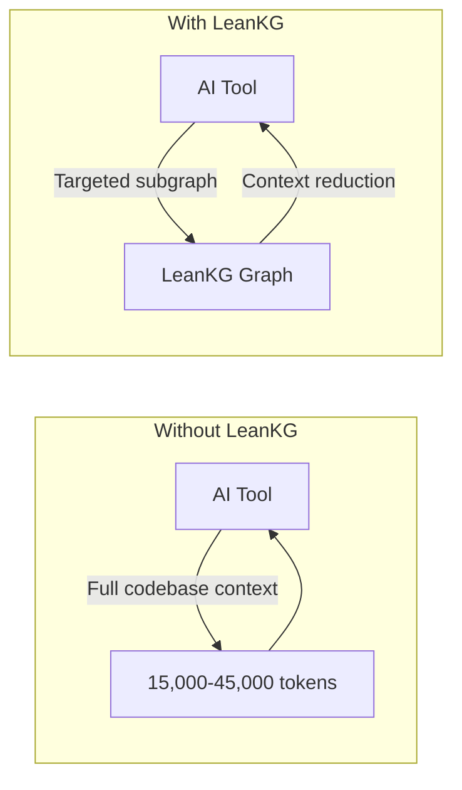

<p align="center">
  
</p>

# LeanKG

[](https://opensource.org/licenses/MIT)
[](https://www.rust-lang.org/)
[](https://crates.io/crates/leankg)
[](https://safeskill.dev/scan/freepeak-leankg)

**Lightweight Knowledge Graph for AI-Assisted Development**

LeanKG is a local-first knowledge graph that gives AI coding tools accurate codebase context. It indexes your code, builds dependency graphs, and exposes an MCP server so tools like Cursor, OpenCode, and Claude Code can query the knowledge graph directly. No cloud services, no external databases.


Visualize your knowledge graph with force-directed layout, WebGL rendering, and community clustering.


See [docs/web-ui.md](docs/web-ui.md) for more features.

---

## Live Demo

Try LeanKG without installing: **https://leankg.onrender.com**

```bash
leankg web --port 9000
```

---

## Installation

### One-Line Install (Recommended)

```bash
curl -fsSL https://raw.githubusercontent.com/FreePeak/LeanKG/main/scripts/install.sh | bash -s -- <target>
```

**Supported targets:**

| Target | AI Tool | Auto-Installed |
|--------|---------|-----------------|
| `opencode` | OpenCode AI | Binary + MCP + Plugin + Skill + AGENTS.md |
| `cursor` | Cursor AI | Binary + MCP + Skill + AGENTS.md + Session Hook |
| `claude` | Claude Code | Binary + MCP + Plugin + Skill + CLAUDE.md + Session Hook |
| `gemini` | Gemini CLI | Binary + MCP + Skill + GEMINI.md |
| `kilo` | Kilo Code | Binary + MCP + Skill + AGENTS.md |
| `antigravity` | Google Antigravity | Binary + MCP + Skill + GEMINI.md |
| `docker` | Any MCP client | Hub image + index + embed + MCP HTTP (no Rust) |

**Examples:**
```bash
curl -fsSL https://raw.githubusercontent.com/FreePeak/LeanKG/main/scripts/install.sh | bash -s -- cursor
curl -fsSL https://raw.githubusercontent.com/FreePeak/LeanKG/main/scripts/install.sh | bash -s -- claude
curl -fsSL https://raw.githubusercontent.com/FreePeak/LeanKG/main/scripts/install.sh | bash -s -- docker
```

### Install via Cargo or Build from Source

```bash
cargo install leankg && leankg --version
```

```bash
git clone https://github.com/FreePeak/LeanKG.git && cd LeanKG && cargo build --release
```

---

### Docker (Recommended for Teams — no Rust)

One command from your project root — pulls the Hub image, indexes, builds the
INT8 embedding index, then starts MCP HTTP on port 9699:

```bash
curl -fsSL https://raw.githubusercontent.com/FreePeak/LeanKG/main/scripts/docker-up.sh | bash
```

Same flow via the installer:

```bash
curl -fsSL https://raw.githubusercontent.com/FreePeak/LeanKG/main/scripts/install.sh | bash -s -- docker
```

Equivalent expanded form (still Docker-only; `--entrypoint leankg` works on
current Hub images):

```bash
docker pull freepeak/leankg:latest && \
docker volume create leankg-rocksdb >/dev/null && docker volume create leankg-models >/dev/null && \
docker rm -f leankg 2>/dev/null; \
docker run --rm -v "$PWD:/workspace" -v leankg-rocksdb:/data/leankg-rocksdb -v leankg-models:/root/.cache/leankg \
  -e LEANKG_DB_ENGINE=rocksdb -e LEANKG_ROCKSDB_ROOT=/data/leankg-rocksdb \
  --entrypoint leankg freepeak/leankg:latest index /workspace && \
docker run --rm --memory=10g --cpus=6 \
  -v "$PWD:/workspace" -v leankg-rocksdb:/data/leankg-rocksdb -v leankg-models:/root/.cache/leankg \
  -e LEANKG_DB_ENGINE=rocksdb -e LEANKG_ROCKSDB_ROOT=/data/leankg-rocksdb \
  -e LEANKG_EMBED_MAX_MB=0 -e LEANKG_EMBED_FAST=1 -e LEANKG_EMBED_MODEL=bge-q \
  --entrypoint leankg freepeak/leankg:latest \
  embed --wait --project /workspace --workers 8 --batch-size 128 --types function,method && \
docker run -d --name leankg -p 9699:9699 --memory=2g --restart unless-stopped \
  -v "$PWD:/workspace" -v leankg-rocksdb:/data/leankg-rocksdb -v leankg-models:/root/.cache/leankg \
  -e LEANKG_EMBED_ON_BOOT=0 -e LEANKG_EMBED_BACKGROUND=0 -e LEANKG_EMBED_MAX_MB=512 \
  freepeak/leankg:latest
```

MCP-only (skip cold embed — keyword/graph tools work; `semantic_search` needs
a prior embed):

```bash
docker run -d --name leankg -p 9699:9699 --memory=2g \
  -v "$PWD:/workspace" \
  -v leankg-rocksdb:/data/leankg-rocksdb \
  -v leankg-models:/root/.cache/leankg \
  -e LEANKG_EMBED_MAX_MB=512 \
  freepeak/leankg:latest
```

Verify:

```bash
curl http://localhost:9699/health
```

Stop / remove:

```bash
docker rm -f leankg
```

Requires [Docker](https://docs.docker.com/engine/install/) or [OrbStack](https://orbstack.dev). Point your AI tool MCP config at `http://localhost:9699/mcp`.

> **Note:** Published image tags (`freepeak/leankg:latest`, `:0.18.2`) currently target `linux/arm64` (Apple Silicon / ARM hosts). On `linux/amd64`, build locally with compose below. The image builds with `--features embeddings` so CozoDB HNSW semantic search works out of the box. Cold embed on mega-graphs can take 10–40+ minutes; `docker-up.sh` finishes embed before starting MCP so `/health` is green when ready.

#### Build from source (compose)

```bash
docker compose -f docker-compose.rocksdb.yml up --build
```

Offline embed for every project in `LEANKG_PROJECT_DIRS` (compose + local
override mounts):

```bash
bash scripts/embed-all-workspaces-then-mcp.sh
```

For multi-project mounts and local overrides, see [AGENTS.md](AGENTS.md) → RocksDB Docker Deployment.

---

## Quick Start

```bash
leankg init                              # Initialize LeanKG in your project
leankg index ./src                        # Index your codebase
leankg watch ./src                        # Auto-index on file changes
leankg impact src/main.rs --depth 3       # Calculate blast radius (with confidence + severity)
leankg status                             # Check index status
leankg metrics                            # View token savings
leankg doctor                             # Diagnose index health
leankg smoke-test                         # Run self-test (also runs at MCP HTTP startup)
leankg web                                # Start Web UI at http://localhost:8080
leankg export --format mermaid            # Export graph as Mermaid, DOT, HTML, SVG, GraphML, Neo4j
leankg quality --min-lines 50             # Find oversized functions
leankg detect-clusters                    # Identify functional code communities
leankg trace --all                        # Show feature-to-code traceability
leankg annotate src/main.rs::main -d "Entry point"  # Annotate code elements

# Smart agent verbs (Graphify-style)
leankg path "FastAPI" "ModelField"        # Shortest path between two symbols
leankg explain "APIRouter"                # Definition, cluster, degree, neighbors
leankg gods --limit 20                    # Top god nodes / hub ranking
leankg report --out .leankg/GRAPH_REPORT.md  # Generate architecture brief

# LSP bridge (uses your configured language server)
leankg lsp-list                           # List supported languages
leankg lsp-install go                     # Print install command for gopls (or run it)
leankg lsp-resolve --language go src/foo.go 42 5   # textDocument/definition via gopls

# Graph quality + reasoning
leankg check-consistency --severity BROKEN   # Detect broken / stale / current links
leankg tunnels --limit 50                 # List cross-domain tunnels
leankg clones --min-similarity 0.8        # Same-file near-duplicate detection
leankg prs --triage --conflicts           # PR impact + community-conflict triage
leankg reflect "auth flow?" useful --nodes src/auth.rs,src/jwt.rs  # Record query outcome

# Semantic search (build with --features embeddings; Docker ships it OOTB)
leankg embed --init                       # One-time model download
leankg embed                              # Incremental embedding build
leankg semantic-context "auth token validation" --top-k 100

# Run shell commands with RTK compression
leankg run -- cargo test -- --compress

# REST API server with auth
leankg api-serve --port 8081 --auth
leankg api-key create --name my-key

# Process management
leankg proc status                        # Show running LeanKG/Vite processes
leankg proc kill                          # Kill all LeanKG/Vite processes

# Obsidian vault sync
leankg obsidian init                      # Initialize Obsidian vault structure
leankg obsidian push                      # Push LeanKG data to Obsidian notes
leankg obsidian pull                      # Pull annotation edits from Obsidian
leankg obsidian watch                     # Watch vault for changes and auto-pull
leankg obsidian status                    # Show vault status

# Microservice call graph (via Web UI)
leankg web                                # Start Web UI at http://localhost:8080
                                          # Then visit http://localhost:8080/services

# Team knowledge: incidents, env, services
leankg incident add --title "DB timeout" --severity P1 --affected checkout --env production
leankg incident list --env staging
leankg env-conflicts --service checkout   # Find promote-time drift across envs
leankg team                                # Show team + on-call + environment map

# Multi-repo registry + auto-install
leankg register my-project                # Register a repository
leankg list                               # List all registered repos
leankg status-repo my-project             # Show repo health + freshness
leankg setup                              # Configure MCP for all repos + install Claude hooks
leankg update                             # Self-update to latest GitHub release
```

See [docs/cli-reference.md](docs/cli-reference.md) for all commands.

---

## Semantic Search (Embeddings)

Optional feature: dense-vector retrieval + cross-encoder reranking + graph
traversal. Off by default to keep the binary slim. Requires building with the
`embeddings` Cargo feature.

**Canonical store:** CozoDB `embedding_vectors` + native HNSW
(`embedding_vectors:vec_idx`, Cosine, f32, 384-dim). Do not migrate the graph
DB to Redis/FalkorDB to speed cold embed — measured writer-only throughput is
already ~100k+ vec/sec; cold wall time is dominated by ONNX inference.

**Measured cold rates (M2 Pro, `function,method`):**

| Profile | Sustained e2e | ~371k ETA |
|---------|---------------|-----------|
| Legacy FP32 (pre-fast) | ~170 vec/s | ~36 min |
| **Fast path** (`LEANKG_EMBED_FAST=1`, INT8) | **~480–500 vec/s** | **~12–15 min** |

See PRD v3.6.3 (`FR-EMBED-R1..R4`) and
`generated_docs/embed_bg_job_and_runtime_plan_2026-07-15.md`.

### Build & first-time setup

```bash
# 1. Build with the feature flag
cargo build --release --features embeddings

# 2. Pre-download models (~2.3 GB) — do this once per machine
./target/release/leankg embed --init
```

Models cache to `~/Library/Caches/leankg/models/` (macOS),
`~/.cache/leankg/models/` (Linux), or `%LOCALAPPDATA%\leankg\models` (Windows).
Fast path uses Xenova `onnx/model_quantized.onnx` (auto-downloaded if missing).

### Build the embedding index

```bash
# Incremental (default): only changed/new nodes — day-2 path (seconds–minutes)
# Defaults: --workers 2 --batch-size 32; further capped by LEANKG_EMBED_MAX_MB
leankg embed --wait --workers 2 --batch-size 32

# Mega-graph cold build: functions/methods only (default filter when >50k nodes)
leankg embed --wait --types function,method

# Force re-embed every selected node
leankg embed --wait --full

# Progress / cancel
leankg embed --status
leankg embed --cancel
```

Incremental runs diff against `embedding_state` and skip rows whose content
hash hasn't changed. Prefer incremental after the first cold pass; avoid
`--full` unless the model or schema changed.

### Fast path (recommended for mega-graph cold builds)

`LEANKG_EMBED_FAST` defaults **on**. It selects INT8 (Xenova quantized BGE-small),
caps sequence length, and runs data-parallel workers (`intra_threads=1`). Raise
`LEANKG_EMBED_MAX_MB` on large hosts so batch size is not clamped to 16:

```bash
export LEANKG_EMBED_FAST=1
export LEANKG_EMBED_MODEL=bge-q          # Xenova INT8 (not Qdrant model_optimized)
export LEANKG_EMBED_MAX_SEQ=128
export LEANKG_EMBED_MAX_MB=6144          # allow batch≥64–128 (macOS default 2048 clamps hard)
export LEANKG_EMBED_MAX_BLOB_CHARS=500   # shorter blobs → faster tokenize/infer

./target/release/leankg embed --wait \
  --project /path/to/project \
  --types function,method \
  --workers 8 \
  --batch-size 128
```

Healthy logs should show `kind=bge-int8`, `max_seq=128`, and
`...Xenova.../onnx/model_quantized.onnx` — **not** Qdrant `model_optimized.onnx`
(that file fails on current ORT with a SkipLayerNorm missing-input error).

Set `LEANKG_EMBED_FAST=0` and/or `LEANKG_EMBED_MODEL=bge` for the legacy FP32 path.

### MCP / Docker: cold embed without blocking day-2 MCP

Cold embed on a mega-graph can take tens of minutes. **First setup:** use
`scripts/docker-up.sh` (or `install.sh … docker`) so embed finishes, then MCP
starts healthy with HNSW ready.

**Day-2 MCP** keeps background embed off by default (`LEANKG_EMBED_BACKGROUND=0`)
so a restart does not drop HNSW. Opt in only if you accept a temporary
`semantic_search` outage while vectors rebuild:

```bash
export LEANKG_EMBED_ON_BOOT=0              # entrypoint must not wait on embed
export LEANKG_EMBED_BACKGROUND=1           # in-process embed inside mcp-http
export LEANKG_EMBED_MAX_MB=2048            # soft RSS budget (macOS default)
export LEANKG_EMBED_BACKGROUND_WORKERS=1
export LEANKG_EMBED_BACKGROUND_BATCH=32
```

While a background rebuild runs, keyword/graph MCP tools work; semantic tools
degrade until HNSW is ready (`leankg embed --status` to poll).

### Query

```bash
# CLI one-shot (retrieve → rerank → traverse)
leankg semantic-context "embedding inference for semantic search"
leankg semantic-context "auth token validation" --env production --top-k 100
leankg semantic-context "..." --no-traverse       # skip Stage 4 graph enrichment
leankg semantic-context "..." --debug             # diagnostics: counts, latency
```

Via MCP, the `kg_semantic_context` tool exposes the same pipeline to AI tools.

### Memory tuning

Embed auto-caps workers, batch size, upsert chunk, and the in-flight vector
queue from `LEANKG_EMBED_MAX_MB` (default **2048** on macOS, **3072** elsewhere)
so a cold run cannot balloon into swap and freeze the host. Inference also
pauses briefly when RSS crosses 90% of that soft cap.

| Knob | Effect |
|------|--------|
| `LEANKG_EMBED_MAX_MB=2048` | Soft RSS budget (set `0` to disable caps — not recommended) |
| `LEANKG_EMBED_FAST=1` | INT8 + seq cap + data-parallel workers (default on) |
| `LEANKG_EMBED_MODEL=bge-q` | Xenova quantized ONNX; `bge` = FP32 |
| `LEANKG_EMBED_MAX_SEQ=128` | Token truncate for cold speed (fast path default) |
| `LEANKG_EMBED_MAX_BLOB_CHARS` | Cap text blob length before tokenize (fast path ~500) |
| `--workers` / `--batch-size` | Requested values; clamped by the memory plan |
| `LEANKG_EMBED_UPSERT_CHUNK` | Writer flush size (also capped under a low budget) |

| `--batch-size` | Approx peak RSS (10-core Mac) | When to use |
|---------------|-------------------------------|------------|
| 128 (fast path) | needs `LEANKG_EMBED_MAX_MB` ≥ ~6g | Mega-graph cold on workstation |
| 32 (CLI default) | ~1–2 GB with 1–2 workers      | Laptop / default |
| 16            | lower                         | Tight `LEANKG_EMBED_MAX_MB` |
| 8             | ~730 MB                       | Memory-pressured host |
| 4             | ~400 MB                       | 1-vCPU container |

For Docker **MCP** (`docker-compose.rocksdb.yml` / `docker-up.sh`), Local
survival is **`mem_limit: 2g`**. For Docker **cold embeds**, prefer
`mem_limit` ≥ 6g **or** set `LEANKG_EMBED_MAX_MB` below the container limit
so backpressure engages before the OOM killer.

### Internals & design rationale

See [`src/embeddings/EMBEDDINGS.md`](src/embeddings/EMBEDDINGS.md) for the
module architecture, file map, data model, the embed/retrieve pipelines,
operational gotchas, and the rationale for storing vectors natively in
CozoDB's HNSW index.

Design philosophy for the retrieve→rerank→traverse flow is in
[docs/design/hybrid-retrieval-reranking.md](docs/design/hybrid-retrieval-reranking.md).

Runtime measurements and rejected storage levers (WAL-off, Redis side-store):
[generated_docs/embed_bg_job_and_runtime_plan_2026-07-15.md](generated_docs/embed_bg_job_and_runtime_plan_2026-07-15.md).

---

## Configuration (Environment Variables)

| Variable | Default | Purpose |
|----------|---------|---------|
| `LEANKG_MMAP_SIZE` | `67108864` (64 MiB) | SQLite mmap window. Lower = less RSS, more page faults. |
| `LEANKG_DB_ENGINE` | `sqlite` | `rocksdb` enables the RocksDB storage backend (recommended for teams). |
| `LEANKG_ROCKSDB_ROOT` | `~/.leankg-rocksdb` | Centralized RocksDB project store. |
| `LEANKG_AUTO_INDEX` | `1` | Enable index-if-needed on container startup. |
| `LEANKG_EMBED_ON_BOOT` | `1` (image-dependent) | Set `0` so Docker entrypoint does **not** block MCP on cold embed. |
| `LEANKG_EMBED_BACKGROUND` | unset | Set `1` to spawn in-process background embed inside `mcp-http` (shared DB). |
| `LEANKG_EMBED_FAST` | `1` (on) | INT8 + seq cap + data-parallel workers. Set `0` for legacy FP32 profile. |
| `LEANKG_EMBED_MODEL` | `bge` / fast→`bge-q` | `bge` = Xenova FP32; `bge-q`/`int8` = Xenova quantized; avoid Qdrant `model_optimized`. |
| `LEANKG_EMBED_MAX_SEQ` | `512` / fast→`128` | Max tokens per blob for DirectEmbedder. |
| `LEANKG_EMBED_MAX_BLOB_CHARS` | unset / fast→`500` | Cap blob text length before tokenize. |
| `LEANKG_EMBED_MAX_MB` | `2048` (macOS) / `3072` | Soft RSS budget for embed: caps workers/batch/channel; pauses infer at 90%. `0` disables. |
| `LEANKG_EMBED_BACKGROUND_WORKERS` | `1` | Worker count for in-process background embed (further capped by `LEANKG_EMBED_MAX_MB`). |
| `LEANKG_EMBED_BACKGROUND_BATCH` | `32` | Batch size for in-process background embed (further capped by `LEANKG_EMBED_MAX_MB`). |
| `LEANKG_EMBED_UPSERT_CHUNK` | `5000` | Rows per Cozo `import_relations` flush during embed (capped under a low RSS budget). |
| `LEANKG_VACUUM_INTERVAL_HOURS` | `1` | Hourly tick that calls `GraphEngine.vacuum()`. Set `0` to disable. **No-op on RocksDB** (background compaction handles it). |
| `LEANKG_WATCHER_DEBOUNCE_MS` | `2000` | File-watcher debounce window. |
| `LEANKG_WATCHER_BURST_LIMIT` | `256` | Soft cap on pending file changes per debounce window. |
| `LEANKG_WATCHER_MAX_DB_SIZE` | `524288000` (500 MiB) | Trigger VACUUM once the on-disk DB exceeds this size. |
| `LEANKG_CACHE_MAX_TOKENS` | `500000` | SessionCache upper bound. Lower this on memory-constrained hosts. |
| `LEANKG_API_PORT` | `9699` | Port for the auto-spawned REST API child process. |

See [INSTRUCTION.md](INSTRUCTION.md) for the full memory-tuning playbook.

---

## Claude Code Setup

LeanKG auto-triggers in Claude Code sessions via lifecycle hooks that route search intents to LeanKG tools instead of native tools.

```bash
# Install LeanKG with Claude Code hooks and plugin
leankg setup

# Then restart Claude Code or run:
/reload-plugins
```

**What `leankg setup` installs:**
- `.claude-plugin/` - Plugin manifest for Claude Code validation
- `hooks/` - Full lifecycle hooks: Setup, SessionStart, UserPromptSubmit, PreToolUse, PostToolUse, Stop
- Adds `leankg@local` to `enabledPlugins` in `~/.claude/settings.json`

**Hook lifecycle:**
- `Setup` - Version gating on startup
- `SessionStart` - Injects tool selection hierarchy into every session
- `UserPromptSubmit` - Initializes session context with LeanKG patterns
- `PreToolUse` - Nudges toward LeanKG when you use Grep/Read/Bash for code analysis
- `PostToolUse` - Logs LeanKG MCP tool usage for analytics
- `Stop` - Captures session summary for future context retrieval

---

## How LeanKG Helps



**Without LeanKG**: AI processes full context from files found via grep/search.
**With LeanKG**: AI queries knowledge graph for targeted context. Token reduction varies by task complexity (see [benchmark results](tests/benchmark/results/clean-benchmark-2026-04-21.md)).

---


## Highlights

- **Auto-Init** -- Install script configures MCP, rules, skills, and hooks automatically
- **Auto-Trigger** -- Session hooks inject LeanKG context into every AI tool session
- **Token Optimized** -- Targeted subgraph retrieval vs full file scanning
- **Impact Radius** -- Compute blast radius before making changes with confidence + severity
- **Pre-Commit Risk Analysis** -- `detect_changes` classifies risk as critical/high/medium/low
- **Dependency Graph** -- Build call graphs with `IMPORTS`, `CALLS`, `TESTED_BY`, `EMITS`, `LISTENS_ON`, `HTTP_CALLS`, `TUNNEL`, `EXPLAINS` edges
- **MCP Server** -- Expose graph via MCP protocol for AI tool integration (85 tools)
- **Orchestration** -- Smart context routing with persistent + hot-path caching via natural language intent
- **Community Detection** -- Auto-detect functional clusters (Leiden) with per-cluster `SKILL.md`
- **Smart Agent Verbs** -- `shortest_path`, `explain_node`, `god_nodes`, `get_graph_report` for connection questions
- **LSP Bridge** -- Generic JSON-RPC client for `gopls` / `typescript-language-server` / `pyright` / `dart-language-server` / `rust-analyzer` with per-(language, workspace) cache; `resolve_with_lsp` MCP + `leankg lsp-resolve` / `lsp-install` / `lsp-list`
- **Semantic Search (HNSW)** -- CozoDB native `::hnsw` over dense embeddings (`--features embeddings`); Docker ships it OOTB
- **Ontology & Knowledge** -- Concept (`concepts.yaml`) + procedural workflow (`workflows.yaml`) layer with `kg_*` MCP tools
- **Agent Personas** -- `agent_focus`, `agent_diary_read/write` for specialist reviewer/architect/ops contexts
- **Temporal Graph** -- `valid_from` / `valid_to` on relationships with `temporal_query` + `timeline`
- **Rationale Extraction** -- `# WHY:` / `# NOTE:` / `# HACK:` / `# FIXME:` / `# XXX:` comments become first-class `rationale` nodes linked via `explains` edges
- **Consistency Checker** -- `check_consistency` flags BROKEN / STALE / CURRENT links against current code
- **Cross-Domain Tunnels** -- Auto-link clusters sharing the same domain concept across projects
- **PR Impact Dashboard** -- `leankg prs` + `triage_prs` use cluster overlap to spot merge-order risk
- **Work-Memory Reflect Loop** -- `report_query_outcome` + `leankg reflect` aggregate into `.leankg/reflections/LESSONS.md`
- **Portable Graph Snapshot** -- `export_graph_snapshot` for merge-friendly team-committed graph artifacts
- **Wake-up Protocol** -- `wake_up` MCP loads ~170 tokens of L0+L1 identity at session start
- **Multi-Language** -- Index Go, TypeScript, JavaScript, Python, Rust, Java, Kotlin, Dart, Android XML, Terraform, CI/CD YAML with tree-sitter
- **Android** -- Extract XML layouts, resources, manifest relationships, Room, Hilt, Navigation, and WorkManager
- **Service Topology** -- Microservice call graph with env namespacing (`local` / `staging` / `production` / `upcoming`)
- **Incidents & Env Conflicts** -- Link outage postmortems to services; `find_env_conflicts` surfaces promote-time drift
- **Annotation Search** -- Search code by `@Entity`, `@HiltViewModel`, and other annotations
- **Graph Export** -- Export as JSON, DOT, Mermaid, HTML, SVG, GraphML, Neo4j, or portable snapshot
- **REST API** -- Axum HTTP API with Argon2 API keys + team multi-project RocksDB deploy
- **RTK Compression** -- 8 read modes + response compressor + `--compress` shell wrapper
- **TOON Responses** -- MCP responses use Token-Oriented Object Notation (~40% token reduction)
- **CI/CD Auto-Update** -- GitHub Actions workflow reindexes + commits portable snapshot on release

See [docs/architecture.md](docs/architecture.md) for system design and data model details.

---

## Supported AI Tools

| Tool | Auto-Setup | Session Hook | Plugin | Full Lifecycle Hooks |
|------|------------|--------------|--------|---------------------|
| Cursor | Yes | session-start | - | - |
| Claude Code | Yes | session-start | Yes | Setup, SessionStart, UserPromptSubmit, PreToolUse, PostToolUse, Stop |
| OpenCode | Yes | - | Yes | - |
| Docker | Yes | - | - | - |
| Kilo Code | Yes | - | - | - |
| Gemini CLI | Yes | - | - | - |
| Google Antigravity | Yes | - | - | - |
| Codex | Yes | - | - | - |

> **Note:** Cursor requires per-project installation. The AI features work on a per-workspace basis, so LeanKG should be installed in each project directory where you want AI context injection.

See [docs/agentic-instructions.md](docs/agentic-instructions.md) for detailed setup and auto-trigger behavior.

---

## Context Metrics

Track token savings to understand LeanKG's efficiency.

```bash
leankg metrics --json              # View with JSON output
leankg metrics --since 7d           # Filter by time
leankg metrics --tool search_code   # Filter by tool
```

See [docs/metrics.md](docs/metrics.md) for schema and examples.

---

## Update

```bash
# Check current version
leankg version

# Update LeanKG binary (kills processes, removes old binary, installs hooks)
leankg update

# Or via install script
curl -fsSL https://raw.githubusercontent.com/FreePeak/LeanKG/main/scripts/install.sh | bash -s -- update

# Obsidian vault sync
leankg obsidian init                      # Initialize Obsidian vault
leankg obsidian push                      # Push LeanKG data to Obsidian notes
leankg obsidian pull                      # Pull annotation edits from Obsidian
```


---

## Documentation

| Doc | Description |
|-----|-------------|
| [docs/cli-reference.md](docs/cli-reference.md) | All CLI commands |
| [docs/mcp-tools.md](docs/mcp-tools.md) | MCP tools reference |
| [docs/agentic-instructions.md](docs/agentic-instructions.md) | AI tool setup & auto-trigger |
| [docs/architecture.md](docs/architecture.md) | System design, data model |
| [docs/web-ui.md](docs/web-ui.md) | Web UI features |
| [docs/metrics.md](docs/metrics.md) | Metrics schema & examples |
| [docs/benchmark.md](docs/benchmark.md) | Performance benchmarks |
| [docs/roadmap.md](docs/roadmap.md) | Feature planning |
| [docs/tech-stack.md](docs/tech-stack.md) | Tech stack & structure |
| [docs/android-extraction.md](docs/android-extraction.md) | Android XML & resource extraction |
| [src/embeddings/EMBEDDINGS.md](src/embeddings/EMBEDDINGS.md) | Embeddings module internals (vector index, pipelines, native HNSW rationale) |

---

## Troubleshooting

### High RAM Usage on macOS

LeanKG uses memory-mapped I/O and in-memory caching which can consume significant RAM on macOS. Primary causes:

| Cause | Location | Fix |
|-------|----------|-----|
| SQLite mmap_size=256MB | `src/db/schema.rs:20` | Set `LEANKG_MMAP_SIZE=134217728` (128MB) |
| Deprecated `all_elements()` | `src/graph/query.rs:537` | Use `get_elements_paginated()` instead |
| Deprecated `all_relationships()` | `src/graph/query.rs:992` | Use `get_relationships_paginated()` |
| SessionCache 500K tokens | `src/compress/session_cache.rs:11` | Set `LEANKG_CACHE_MAX_TOKENS=100000` |
| Multiple GraphEngine cached | `src/mcp/server.rs:48-49` | Cache eviction with TTL |
| Multiple cache layers | Various | Enable `memory_only` mode for PersistentCache |
| Unbounded DB file growth on long-lived servers | `src/graph/query.rs:100` | `LEANKG_VACUUM_INTERVAL_HOURS=1` (default) reclaims free pages hourly. No-op on RocksDB. |

**Quick fix - add to your shell profile:**
```bash
export LEANKG_MMAP_SIZE=134217728   # 128MB instead of 256MB
export LEANKG_CACHE_MAX_TOKENS=100000  # 100K instead of 500K
```

See [INSTRUCTION.md](INSTRUCTION.md) for detailed memory tuning and MCP server setup.

### Embeddings feature (`--features embeddings`)

The optional embeddings pipeline (dense-vector retrieval + reranker) has its
own failure modes. See [`src/embeddings/EMBEDDINGS.md`](src/embeddings/EMBEDDINGS.md)
for full operational notes. Common issues:

| Symptom | Cause | Fix |
|---------|-------|-----|
| Cold embed still ~30–40+ min | Fast path off, or `LEANKG_EMBED_MAX_MB` clamps batch to 16 | Enable `LEANKG_EMBED_FAST=1` + `bge-q`; raise `LEANKG_EMBED_MAX_MB` (e.g. 6144); `--workers 8 --batch-size 128` |
| ORT `SkipLayerNorm` / missing `LayerNorm.weight` | Loading Qdrant `model_optimized.onnx` | Rebuild binary; use Xenova `model_quantized.onnx` via `LEANKG_EMBED_MODEL=bge-q` |
| MCP / Docker stuck unhealthy for hours | Entrypoint waiting on sync embed | Prefer `scripts/docker-up.sh` for first setup; keep `LEANKG_EMBED_ON_BOOT=0` and `LEANKG_EMBED_BACKGROUND=0` on day-2 MCP |
| `semantic_search` missing `vec_idx` after MCP restart | Background embed dropped HNSW | Keep `LEANKG_EMBED_BACKGROUND=0`; re-run offline embed via `docker-up.sh` or `embed-all-workspaces-then-mcp.sh` |
| `embed` peaks at 10+ GB RSS | ORT arenas × many workers × large batch/channel | Set `LEANKG_EMBED_MAX_MB=2048` (default on macOS); use `--workers 1 --batch-size 8` |
| `semantic-context` returns 0 seeds, `Env-filtered: N` in `--debug` | elements' `env` doesn't match the requested env (default `local`) | pass `--env <value>`, or re-index with the right env |
| `parser::pest` from `embed` | ran against an old build that uses `:delete` (CozoDB 0.2.2 only supports `:rm`) | rebuild from current `main` |
| `semantic-context` says `Reranker: fallback` | bge-reranker-v2-m3 failed to init (corrupt cache, OOM) | `leankg embed --init` to re-download; lower `--batch-size` |
| Searches miss elements that state says are `fresh` | DB was modified out-of-band (manual SQLite edit) without re-running `embed` | `leankg embed --full` |
| Considering Redis/FalkorDB to “fix” cold embed | Writer is not the limiter (~100k+ vec/sec empty-DB) | Do not migrate; see plan doc / PRD v3.6.3 Won't Do |

### Database Lock Error

If you see `database is locked (code 5)`, another LeanKG process is holding the database:

```bash
# Kill all leankg and vite processes
leankg-kill

# Or manually
pkill -9 -f "leankg"
pkill -9 -f "vite"
```

### Process Management

```bash
leankg proc kill        # Kill all leankg and vite processes
leankg proc status      # Show running leankg/vite processes
```

**Important:** Always kill the web server before indexing to avoid database lock conflicts.

---

## Performance Benchmarks

### Load Test Results (100K nodes)

| Operation | Throughput |
|-----------|------------|
| Insert elements | ~57,618 elements/sec |
| Insert relationships | ~67,067 relationships/sec |
| Retrieve all elements | ~418,718 elements/sec |
| Cache speedup (cold to warm) | 345-461x |

Run load tests:
```bash
cargo test --release load_test -- --nocapture
```

### Unified A/B Benchmark (All Tools, Simple to Complex)

Measures latency, input/output token usage, and token efficiency across **19 test cases** spanning all LeanKG tools (search, find, context, dependencies, impact radius, call graphs, ontology) at 3 complexity levels, with automated Markdown export.

```bash
# Run the unified benchmark (rebuild first if source changed)
cargo build --release
target/release/leankg benchmark-unified --project .
```

| Metric | With LeanKG | Without (grep) | Winner |
|--------|-------------|----------------|--------|
| Input Token Savings | 30.0% | -- | **LeanKG** |
| Token Efficiency (tokens/result) | 2.09 | 6.39 | **LeanKG (3x)** |
| Latency (simple queries) | 20.4ms | 20.2ms | ~Equal |
| Latency (complex queries) | 8.9s | 34.9ms | Manual (impact radius is heavy) |

See [benchmark/results/unified-benchmark-1782980096.md](benchmark/results/unified-benchmark-1782980096.md) for the full report (JSON + Markdown).

### A/B Benchmark Results (Legacy)

See [tests/benchmark/results/clean-benchmark-2026-04-21.md](tests/benchmark/results/clean-benchmark-2026-04-21.md) for earlier A/B testing results comparing LeanKG vs baseline code search.

---

## Requirements

- Rust 1.75+
- macOS or Linux

---

## License

MIT

---

## Star History

<a href="https://www.star-history.com/?repos=FreePeak%2FLeanKG&type=date&legend=top-left">
 <picture>
   <source media="(prefers-color-scheme: dark)" srcset="https://api.star-history.com/chart?repos=FreePeak/LeanKG&type=date&theme=dark&legend=top-left" />
   <source media="(prefers-color-scheme: light)" srcset="https://api.star-history.com/chart?repos=FreePeak/LeanKG&type=date&legend=top-left" />
   
 </picture>
</a>
