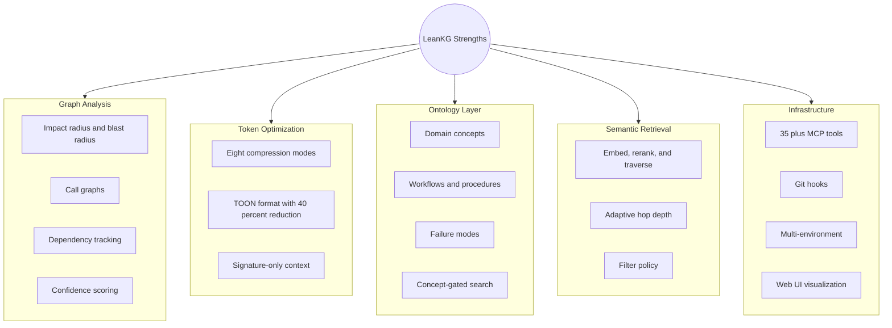
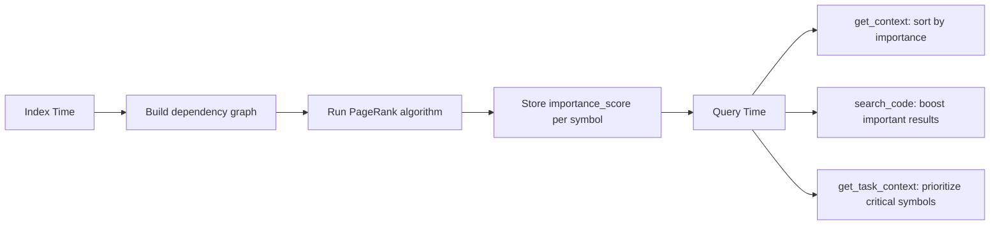
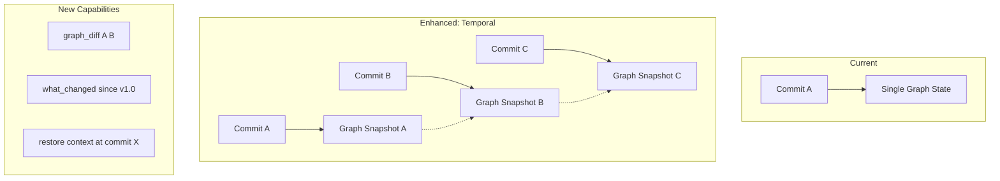
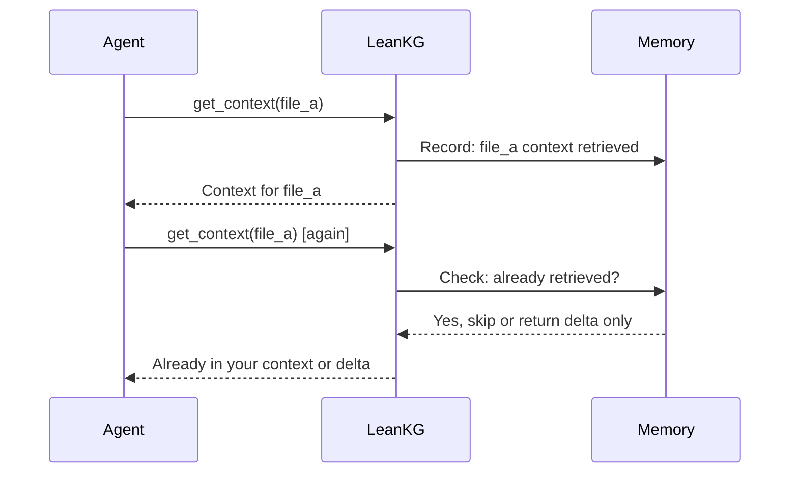
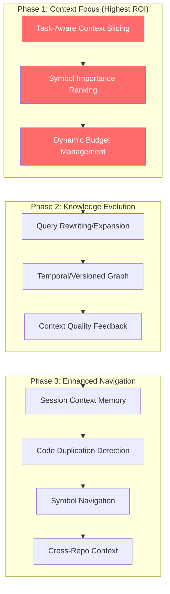

# LeanKG Enhancement Analysis: Helping AI Agents Focus on Context

**Date:** 2026-07-09
**Version analyzed:** 0.17.8
**Status:** Analysis complete
**Author:** AI Agent Context Review

---

## Executive Summary

This document analyzes LeanKG against 7 major AI context tools and identifies 10 specific enhancements that would improve how AI agents focus on context. LeanKG already has strong foundations (graph-based analysis, token optimization, ontology layer, semantic retrieval pipeline), but competitor ideas reveal gaps in task-aware context delivery, symbol ranking, temporal versioning, and feedback loops.

**Competitors analyzed:**

| Competitor | Key Innovation |
|------------|---------------|
| Augment Code | Context Engine: gives agents only the "slice" the task touches (33% lower token cost) |
| Cursor | @-symbols for explicit context injection |
| Sourcegraph Cody | Query rewriting + hybrid context (keyword + graph + search) |
| Aider | Repo map with graph ranking algorithm (PageRank-like) |
| Bloop | Code duplication detection + bidirectional symbol navigation |
| Graphiti | Temporal/bi-temporal knowledge graphs, tracks changes over time |
| Continue.dev | Customizable context providers, conversation memory |

---

## What LeanKG Already Does Well



**Current tool surface (35+ tools):** `get_impact_radius`, `get_call_graph`, `get_context`, `orchestrate`, `kg_context`, `kg_semantic_context`, `concept_search`, `detect_changes`, etc.

**Key architecture evidence:**

| Capability | Evidence |
|-----------|----------|
| Graph traversal engine | `src/graph/query.rs` |
| 8 compression modes | `src/compress/modes.rs` |
| Ontology layer | `src/ontology/mod.rs`, `src/ontology/concept.rs` |
| Semantic retrieval pipeline | `src/retrieval/pipeline.rs` |
| Per-node-type filter policy | `src/retrieval/filter_policy.rs` |
| Intent parser | `src/orchestrator/intent.rs` |
| Token budget tracking | `src/mcp/token_budget.rs` |
| Embeddings (optional feature) | `src/embeddings/`, `Cargo.toml:23` |

---

## Competitor Landscape - Key Differentiators

| Competitor | Key Innovation | What LeanKG Lacks |
|------------|---------------|-------------------|
| **Augment Code** | Context Engine: gives agents only the "slice" the task touches (33% lower token cost) | Task-aware context slicing |
| **Aider** | Repo map with graph ranking algorithm (PageRank-like) to rank symbols by importance | Symbol importance ranking |
| **Sourcegraph Cody** | Query rewriting + hybrid context (keyword + graph + search) | Query expansion, remote repo context |
| **Graphiti** | Temporal/bi-temporal knowledge graphs, tracks changes over time | Versioned graph, contradiction detection |
| **Bloop** | Code duplication detection + bidirectional symbol navigation | Similarity detection, go-to-definition |
| **Cursor** | @-symbols for explicit context injection | Rich @-mention context providers |
| **Continue.dev** | Customizable context providers, conversation memory | Session-level context memory |

---

## Gap Analysis: 10 Enhancements for Better AI Context Focus

### Priority 1: Task-Aware Context Slicing (HIGH IMPACT)

**Inspired by:** Augment Code's Context Engine

**The Problem:** LeanKG's `get_context` returns file-level context. The `orchestrate` tool uses keyword-based intent matching (`src/orchestrator/intent.rs:22-69`). Neither understands *what task the agent is trying to accomplish* and returns only the relevant slice.

**What Augment Does:** Maps the codebase by structure, then gives agents only the slice of context the task touches. Result: 33% lower token cost, 2-3x throughput.

**Proposed Enhancement:** New `get_task_context` MCP tool

```
Input: task_description (natural language) + optional: file_hints[], max_tokens
Process:
  1. Semantic understanding of the task (not just keyword matching)
  2. Identify entry-point files/symbols from task description
  3. Expand to only the directly relevant subgraph (1-2 hops)
  4. Rank by relevance to the specific task
  5. Fill token budget with most task-relevant context
Output: Minimal context slice optimized for THAT task
```

**Evidence:** `src/orchestrator/intent.rs:22` - current IntentParser uses static keyword patterns like `["context", "content", "read", "file"]`. This is keyword matching, not task understanding.

**Files to modify:**

| File | Change |
|------|--------|
| `src/orchestrator/intent.rs` | Upgrade from keyword to semantic intent |
| `src/orchestrator/mod.rs` | Add task-slicing logic |
| `src/mcp/tools.rs` | New `get_task_context` tool definition |
| `src/mcp/handler.rs` | New `get_task_context` handler |

---

### Priority 2: Symbol Importance Ranking (HIGH IMPACT)

**Inspired by:** Aider's repo map graph ranking algorithm

**The Problem:** LeanKG treats all symbols equally. When building context or search results, there's no notion of "this function is critical because 50 other files depend on it" vs "this is a leaf utility function."

**What Aider Does:** Uses a graph ranking algorithm on a dependency graph (files as nodes, dependencies as edges) to identify the most important identifiers -- the ones most often referenced by other portions of the code.

**Proposed Enhancement:** PageRank-like importance scoring at index time



**Evidence:** LeanKG already has `get_dependents` (`src/graph/query.rs`) which returns files depending on a target. This is the raw data for PageRank, but it's computed per-query, not precomputed at index time.

**Implementation:**
- Precompute importance scores during indexing
- Store in `code_elements` table as `importance_score` column
- Integrate into `get_context`, `search_code`, and the new `get_task_context`

---

### Priority 3: Dynamic Context Budget Management (HIGH IMPACT)

**Inspired by:** Aider (dynamic repo map sizing) + Augment Code (context slicing)

**The Problem:** `get_context` has a `max_tokens` parameter (default 4000), but it doesn't intelligently fill that budget. It returns whatever it finds up to the limit, without prioritizing.

**What Aider Does:** Dynamically adjusts repo map size based on chat state. Expands when no files are added to chat (needs to understand whole repo), contracts when files are already in context.

**Proposed Enhancement:** A `ContextBudgetManager` that:
1. Takes a token budget and a task
2. Fills budget in priority order: critical symbols first, then important, then supporting
3. Dynamically adjusts based on what's already in the agent's context window
4. Returns a "context completeness" score (did we fit everything important?)

**Evidence:** `src/mcp/token_budget.rs` exists (6KB) but appears to be a simple budget tracker, not an intelligent allocator.

---

### Priority 4: Query Rewriting and Expansion (MEDIUM IMPACT)

**Inspired by:** Sourcegraph Cody ("queries are automatically rewritten to include more relevant terms")

**The Problem:** `search_code` does literal name matching. `concept_search` does concept matching via the ontology, but doesn't expand the query with synonyms or related terms before searching.

**What Sourcegraph Does:** Automatically rewrites queries to include more relevant terms, improving recall.

**Proposed Enhancement:** Query expansion pipeline before search:

```
User query: "where is auth validation"
  -> Expand with ontology aliases + synonyms
Expanded: "auth validation" + "token verification" + "access control" + "permission check"
  -> Search with expanded terms
  -> Merge + deduplicate results
```

**Evidence:** `src/ontology/concept.rs` has `ConceptMetadata` with aliases, but `search_code` doesn't leverage this for query expansion. The `concept_search` tool does concept-gated search but doesn't expand the user's query terms.

---

### Priority 5: Temporal/Versioned Knowledge Graph (MEDIUM IMPACT)

**Inspired by:** Graphiti's bi-temporal models and episode-based ingestion

**The Problem:** LeanKG has multi-environment support (`local`, `staging`, `production`, `upcoming`) but no true temporal versioning. You can't ask "what did the graph look like at commit X?" or "what changed in the dependency graph between v1.0 and v2.0?"

**What Graphiti Does:** Tracks changes over time with bi-temporal models, handles contradictions when facts change, ingests data as episodes.

**Proposed Enhancement:** Versioned graph snapshots



**New MCP tools:**

| Tool | Purpose |
|------|---------|
| `graph_diff(commit_a, commit_b)` | What changed in the graph between two commits |
| `get_context_at(commit, file)` | Get context as it existed at a specific commit |
| `what_changed(file)` | Timeline of changes to a file/symbol |

**Evidence:** LeanKG has `detect_changes` for pre-commit risk analysis, but it compares working tree vs last indexed commit. There's no multi-commit history.

---

### Priority 6: Context Quality Feedback Loop (MEDIUM IMPACT)

**Inspired by:** Augment Code's shared memory and feedback loops

**The Problem:** LeanKG has context metrics tracking (18 fields, `US-INF-05` DONE) but no feedback on context *quality*. There's no way to know which context actually helped the AI agent succeed.

**What Augment Does:** Knowledge compounds as teams give feedback. Shared memory learns what context was useful.

**Proposed Enhancement:** Context quality tracking

```
Agent requests context -> LeanKG returns context + context_id
  -> Agent uses context for task
  -> Agent reports: was this context useful? (success/fail/partial)
  -> LeanKG learns: which context patterns lead to success
  -> Future queries prioritize high-success context patterns
```

**New MCP tools:**

| Tool | Purpose |
|------|---------|
| `report_context_quality(context_id, outcome)` | Agent reports if context was useful |
| `get_context_stats()` | View historical context success rates |

LeanKG adjusts ranking based on historical success patterns.

---

### Priority 7: Session-Level Context Memory (MEDIUM IMPACT)

**Inspired by:** Graphiti (memory) + Continue.dev (conversation context)

**The Problem:** The orchestrator has a persistent cache (`src/orchestrator/cache.rs`), but it caches *results*, not *conversation context*. An AI agent re-queries the same things within a session because there's no memory of what was already retrieved.

**Proposed Enhancement:** Session-level context memory



**Benefit:** Prevents context window dilution from re-querying the same files. Agents get told "you already have this" instead of getting duplicate context.

---

### Priority 8: Code Duplication/Similarity Detection (LOWER IMPACT)

**Inspired by:** Bloop ("Reduce code duplication by checking for existing functionality")

**The Problem:** No way to ask "is there already a function that does X?" before writing new code.

**Proposed Enhancement:** Use the existing embeddings (optional feature) to detect similar functions

**New MCP tools:**

| Tool | Purpose |
|------|---------|
| `find_similar_code(description or code_snippet)` | Returns similar existing functions |
| `detect_duplicates()` | Finds code blocks that are semantically similar |

**Evidence:** LeanKG already has the embedding infrastructure (`src/embeddings/`, `src/retrieval/pipeline.rs`). This is a new use case for existing capability.

---

### Priority 9: Bidirectional Symbol Navigation (LOWER IMPACT)

**Inspired by:** Bloop (go-to-reference, go-to-definition) + Sourcegraph (code graph)

**The Problem:** LeanKG has `get_callers` and `get_call_graph` but not the IDE-style navigation that agents need: "where is this defined?" and "where is this used?"

**Proposed Enhancement:** Graph-backed symbol navigation

**New MCP tools:**

| Tool | Purpose |
|------|---------|
| `go_to_definition(symbol)` | Find where a symbol is defined (uses graph, not text search) |
| `find_all_references(symbol)` | Find all places that reference a symbol (uses `calls` + `imports` + `references` edges) |

**Evidence:** `find_function` exists but does name search. `get_callers` exists but is call-specific. A unified symbol navigation would be more useful for agents.

---

### Priority 10: Cross-Repository Context (LOWER IMPACT)

**Inspired by:** Sourcegraph Cody (remote repositories) + LeanKG's existing global registry

**The Problem:** LeanKG has a global multi-repo registry (`US-GN-03` DONE) but limited cross-repo queries. Can't trace "if I change this function in repo A, what breaks in repo B?"

**Proposed Enhancement:** Cross-repo impact analysis using the `service_calls` relationship

**New MCP tools:**

| Tool | Purpose |
|------|---------|
| `cross_repo_impact(file, repo)` | Impact across all registered repos |
| `get_service_context(service, env)` | Already exists, could be enhanced for cross-repo |

---

## Recommended Implementation Priority



### Priority Matrix

| Priority | Enhancement | Impact | Effort | ROI |
|----------|------------|--------|--------|-----|
| 1 | Task-Aware Context Slicing | Very High | Medium | Highest |
| 2 | Symbol Importance Ranking | High | Low | High |
| 3 | Dynamic Budget Management | High | Medium | High |
| 4 | Query Rewriting/Expansion | Medium | Low | Medium |
| 5 | Temporal/Versioned Graph | Medium | High | Medium |
| 6 | Context Quality Feedback | Medium | Medium | Medium |
| 7 | Session Context Memory | Medium | Low | Medium |
| 8 | Code Duplication Detection | Low | Low | Medium |
| 9 | Symbol Navigation | Low | Low | Low |
| 10 | Cross-Repo Context | Low | High | Low |

---

## Key Insight: The "Context Slice" is the Missing Piece

The biggest gap is **task-aware context slicing** (Priority 1). LeanKG currently gives agents *file-level* or *graph-neighborhood* context. Augment Code's breakthrough is giving agents only the *slice* of context the specific task touches.

**Current LeanKG flow:**

```
Agent asks "fix the auth bug"
  -> get_context(auth.rs)
  -> returns ALL of auth.rs context (up to max_tokens)
```

**Enhanced flow:**

```
Agent asks "fix the auth bug"
  -> get_task_context("fix auth bug")
  -> understands task is about authentication logic
  -> identifies auth.rs::validate_token as the entry point
  -> expands to only the auth validation subgraph (2 hops)
  -> ranks by importance (token verification > logging)
  -> returns 500 tokens of laser-focused context, not 4000 tokens of file dump
```

This is the single highest-ROI enhancement because it directly addresses LeanKG's core mission: **"provide AI models with accurate, concise codebase context without scanning unnecessary code, avoiding context window dilution"** (from `docs/prd.md:49-50`).

---

## Proposed New MCP Tools Summary

| New Tool | Enhancement Priority | Description |
|----------|---------------------|-------------|
| `get_task_context` | 1 | Task-aware context slice |
| *(integrated)* | 2 | Importance score on existing tools |
| `ContextBudgetManager` | 3 | Smart budget allocation (internal) |
| *(integrated)* | 4 | Query expansion in `search_code` |
| `graph_diff` | 5 | Graph diff between commits |
| `get_context_at` | 5 | Context at a specific commit |
| `what_changed` | 5 | Change timeline for a symbol |
| `report_context_quality` | 6 | Agent feedback on context |
| `get_context_stats` | 6 | Historical context success |
| *(internal)* | 7 | Session context memory |
| `find_similar_code` | 8 | Semantic similarity search |
| `detect_duplicates` | 8 | Find duplicate code |
| `go_to_definition` | 9 | Graph-backed definition lookup |
| `find_all_references` | 9 | Graph-backed reference lookup |
| `cross_repo_impact` | 10 | Impact across repositories |

---

## References

- LeanKG PRD: `docs/prd.md`
- LeanKG Architecture: `docs/architecture.md`
- LeanKG Roadmap: `docs/roadmap.md`
- LeanKG MCP Tools: `docs/mcp-tools.md`
- Embedding Plan: `docs/plans/2026-06-30-embedding-retrieve-rerank-traverse.md`
- Previous Competitor Analysis: `docs/analysis/competitor-analysis-2026-04-10.md`
- GitNexus Analysis: `docs/analysis/gitnexus-analysis-2026-03-27.md`

**Competitor sources:**

| Competitor | Reference |
|------------|-----------|
| Augment Code | https://www.augmentcode.com/product |
| Aider Repo Map | https://aider.chat/docs/repomap.html |
| Sourcegraph Cody Context | https://docs.sourcegraph.com/cody/core-concepts/context |
| Graphiti | https://github.com/getzep/graphiti |
| Bloop | https://github.com/BloopAI/bloop |
| Continue.dev | https://docs.continue.dev/customize/overview |
| Cursor | https://docs.cursor.com/context/agent |

---

*Last updated: 2026-07-09*
