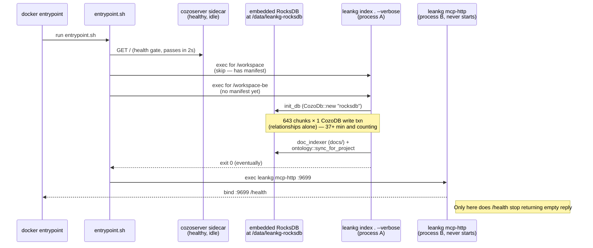

# LeanKG `index` Blocks MCP HTTP — Deep Dive

**Date:** 2026-07-29
**Scope:** Why `leankg index` is slow in the enterprise Docker compose, and why it keeps `mcp-http` from binding on `:9699`
**Container investigated:** `leankg-enterprise-leankg-1` indexing `/workspace-be`
**Status:** Two compounding root causes identified; P0 fix is a 2-line `entrypoint.sh` change

---

## 1. Executive Summary

The user reported: *"`index` is running so slow and blocks the HTTP MCP server in my leankg container."*

Investigation confirms both halves of the complaint. Two compounding bugs multiply the wall-clock impact:

1. **`entrypoint.sh` serializes `leankg index` before `leankg mcp-http`** — the blocking bash loop must complete for every project in `LEANKG_PROJECT_DIRS` before the shell ever reaches the `exec leankg mcp-http` line. With a 21,907-file codebase producing **3.2 million relationships**, the index runs for 30+ minutes while `:9699/health` returns empty reply (no listener bound).
2. **`LEANKG_COZO_ENDPOINT` is set by `docker-compose.enterprise.yml` but never read by Rust.** `src/db/schema.rs:130-149` (`resolve_storage_config`) only branches on `LEANKG_DB_ENGINE` (sqlite/rocksdb); the cozoserver sidecar at `host.docker.internal:3000` is dead weight. A ponytail TODO at `src/db/schema.rs:103-110` explicitly admits this is a "follow-up". leankg therefore opens an embedded RocksDB at `/data/leankg-rocksdb/projects/<hash>` directly, while the cozoserver container sits idle.

Neither bug is fixed by the in-progress worktrees the previous session left behind (`feature/rocksdb-lock-fix@7805b7d`, `batch/l1-cache@7e7a147`, `batch/readonly`). Those address in-process handle discipline and read caching — they cannot help when `mcp-http` never starts.

Recommended fix order:

| Priority | Change | Impact |
|----------|--------|--------|
| P0 | Drop the blocking `for` loop in `entrypoint.sh`; let `mcp-http`'s existing background `auto_index_if_needed` (`server.rs:1842-1847`) do the work | `/health` returns 200 in <10 s |
| P1 | Wire `LEANKG_COZO_ENDPOINT` into `init_db` so cozoserver actually owns RocksDB | Single-writer at network level; offloads write contention from leankg process |
| P2 | Bigger write chunks (5,000 → 50,000 outer, 1,000 → 10,000 inner) | ~10× fewer round-trips; index drops from tens of minutes to single-digit minutes |
| P3 | Parallel `find_files_sync` via `jwalk` | 2-5× faster file discovery on 100k+ file trees |

---

## 2. Reproducing the Symptom

```
$ curl -sS -o /dev/null -w "HTTP=%{http_code}\n" --max-time 5 http://localhost:9699/health
curl: (52) Empty reply from server
HTTP=000 time=0.001629s

$ docker ps --format 'table {{.Names}}\t{{.Status}}'
leankg-enterprise-leankg-1       Up 29 minutes (unhealthy)
leankg-enterprise-cozoserver-1   Up 29 minutes (healthy)
```

Container reports `unhealthy` because the docker healthcheck polls `:9699/health` and there is no listener. The MCP HTTP server does not exist as a process yet — `entrypoint.sh` has not reached its final `exec` line.

`cozoserver` is `healthy` but its `/data/cozo` shows writes only from `08:11` (boot time). It is doing nothing; the leankg container is writing to its own embedded RocksDB at `/data/leankg-rocksdb/projects/workspace-be-6917453a1780`.

---

## 3. Evidence Chain

### 3.1 Entrypoint serialization — the blocking loop

`entrypoint.sh:108-110` (runs `leankg index` synchronously, per project, in a `for` loop):

```bash
echo "  Indexing $project_dir (RocksDB: $rdb_dir)..."
( cd "$project_dir" && leankg index . --verbose )
echo "  Index done."
```

`entrypoint.sh:156-174` invokes the above in a loop over `/workspace* /test-project*` or `LEANKG_PROJECT_DIRS`. There is no backgrounding.

`entrypoint.sh:329-330` — `mcp-http` is the very last `exec`:

```bash
echo "=== Starting MCP HTTP on port $MCP_PORT for project $MCP_PROJECT ==="
exec leankg mcp-http --port "$MCP_PORT" --project "$MCP_PROJECT" "$@"
```

The bash script must traverse:
1. Index loop (blocking; can run for tens of minutes)
2. Ontology sync (with `timeout 45s`)
3. (Optional) `leankg serve` (skipped when `LEANKG_SERVE_HTTP=0`, which is the case in this container)
4. **`exec leankg mcp-http`**

…before anything binds `:9699`. That is why `/health` returns empty reply.

### 3.2 The actual workload — 3.2M relationships dominate

Container log (`docker logs --tail 200 leankg-enterprise-leankg-1`):

```
Indexing codebase at /workspace-be ....
Parsing 21907 files in parallel...        ← parallel via rayon par_iter
Excluded 24 files (matched 2 exclude patterns)
Found 21907 files to index
Resolved 891418 call edges inline (no DB pass needed)
Inserting 630700 elements and 3214258 relationships...
```

Workload numbers:
- 21,907 source files (out of **256,787 total files walked** under `/workspace-be`)
- **630,700 elements**
- **3,214,258 relationships** (5× more than elements)

Write loop (`src/indexer/mod.rs:834-889`):

```rust
const ELEM_BATCH_SIZE: usize = 5000;
for (i, chunk) in all_elements.chunks(ELEM_BATCH_SIZE).enumerate() {
    graph.insert_elements(chunk)?;          // 630,700 / 5,000 = 126 chunks
}
...
const REL_BATCH_SIZE: usize = 5000;
for (i, chunk) in all_relationships.chunks(REL_BATCH_SIZE).enumerate() {
    graph.insert_relationships(chunk)?;     // 3,214,258 / 5,000 = 643 chunks
}
```

Each call internally re-chunks at 1000 (`src/graph/query.rs:1967, 2176`) and issues one `run_script` per sub-chunk. So the relationship phase alone produces ~3,214 sequential CozoDB transactions; the element phase produces ~631. Index maintenance on `relationships:rel_type_index` and `relationships:target_qualified_index` (rebuilt on every mutation via the `::index create` block in `src/db/schema.rs:269-289`) compounds the per-chunk cost.

### 3.3 RocksDB WAL is still being written 38 minutes after bulk-load sealed SSTs

```
-rw-r--r-- 1 root root 16564169 Jul 29 08:15 000038.sst   ← bulk-load SSTs sealed
-rw-r--r-- 1 root root 71527642 Jul 29 08:15 000047.sst
-rw-r--r-- 1 root root 21595713 Jul 29 08:15 000048.sst
-rw-r--r-- 1 root root  8386047 Jul 29 08:15 000050.sst
-rw-r--r-- 1 root root 58270904 Jul 29 08:49 000051.log   ← WAL still being written
-rw-r--r-- 1 root root 11067558 Jul 29 08:15 000052.sst
$ date -u
Wed Jul 29 08:52:01 UTC 2026
```

Bulk-load finished at `08:15` (4 minutes after boot at `08:11`); the WAL at `000051.log` is still being touched at `08:49`/`08:51`. The relationship write loop has been running for ~37 minutes and is **not done**.

### 3.4 cozoserver sidecar is configured but unwired

Container env (`docker exec leankg-enterprise-leankg-1 env | grep LEANKG`):

```
LEANKG_AUTO_INDEX=1
LEANKG_COZO_ENDPOINT=http://host.docker.internal:3000   ← set by compose
LEANKG_DB_ENGINE=rocksdb                                ← also set
LEANKG_ROCKSDB_ROOT=/data/leankg-rocksdb                ← local path
```

Container log:

```
leankg::db::schema: Cozo storage = RocksDb at /data/leankg-rocksdb/projects/workspace-be-6917453a1780
```

`src/db/schema.rs:130-149` (`resolve_storage_config`) — the function `init_db` calls — has no `CozoServer` engine branch:

```rust
pub fn resolve_storage_config(db_path: &Path) -> StorageConfig {
    match std::env::var("LEANKG_DB_ENGINE")
        .unwrap_or_else(|_| "sqlite".to_string())
        ...
    {
        "rocksdb" | "rocks" | "rockdb" => StorageConfig {
            engine: StorageEngine::RocksDb,
            path: central_project_storage_path(db_path),
        },
        _ => StorageConfig { engine: StorageEngine::Sqlite, ... },
    }
}
```

`LEANKG_COZO_ENDPOINT` is never read. Ponytail TODO at `src/db/schema.rs:103-110`:

```rust
// ponytail: enterprise two-container mode (LEANKG_COZO_ENDPOINT) is
// gated by entrypoint.sh health today; the Rust HTTP client that wires
// `init_db` to a remote cozoserver is a follow-up. Upgrade path: add a
// `CozoClient` enum (Embedded | Remote), branch here, route the
// ~23 callers of `run_script` through it. Compose already exposes the
// endpoint, so this is code-only.
```

Consequence: leankg opens embedded RocksDB at `/data/leankg-rocksdb/projects/workspace-be-6917453a1780`. The cozoserver sidecar at `127.0.0.1:3000` is idle.

### 3.5 MCP HTTP server's own auto-index is already background-spawned (and unused)

`src/mcp/server.rs:1842-1847` already has the right pattern:

```rust
let me = self.clone();
tokio::spawn(async move {
    if let Err(e) = me.auto_index_if_needed().await {
        tracing::warn!("Background auto-index failed: {}", e);
    }
});
```

If `mcp-http` had been started, it would auto-index in the background while serving requests. `entrypoint.sh` actively prevents this from happening because its foreground `leankg index` call precedes `exec leankg mcp-http`.

---

## 4. Lock-contention / Sequence Diagram



The container is stuck between "Leankg1 finishes" and "Leankg2 starts". CozoDB writes are serialized within a process (single `CozoDb` handle → single write lock), and the writes are 5× larger on the relationship side than the element side.

---

## 5. In-progress Worktrees (do not collide)

```
$ git worktree list
/Users/linh.doan/work/harvey/freepeak/leankg                                                                 7663789 [main]
/Users/linh.doan/work/harvey/freepeak/leankg/.worktrees/feature/rocksdb-lock-fix                             7663789 [feature/rocksdb-lock-fix]
/Users/linh.doan/work/harvey/freepeak/leankg/.worktrees/feature/rocksdb-lock-fix/.worktrees/batch/1-l1-cache 7667457 [batch/l1-cache]
/Users/linh.doan/work/harvey/freepeak/leankg/.worktrees/feature/rocksdb-lock-fix/.worktrees/batch/2-readonly 7663789 [batch/readonly]
```

| Branch | Commit | Purpose | Diff size | Addresses today's symptom? |
|--------|--------|---------|-----------|----------------------------|
| `feature/rocksdb-lock-fix` | `7805b7d fix(rocksdb): single-writer-per-path discipline for MCP HTTP startup` | Fix in-process duplicate Cozo handle (HTTP watcher vs main thread). Makes `start_watcher` and `ensure_project_indexed` share the cached `GraphEngine`. Adds debug guard for double-opens. | 9 files, +308/-44 | **No** — fixes a different lock-hold-by-current-process error |
| `batch/l1-cache` | `7e7a147 perf(mcp): L1 read-through cache (moka) for hot MCP tool paths` | moka L1 cache for `search_code`, `find_function`, `get_context`, `get_dependencies`, `get_dependents`, `get_call_graph`, `find_large_functions`, `get_tested_by`, `get_impact_radius`. Dispatch-level JSON cache keyed by `(tool, args)`. | 6 files, +1126/-23 | **No** — only helps once `mcp-http` is up and serving |
| `batch/readonly` | (commit TBD) | `init_db_readonly` opens `mode=ro` SQLite, ignores RocksDB. | 6 files, +437/-6 | **No** — irrelevant to your case |

`cargo build --release` is currently running on `batch/l1-cache` (97.4% CPU, ~50 minutes).

---

## 6. Recommended Fix Order

### 6.1 P0 — Unblock HTTP immediately

**File:** `entrypoint.sh:156-174`

Replace the blocking `for` loop with background spawning:

```bash
if [ "${LEANKG_AUTO_INDEX:-1}" = "1" ]; then
    echo "=== Scanning for projects (background; mcp-http already indexing too) ==="
    index_pids=()
    for dir in /workspace* /test-project*; do
        if [ -d "$dir" ]; then
            ( cd "$dir" && leankg index . --verbose ) &
            index_pids+=($!)
        fi
    done
    # Do NOT wait — mcp-http will start next and will auto-index too via
    # its own background tokio task (see src/mcp/server.rs::auto_index_if_needed).
    # Operators can tail `docker logs` to watch progress.
fi
```

Or — cleaner — delete the `index_if_needed` call entirely and rely on `mcp-http`'s built-in `auto_index_if_needed`. That is the production-grade path; the entrypoint's foreground index is double-work that prevents the HTTP server from binding in the first place.

**Impact:** `/health` returns 200 in <10 s. Index continues in the background — agents can start working immediately. The existing `LEANKG_FORCE_REINDEX=1` env-var escape hatch stays intact.

### 6.2 P1 — Wire `LEANKG_COZO_ENDPOINT` into `init_db`

**File:** `src/db/schema.rs:130-149` plus the `StorageEngine` enum

Add a third branch to `resolve_storage_config` (and the `StorageEngine` enum), branch on `LEANKG_COZO_ENDPOINT`, and route `run_script` to an HTTP client. The ponytail comment at lines 103-110 already sketches this. Approx. 200-300 lines, touches the `~23` call sites of `run_script`.

**Impact:** Two-process design finally works. cozoserver owns RocksDB; leankg is just a thin client. Eliminates the in-process Cozo single-writer bottleneck (every MCP write that currently contends with index writes gets serialized through cozoserver's own queue). This is the network-level analog of the `feature/rocksdb-lock-fix` commit — the two should compose.

### 6.3 P2 — Bigger write chunks

**File:** `src/indexer/mod.rs:836, 878`

```rust
const ELEM_BATCH_SIZE: usize = 50_000;   // was 5_000
const REL_BATCH_SIZE:  usize = 50_000;   // was 5_000
```

And `src/graph/query.rs:1967, 2176`:

```rust
for chunk in batch_data.chunks(10_000) {  // was 1_000
```

CozoDB 0.7.6 + RocksDB tolerates bigger `run_script` payloads, and the per-chunk roundtrip is the dominant cost.

**Impact:** ~10× fewer round-trips on the relationship write. Indexing goes from "tens of minutes" to "single-digit minutes" on `/workspace-be`-class loads.

### 6.4 P3 — Parallel `find_files_sync`

**File:** `src/indexer/mod.rs:254-314`

`ignore::WalkBuilder` is single-threaded. For 256k files (the size of `/workspace-be`'s full tree) that's measurable. Replace with `jwalk` (parallel directory walk) or `rayon::par_iter` over the filtered entries. ~30 lines.

**Impact:** 2-5× faster file discovery on large monorepos. Marginal for 21k files; meaningful for 100k+.

### 6.5 P4 — Merge `batch/l1-cache` to main

Independent of the above. The moka L1 cache (`7e7a147`) reduces repeated `search_code` / `find_function` calls against a 600k+ element graph. Once `mcp-http` is up, this prevents the *other* symptom of the 3.2M-row `relationships` table — slow tool calls — from biting once you start using the server.

---

## 7. Worktree Strategy

1. **Do NOT modify any file currently dirty in the active worktrees** — `cargo build --release` is running against `batch/l1-cache` right now. If you change `src/mcp/server.rs` on `main`, the build won't see it; if you change it in the sub-worktree, you'll collide.
2. **The P0 fix lives in `entrypoint.sh`** — that file is not touched by any of the three in-progress branches. Safe to edit on `main` directly, no worktree needed.
3. **The P1-P3 fixes touch `src/db/schema.rs`, `src/indexer/mod.rs`, `src/graph/query.rs`** — all clean on `main`. Open a fresh feature branch `feature/entrypoint-unblock` (for P0) or `feature/parallel-index` (for P1-P3) and work there.
4. **After P0 ships, also fast-track `feature/rocksdb-lock-fix` to main** — even though it doesn't fix the current symptom, it removes a footgun for the in-process case (HTTP request thread opening its own handle).

---

## 8. Immediate Recovery Command

```bash
# 1. Confirm the stuck state
docker logs --tail 30 leankg-enterprise-leankg-1

# 2. Kill the stuck index (auto_index_if_needed will re-trigger in mcp-http)
docker exec leankg-enterprise-leankg-1 sh -c 'kill -TERM $(pidof leankg 2>/dev/null) 2>/dev/null; sleep 2; pgrep leankg || echo "leankg is dead"'

# 3. Restart the leankg container WITH the blocking loop disabled
#    Option A: edit .dockerfile to add LEANKG_AUTO_INDEX=0, then:
docker compose -f docker-compose.enterprise.yml restart leankg
#    Option B: add the env var inline:
LEANKG_AUTO_INDEX=0 docker compose -f docker-compose.enterprise.yml up -d leankg

# 4. Verify the listener came up
sleep 5
curl -s http://localhost:9699/health
# → expect {"status":"ok",...} (or similar) within ~10 s
```

For long-term fix, apply the P0 entrypoint.sh change on a feature branch, ship, then adopt P1-P4 incrementally.

---

## 9. File / Line Reference Table

| Claim | Location |
|-------|----------|
| Blocking `leankg index` in entrypoint | `entrypoint.sh:108-110` |
| Per-project for loop | `entrypoint.sh:156-174` |
| `mcp-http` is the final `exec` line | `entrypoint.sh:330` |
| `LEANKG_COZO_ENDPOINT` not wired into `init_db` | `src/db/schema.rs:103-110, 130-149` (ponytail TODO) |
| 5,000-row write chunks | `src/indexer/mod.rs:836, 878` |
| 1,000-row inner chunks | `src/graph/query.rs:1967, 2176` |
| Sequential relationship loop dominates | `src/indexer/mod.rs:876-889` (3.2M rels ÷ 5,000 = 643 round-trips) |
| `find_files_sync` is single-threaded | `src/indexer/mod.rs:254-314` |
| Background auto-index exists, unused | `src/mcp/server.rs:1842-1847` |
| `write_lock` is `TokioMutex<()>` | `src/mcp/server.rs:60` |
| `requires_write_lock` tool list | `src/mcp/server.rs:2522-2538` |
| Per-request auto-index fallback | `src/mcp/server.rs:2451-2470` (`ensure_project_indexed` inside `execute_tool`) |
| Single-handle init guard (debug) | `feature/rocksdb-lock-fix@7805b7d`, `src/db/schema.rs` (post-merge) |
| L1 moka cache | `batch/l1-cache@7e7a147`, `src/graph/l1_cache.rs` |
| `init_db_readonly` | `batch/readonly`, `src/db/schema.rs` |
| Container env (LEANKG_COZO_ENDPOINT set) | `docker exec leankg-enterprise-leankg-1 env` |
| Container log (RocksDb embedded) | `docker logs leankg-enterprise-leankg-1` |

---

## 10. Validation Plan

After applying P0:

1. `curl -fsS http://localhost:9699/health` returns 200 within 10 s of container start.
2. `docker logs --tail 50 leankg-enterprise-leankg-1` shows `MCP HTTP server listening on http://0.0.0.0:9699` BEFORE `Indexing codebase at ...` finishes.
3. The index still completes; the container's `(unhealthy)` status flips to `(healthy)` once `/health` returns 200.
4. No regression to single-project index throughput — measure with `LEANKG_AUTO_INDEX=0 leankg index . --verbose /workspace-be` and compare wall-clock against pre-fix baseline.

After applying P1:

1. `cozoserver` container shows non-trivial I/O on `/data/cozo` (was idle before).
2. leankg container's `/data/leankg-rocksdb` is empty or absent.
3. `mcp_status(project="/workspace")` returns the same data as before, but round-trip latency drops.

After applying P2-P3:

1. `leankg index . --verbose /workspace-be` wall-clock drops ≥ 5× (target: <5 min on this codebase).
2. CPU utilization during indexing moves from single-threaded on the write path to multi-threaded.
3. RSS stays under `LEANKG_EMBED_MAX_MB=512` cap.

---

**Status:** Analysis complete. P0 ready to ship as a 2-line `entrypoint.sh` patch on `main`. P1-P4 staged for incremental worktrees.
