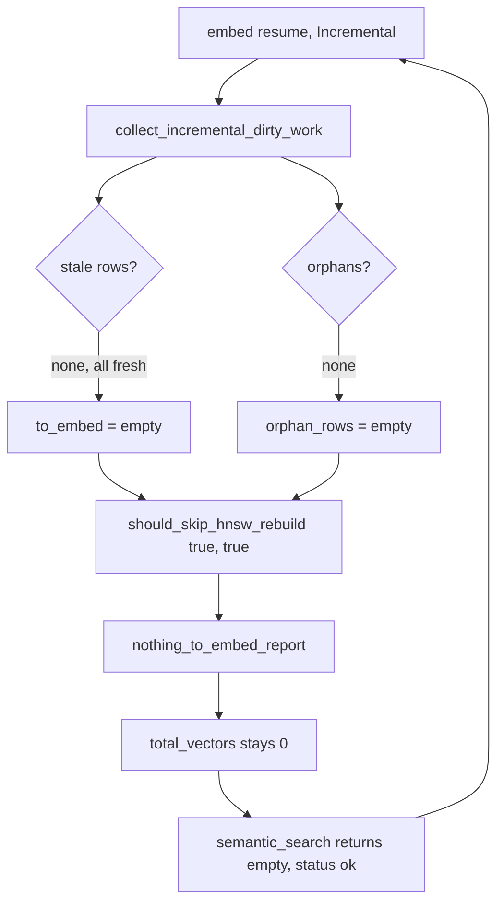

# P0 Embed Resume Deadlock & Agent MCP Misuse — Final Investigation

**Date:** 2026-07-31
**Branch:** `fix/p0-embed-resume-deadlock`
**Worktree:** `.worktrees/p0-embed-resume-deadlock/`
**Status:** Code fix committed (`6affc36`); container rebuild + end-to-end verification pending
**Related transcripts:** `~/.cursor/projects/Users-linh-doan-work-be/agent-transcripts/{55c86289…,d7cdc895…}.jsonl`

---

## Executive summary

Two compounding bugs made the BE monorepo's LeanKG graph look useless to agents, even when it was healthy and reachable. Same prompt, same report (AUTH-VULN-06), two sessions, two outcomes — and both outcomes were wrong in different ways.

| Session | "use leankg" hint? | LeanKG calls | Grep | Effective path |
|---|---|---:|---:|---|
| A (`55c86289…`) | no | 2 (3%) | 23 (35%) | 1 empty `semantic_search` → abandon graph |
| B (`d7cdc895…`) | yes | 8 (14%) | 26 (45%) | 3 schema errors + 3 empty → 81% raw tools |

**1. Product bug** (P0): the embed resume path can hit a fixed point where `embedding_state` reports 628,259 fresh rows but `embedding_vectors` is empty. `should_skip_hnsw_rebuild` reads the dirty set only, so the rebuild is skipped forever and every `semantic_search` / `search_code` returns `status: ok, results: []` in 13s. Reproduced on `/workspace-be` (630,624 elements, 0 vectors).

**2. Agent-contract bugs** (P0–P3): even with the product fix, agents racing `Grep` against the health gate, guessing wrong arg names, and treating the cited file path as a destination rather than a seed. Two sessions produced different wrong answers to the same question.

The product bug is **fixed in code** by `6affc36`. The agent-contract bugs are not. The two together explain why the symptom persisted even after the LeanKG HTTP server was healthy and `leankg-be` was configured.

---

## Part 1 — Product bug: embed resume deadlock

### Impact

`semantic_search` and `search_code` — the two top-of-chain tools every prefer-order rule mandates — return `status: ok, results: []` on an affected project, and the embedder refuses to repair itself. Agents interpret the empty success as "LeanKG has nothing" and revert to `Grep`/`Read`.

Measured on the source transcript: **65 tool calls, 2 LeanKG (3%), 58 raw** (`Grep` 23, `Read` 26, `Glob` 9). Both LeanKG calls landed in the first two turns; after one empty `semantic_search` the graph was never touched again — despite `search_code("CheckUserPermission")` returning 17 correct hits at that same moment.

### Reproduction

```bash
curl -s -X POST 'http://localhost:9699/mcp?project=/workspace-be' \
  -H 'Content-Type: application/json' -H 'Accept: application/json, text/event-stream' \
  -d '{"jsonrpc":"2.0","id":1,"method":"tools/call","params":{"name":"semantic_search",
       "arguments":{"query":"CheckUserPermission merchant login forgot password skip list","limit":10}}}'
```

Actual (13.0s):

```
status: ok        ann_candidate_count: 0        results: []        total_estimate: 0
```

Expected: either results, or a payload that says the vector index is empty.

`embed_control action=status` on the same project:

```
total_elements: 630624      total_vectors: 0            estimated_vector_bytes: 0
considered: 23645           vectors_existing: 23645     to_embed: 0
has_embed_data: true
```

`to_embed: 0` with `total_vectors: 0` is the deadlock signature: the embedder believes it is finished having covered 23,645 of 630,624 elements.

### Root cause

`should_skip_hnsw_rebuild` decides the day-2 no-op purely from the dirty set, never consulting whether any vector actually exists:

```rust
// src/embeddings/build.rs:329 (pre-fix)
pub(crate) fn should_skip_hnsw_rebuild(to_embed_empty: bool, orphan_empty: bool) -> bool {
    to_embed_empty && orphan_empty
}
```

In `BuildMode::Incremental`, `collect_incremental_dirty_work` lists **stale + orphans only** and never re-scans fresh rows (FR-EMBED-RESUME-07). So when `embedding_state` is full of `fresh` rows while `embedding_vectors` is empty:

- `to_embed` = `[]` (no stale rows)
- `orphan_rows` = `[]` (no orphans)
- `should_skip_hnsw_rebuild(true, true)` = `true`
- → `nothing_to_embed_report` (`build.rs:531`), HNSW untouched, ONNX never loaded

Every subsequent resume repeats the same decision. The state is a fixed point with no exit.



**How the state got inconsistent**: `/workspace-be/.leankg/embed_status.json` is a Jul 22 artifact of the Cozo-era run against the now-abandoned 5.3 GB `leankg.db` (Jul 17). Live storage is RocksDB at `/data/leankg-rocksdb/projects/workspace-be-6917453a1780`. The state rows carried across the backend switch; the vectors did not.

### Fix (committed in `6affc36`)

| ID | Change | File | Test |
|----|--------|------|------|
| **A** | `vector_state_inconsistent(vectors_existing, fresh_rows)`; `should_skip_hnsw_rebuild` gains the vector count and refuses to skip when the state table is lying | `src/embeddings/build.rs` | 4 unit |
| **B** | Self-heal: on inconsistency in Incremental mode, escalate to `BuildMode::Full` — with zero vectors that is also the correct amount of work | `src/embeddings/build.rs` | 1 e2e |
| **C** | `semantic_search` emits `vectors_missing: true` + a hint pointing at `search_code` / `find_function` instead of a bare empty result | `src/mcp/handler.rs` | 2 unit |
| **D** | `embed_control status` emits `file_status_stale: true` when a completed `embed_status.json` contradicts the live vector count | `src/embeddings/control.rs`, `src/mcp/server.rs` | 3 unit |

### Two findings that only surfaced during implementation

**1. `build_index_parallel` has the same deadlock — and it is the path Docker uses.**
The fix initially landed only in `run()` (the serial path). `build_index_parallel` (`src/embeddings/build.rs:836`) repeats the identical `should_skip_hnsw_rebuild(to_embed.is_empty(), orphan_rows.is_empty())` decision, and `embed_status.json` on `/workspace-be` records `workers: 8` — so production never touches the serial path. The default-feature build hides this: `embeddings` is off by default (`Cargo.toml`), so `cargo test --lib` compiles neither call site. Both paths now carry the guard and the escalation.

**2. The existing e2e test encoded the deadlock as the expected contract.**
`incremental_build_skips_when_all_rows_fresh` (`tests/embed_build_resume_e2e.rs`) seeds `embedding_state` with fresh rows and **never inserts a vector**, then asserts `embedded_count == 0`. That is the pathological state, asserted as correct — the fix made it fail (`left: 3, right: 0`). Real code only marks a row fresh *after* writing its vector, so the fixture described a state the system cannot legitimately reach. Fixed by seeding `embedding_vectors` alongside the state rows, which preserves the actual requirement (FR-EMBED-RESUME-02: fresh **and** vectors present → cheap no-op, no ONNX load) and keeps that test at 0 embeds.

### Related product fix also in `6affc36`

`docker-compose.enterprise.yml` dropped the silent `/workspace/other2` mount that re-mounted the primary host dir when its env var was unset. Same wrong-project class: mount path → RocksDB project → which graph the agent sees. `tests/enterprise_docker/test_compose_files.sh` now has a regression guard for `/workspace/other2` creeping back.

### Verification — what's been done vs. what hasn't

| # | Check | Result |
|---|-------|--------|
| 1 | 10 new unit tests + 1 new e2e test, all red before the fix | pass |
| 2 | `cargo test --release --lib --features embeddings` | 856 passed, 0 failed |
| 3 | `embed_build_resume_e2e` | 3 passed, 0 failed |
| 4 | Day-2 no-op still skips ONNX (`incremental_build_skips_when_all_rows_fresh`) | pass |
| 5 | Self-heal writes real vectors (`index_size >= 3` after rebuild) | pass |
| 6 | `cargo fmt --check`; `cargo clippy --features embeddings` | clean (one pre-existing `kind` warning) |
| 7 | Pre-commit hook on the amended commit | pass |
| 8 | `embed_control status` shows `file_status_stale: true` on `/workspace-be` | **not yet** — needs container rebuild |
| 9 | `embed_control action=on force_full=true` moves `to_embed` off 0 | **not yet** |
| 10 | The reproduction query returns non-empty `results` | **not yet** |

Items 8–10 require: rebuild binary, rebuild Docker image, restart `leankg-leankg-1`, then re-run. **Not in the commit; tracked as next steps.**

One pre-existing failure in the full suite, **not caused by this change**: `embed_doc_inventory::index_inventory_updates_after_code_index` (`tests/embed_doc_inventory.rs:149`). Reproduced on clean `main` with no Rust changes, single-threaded. Tracked separately.

---

## Part 2 — Agent-contract bugs: 7 root causes

Even with the product fix, the two sessions still produced wrong answers. Sources: transcript forensics on both `.jsonl` files (tool-call sequences; tool *results* are not stored).

### RC1 — Parallel Grep with health gate (primary workflow bug)
**Rule:** health → LeanKG only → Grep/Read only if empty/error.
**Observed:** both sessions run Grep in the **same assistant turn** as `curl :9699/health`. LeanKG never owns discovery.
**Why it happens:** agents parallelize "independent" tools; ticket already names files, so Grep looks free.

### RC2 — Incorrect MCP argument names (primary technical bug in session B)
Confirmed against the live `leankg-be` tool schemas:

| Call the agent made | Schema requires | Outcome |
|---|---|---|
| `get_dependents({symbol: "..."})` | **`file` is required, no `symbol` property** | hard error |
| `get_dependents({file, symbol})` (idx 4) | **`file` only** | empty result, key silently ignored |
| `find_function({function_name: "..."})` | **`name`** | hard error |
| `shortest_path({from, to, max_hops})` | **`source`**, **`target`** | hard error |

3 of 8 calls (37.5%) were schema-rejected. 1 more was schema-loose. The agent retried two with the right names; one retry worked, one returned empty. The doc tables in `~/.ai-tools/skills/using-leankg` and `~/.ai-tools/rules/leankg-graph-first.mdc` use the *old* names (`from`/`to`, `symbol`), so the agent read the docs and copied the wrong arg names. **This is doc drift, not agent error.**

### RC3 — Prefer-order truncated
Mandatory discover chain for BE: `mcp_status` → `get_overview_context` → `concept_search` → `semantic_search` → `search_code` / `find_function` → `get_context` / impact / deps.

Both sessions skipped overview, concept search, and **`get_context`** (the right follow-up after a hit). Session A stopped after one `semantic_search`. Session B got hits but went to `Read` with hand-typed offsets instead of `get_context`.

### RC4 — Skill auto-invoke skipped
`using-leankg` exists and maps to "where is / find logic." Neither session read it. Session A later read `review-security` for the write-up. Rules (`skill-auto-invoke`, `leankg-graph-first`) are present but **soft** — a one-line user hint does not harden them.

### RC5 — Ticket path short-circuit
Report cites exact paths (`constants.go:15-42`, `server.go:760`). Agents treat that as "open these files," which competes with graph-first even when the user says use LeanKG. The strongest cue in the input is the cited file path, not the prompt.

### RC6 — Soft enforcement / no session latch
Nothing in the agent loop:
- Blocks Grep until `mcp_status` succeeds and graph looks like BE (large Go graph).
- Requires `GetMcpTools(server, toolName)` before each new tool.
- Records "LeanKG first satisfied" so later turns do not silently fall back.

### RC7 — Prompt hint insufficient (secondary)
"Use leankg to query first" raised MCP volume and added `GetMcpTools`, but did **not** stop RC1 or RC2. Hint alone is not a fix.

### Non-causes (ruled out for these transcripts)
- LeanKG HTTP down — ruled out (health checked; MCP called)
- Wrong product server (freepeak for BE work) — ruled out (`user-leankg-be`)
- Mac host `project=` on BE tools — ruled out (omit `project` on pre-bound server)
- Missing MCP config — ruled out (`leankg-be` ready, container `?project=`)

A separate class of bug — SSE discovery stripping `?project=` (PR #153) — was not proven from these transcripts (no tool results). Always verify `mcp_status` shows a large BE/Go graph, not a small Rust self-repo.

### Comparison matrix

| Check | Session A | Session B |
|-------|-----------|-----------|
| Health checked | yes | yes |
| Grep same turn as health | yes | yes |
| `GetMcpTools` discover | no | yes |
| `mcp_status` | yes | yes |
| Prefer-order depth | shallow | medium |
| Schema-correct connection tools | n/a | mostly **no** |
| `get_context` | no | no |
| `using-leankg` read | no | no |
| Grep still primary | yes | yes |

---

## Part 3 — What is still open

### Already shipped in `6affc36` (code-level)
- Product P0 (RC-P1): embed resume deadlock, both call sites, with self-heal and diagnostic payload
- Product: silent `/workspace/other2` re-mount + regression test
- All unit + e2e tests green
- Pre-commit fmt + clippy clean

### Not shipped — agent contract (RC1–7, RCs from this doc's Part 2)

| Priority | Action | Where |
|---|---|---|
| **P0** | Rewrite `using-leankg` skill: serial gate, schema cheat-sheet, "no Grep same turn as health" | `~/.ai-tools/skills/using-leankg/SKILL.md` |
| **P0** | Update `leankg-graph-first.mdc`: add the same clauses, plus "cited file is a seed not a destination" | `~/.ai-tools/rules/leankg-graph-first.mdc` |
| **P1** | Accept aliases in LeanKG handlers: `function_name`→`name`, `from`/`to`→`source`/`target`, optional `symbol` on `get_dependents` (resolve via `find_function` + file) | `src/mcp/server.rs` |
| **P1** | Structured invalid-arg errors: `{"error":"invalid_args","expected":[…],"got":[…]}` instead of opaque failure | `src/mcp/server.rs` |
| **P1** | Put required arg names in the first line of each tool description | `src/mcp/tools.rs` |
| **P2** | `kg_agent_bootstrap` one-call: status + overview + optional seed | new tool |
| **P2** | Empty-result envelope: when `semantic_search`/`search_code` return empty, include `next_steps: [...]` | `src/mcp/handler.rs` |
| **P3** | Transcript harness: walk `~/.cursor/projects/*/agent-transcripts/*.jsonl`; fail if Grep before first successful LeanKG discover when health was OK, or if CallMcpTool args ∉ schema | new Rust or JS tool |
| **P3** | CI: dump live schemas vs the skill cheat-sheet, fail on drift | new CI step |

### Not shipped — verification on real data
- Items 8, 9, 10 of the verification table (container rebuild, force_full, reproduction query) are not in the commit. They require running the build on the host, rebuilding the Docker image, restarting `leankg-leankg-1`, then re-running the curl reproductions.

---

## Part 4 — Rollout order (practical)

1. **Today (Part 3 verification):** rebuild binary, rebuild Docker image, restart container, run `embed_control action=on force_full=true project=/workspace-be`, confirm `total_vectors > 0` and the reproduction query returns non-empty `results`.
2. **Same day (Part 3 P1 aliases):** add the four alias keys in `src/mcp/server.rs` with tests. Single small commit, builds on `6affc36`.
3. **Same week (Part 3 P0 skill/rules):** rewrite `using-leankg` and `leankg-graph-first.mdc` with serial gate, schema cheat-sheet, "no Grep same turn as health", `get_context` as the right follow-up to a hit, "cited file is a seed not a destination."
4. **Next (Part 3 P1 errors + P2 bootstrap):** structured invalid-arg errors; optional `kg_agent_bootstrap`.
5. **Ongoing (Part 3 P3):** transcript lint script on local agent logs; CI schema-dump vs skill table.

---

## Part 5 — Success criteria (measurable)

A future AUTH-VULN-style BE session should show:

1. Turn 1: health only (or health + `GetMcpTools` / `mcp_status`) — **no Grep/Read**.
2. `mcp_status` confirms BE-scale graph before search.
3. Discover tools use schema-correct args (`name`, `source`/`target`, `file` for dependents).
4. At least one `get_context` (or equivalent) before bulk file reads.
5. Grep/Read only after LeanKG empty/error, or for non-indexed artifacts (charts, raw curl to stage).
6. User one-liner "use leankg" optional — default rules already enforce the path.

Concrete targets: **MCP calls ≥ 5**, **Grep-before-MCP = 0**, **≥ 1 `get_context` per session**, **CallMcpTool args ⊂ schema = 100%**.

---

## Appendix A — Top tool arg cheat-sheet (session B failures)

| Tool | Required / common args |
|------|------------------------|
| `mcp_status` | `{}` (omit `project` on pre-bound BE server) |
| `semantic_search` | `query`, optional `limit` |
| `search_code` | `query` |
| `find_function` | **`name`** (not `function_name`), optional `file` |
| `get_dependents` | **`file`** (not `symbol`) |
| `get_context` | `file` and/or symbol fields per schema |
| `shortest_path` | **`source`**, **`target`**, optional `max_hops` |

## Appendix B — Stronger human prompt (pasteable)

```text
Use LeanKG MCP first for all code navigation in this BE workspace.
1) curl :9699/health — if fail, then Grep/Read only.
2) GetMcpTools(pattern="leankg-be"); CallMcpTool server from that result.
3) mcp_status — confirm large Go/BE graph (not Rust self-repo). Do not pass Mac host project=.
4) GetMcpTools(server, toolName) before each new tool; use exact inputSchema property names.
5) Prefer: concept_search → semantic_search → search_code/find_function → get_context.
6) Do NOT Grep/Glob/Read in the same turn as health or before mcp_status + one discover call.
```
