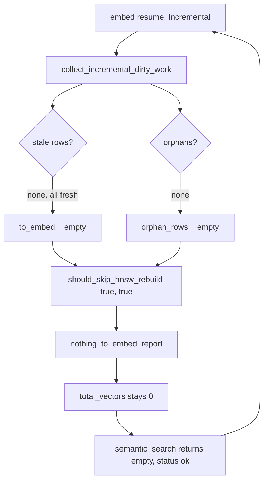

# P0: Embed resume deadlock — mega graph silently unsearchable

**Severity**: P0
**Status**: Open
**Found**: 2026-07-31, via Cursor session transcript `55c86289-1709-49c1-9c88-99baa35c451d` (BE monorepo)
**Affected**: `/workspace-be` (630,624 elements, 0 vectors), any project whose `embedding_state` rows outlive its `embedding_vectors`
**Branch**: `fix/p0-embed-resume-deadlock`

## Impact

`semantic_search` and `concept_search` — the two tools every LeanKG prefer-order rule mandates as the *first* discovery hops — return `status: ok` with `results: []` on an affected project, and the embedder refuses to repair itself. Agents interpret the empty success as "LeanKG has nothing" and revert to `Grep`/`Read` for the rest of the session.

Measured on the source transcript: **65 tool calls, 2 LeanKG (3%), 58 raw** (`Grep` 23, `Read` 26, `Glob` 9). Both LeanKG calls landed in the first two turns; after one empty `semantic_search` the graph was never touched again — despite `search_code("CheckUserPermission")` returning 17 correct hits at that same moment.

## Reproduction

```bash
curl -s -X POST 'http://localhost:9699/mcp?project=/workspace-be' \
  -H 'Content-Type: application/json' -H 'Accept: application/json, text/event-stream' \
  -d '{"jsonrpc":"2.0","id":1,"method":"tools/call","params":{"name":"semantic_search",
       "arguments":{"query":"CheckUserPermission merchant login forgot password skip list","limit":10}}}'
```

Actual (13.0s):

```
status: ok        ann_candidate_count: 0        results: []        total_estimate: 0
```

Expected: either results, or a payload that says the vector index is empty.

`embed_control action=status` on the same project:

```
total_elements: 630624      total_vectors: 0            estimated_vector_bytes: 0
considered: 23645           vectors_existing: 23645     to_embed: 0
has_embed_data: true
```

`to_embed: 0` with `total_vectors: 0` is the deadlock signature: the embedder believes it is finished having covered 23,645 of 630,624 elements.

## Root cause

`should_skip_hnsw_rebuild` decides the day-2 no-op purely from the dirty set, never consulting whether any vector actually exists:

```rust
// src/embeddings/build.rs:329
pub(crate) fn should_skip_hnsw_rebuild(to_embed_empty: bool, orphan_empty: bool) -> bool {
    to_embed_empty && orphan_empty
}
```

In `BuildMode::Incremental`, `collect_incremental_dirty_work` lists **stale + orphans only** and never re-scans fresh rows (FR-EMBED-RESUME-07, `src/embeddings/build.rs:595-598`). So when `embedding_state` is full of `fresh` rows while `embedding_vectors` is empty:

- `to_embed` = `[]` (no stale rows)
- `orphan_rows` = `[]` (no orphans)
- `should_skip_hnsw_rebuild(true, true)` = `true`
- → `nothing_to_embed_report` (`build.rs:531`), HNSW untouched, ONNX never loaded

Every subsequent resume repeats the same decision. The state is a fixed point with no exit.



**How the state got inconsistent**: `/workspace-be/.leankg/embed_status.json` is a Jul 22 artifact of the Cozo-era run against the now-abandoned 5.3 GB `leankg.db` (Jul 17). Live storage is RocksDB at `/data/leankg-rocksdb/projects/workspace-be-6917453a1780`. The state rows carried across the backend switch; the vectors did not. Whatever the trigger, the embedder must be able to recover from "state says fresh, vectors are gone" rather than trusting the state table unconditionally.

**Secondary — the status API launders the stale file.** `embed_job_status` (`src/embeddings/control.rs:286-308`) reads `embed_status.json` and republishes it verbatim as `file_status`, so an operator sees `{"embedded":628259,"status":"completed"}` next to `total_vectors: 0` with nothing marking the contradiction.

**Secondary — empty is indistinguishable from broken.** `semantic_search` (`src/mcp/handler.rs:5046-5070`) emits no signal when the vector table is empty. `concept_search` at least sets `fallback_used: true`; `semantic_search` sets nothing, so a caller cannot tell "indexed, genuinely no match" from "this project has no vectors."

## Fix plan (TDD, red first)

| ID | Change | File | Test |
|----|--------|------|------|
| **A** | `vector_state_inconsistent(vectors_existing, fresh_rows)`; `should_skip_hnsw_rebuild` gains the vector count and refuses to skip when the state table is lying | `src/embeddings/build.rs` | unit ×4 |
| **B** | Self-heal: on inconsistency in Incremental mode, escalate to `BuildMode::Full` — with zero vectors that is also the correct amount of work | `src/embeddings/build.rs` | e2e ×1 |
| **C** | `semantic_search` emits `vectors_missing: true` + `hint` when the vector table is empty | `src/mcp/handler.rs` | unit ×2 |
| **D** | `embed_job_status` / `embed_control status` emits `file_status_stale: true` when a completed `embed_status.json` contradicts the live vector count | `src/embeddings/control.rs`, `src/mcp/server.rs` | unit ×3 |

Order: all tests red first, then implement A→D.

### Two findings that only surfaced during implementation

**1. `build_index_parallel` has the same deadlock — and it is the path Docker uses.**
The fix initially landed only in `run()` (the serial path). `build_index_parallel` (`src/embeddings/build.rs:836`) repeats the identical `should_skip_hnsw_rebuild(to_embed.is_empty(), orphan_rows.is_empty())` decision, and `embed_status.json` on `/workspace-be` records `workers: 8` — so production never touches the serial path. The default-feature build hides this: `embeddings` is off by default (`Cargo.toml`), so `cargo test --lib` compiles neither call site. Both paths now carry the guard and the escalation.

**2. The existing e2e test encoded the deadlock as the expected contract.**
`incremental_build_skips_when_all_rows_fresh` (`tests/embed_build_resume_e2e.rs`) seeds `embedding_state` with fresh rows and **never inserts a vector**, then asserts `embedded_count == 0`. That is the pathological state, asserted as correct — the fix made it fail (`left: 3, right: 0`). Real code only marks a row fresh *after* writing its vector, so the fixture described a state the system cannot legitimately reach. Fixed by seeding `embedding_vectors` alongside the state rows, which preserves the actual requirement (FR-EMBED-RESUME-02: fresh **and** vectors present → cheap no-op, no ONNX load) and keeps that test at 0 embeds.

## Verification

Run: `cargo test --release --features embeddings` (the feature is **required** — `--lib` alone skips every affected line).

| # | Check | Result |
|---|-------|--------|
| 1 | 10 new unit tests + 1 new e2e test, all red before the fix | pass |
| 2 | `--lib --features embeddings` | 856 passed, 0 failed |
| 3 | `embed_build_resume_e2e` | 3 passed, 0 failed |
| 4 | Day-2 no-op still skips ONNX (`incremental_build_skips_when_all_rows_fresh`) | pass |
| 5 | Self-heal writes real vectors (`index_size >= 3` after rebuild) | pass |
| 6 | `cargo fmt --check`; `cargo clippy --features embeddings` | clean (one pre-existing `kind` warning) |
| 7 | Full suite, all targets | all green except one pre-existing failure |

Pre-existing failure, **not** caused by this change: `embed_doc_inventory::index_inventory_updates_after_code_index` (`tests/embed_doc_inventory.rs:149`, `load_latest_inventory` returns `None` after `index_file_sync`). Reproduced identically on clean `main` with no Rust changes present, single-threaded. Tracked separately.


Still to do against a rebuilt container, on `/workspace-be` (630k elements, expect a long full embed):

- `embed_control action=status` shows `file_status_stale: true` before the rebuild
- `embed_control action=on force_full=true` moves `to_embed` off 0 and `total_vectors` above 0
- the reproduction query returns non-empty `results`
- an un-embedded project reports `vectors_missing: true` + `hint` instead of a bare `results: []`


### Out of repo (tracked separately)

The agent-side rules amplified the outage and are not fixable here:

- `~/.ai-tools/skills/using-leankg/SKILL.md` — "If LeanKG returns EMPTY results → fall back to Grep/Glob/Read" is written at *whole-skill* scope, so one empty `semantic_search` legally terminates the `concept_search → semantic_search → search_code → find_function` chain. Should be per-tool: empty semantic/concept must fall through to `search_code`/`find_function`; only both empty permits Grep.
- `~/.ai-tools/rules/leankg-graph-first.mdc` — same clause at step 6; also the "Gate (ALWAYS FIRST)" health check was issued in the same parallel batch as `Grep`/`Glob` in the source transcript, so it never gated anything.

## Verification

1. `cargo test --release embed` green, including the new red tests.
2. `embed_control action=on force_full=true project=/workspace-be` moves `to_embed` off 0.
3. `total_vectors` > 0 in `embed_control action=status`.
4. The reproduction query returns non-empty `results`.
5. A project with genuinely nothing to do still hits `nothing_to_embed_report` (no regression on the day-2 no-op cost).
