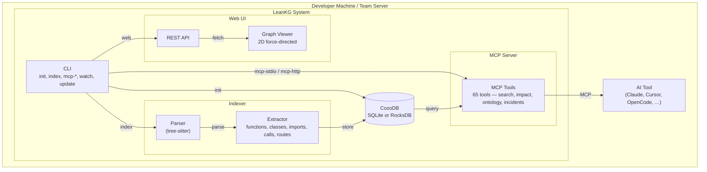
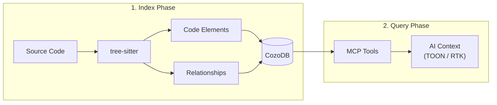

# LeanKG Architecture

> **HLD lives in [`prd.md`](prd.md) Section 6.4–6.9.** This page is a short C4 overview only.

## System Design

### C4 Model - Level 2: Component Diagram

### Data Flow

## See also

- Full HLD, data model, vacuum/self-test flows: [`prd.md`](prd.md) §6
- Product requirements & status: [`prd.md`](prd.md)
- Roadmap: [`roadmap.md`](roadmap.md)
