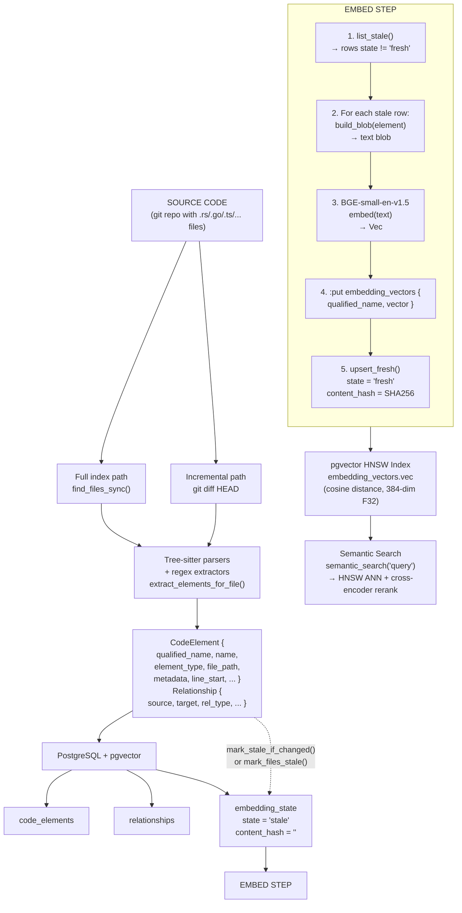
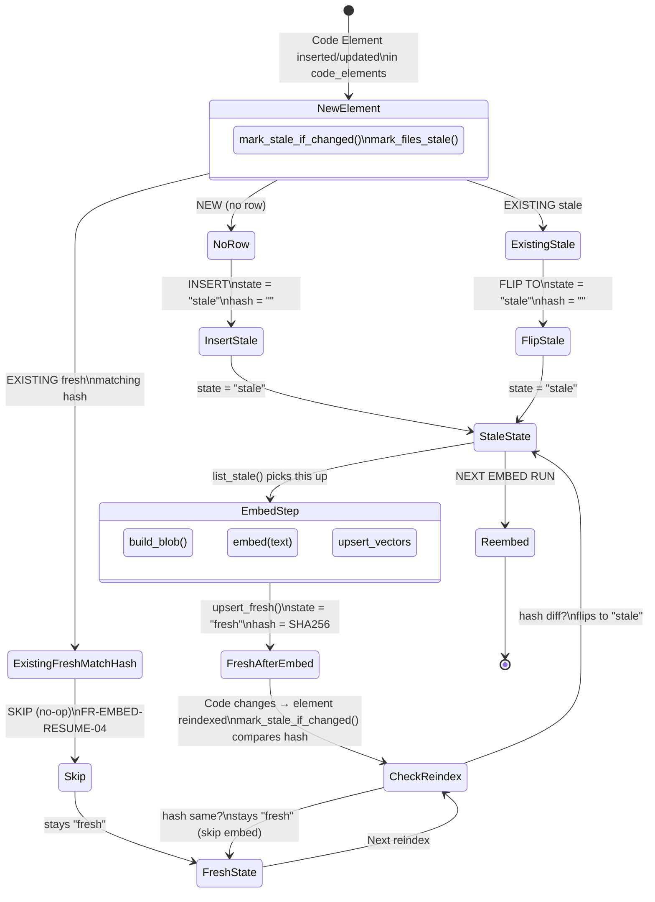
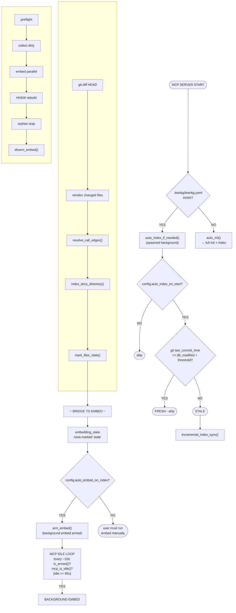
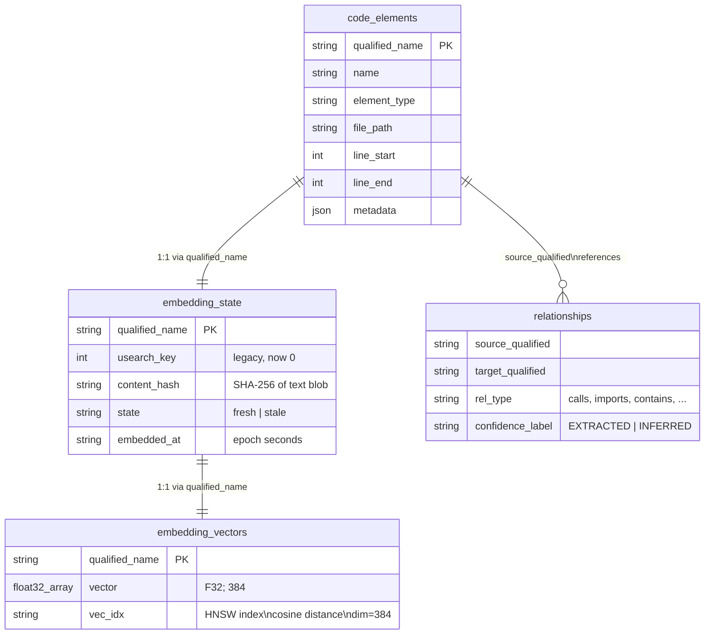

# LeanKG Index, Embed & Staleness — End-to-End Flows

## Table of Contents

1. [Architecture Overview](#architecture-overview)
2. [Index Flow](#index-flow)
3. [Embed Flow](#embed-flow)
4. [Staleness Detection](#staleness-detection)
5. [Reindex / Re-embed](#reindex--re-embed)
6. [MCP Auto-Index & Background Embed](#mcp-auto-index--background-embed)
7. [Configuration Reference](#configuration-reference)
8. [Diagrams](#diagrams)

---

## Architecture Overview

LeanKG has two independent but coordinated pipelines:

| Pipeline | Parser | Storage | Staleness mechanism |
|----------|--------|---------|---------------------|
| **Index** | tree-sitter + regex extractors | `code_elements` + `relationships` (PostgreSQL) | Git commit timestamps vs DB modification time |
| **Embed** | ONNX Runtime (BGE-small-en-v1.5) / fastembed | `embedding_vectors` (pgvector HNSW) + `embedding_state` (PostgreSQL) | Per-element SHA-256 content hash in `embedding_state` |

The bridge: after every index operation, the indexer flags changed elements as `stale` in `embedding_state`. The embed step reads `stale` rows and recomputes vectors only for those.

---

## Index Flow

### Full Index (`leankg index`)

**Entry point:** `src/main.rs:1337` → `index_codebase()`

```
┌────────────────────────────────────────────────────────────────────┐
│                        leankg index                                │
└────────────────────────────────────────────────────────────────────┘
                              │
                              ▼
┌────────────────────────────────────────────────────────────────────┐
│  1. init_db()           Connect to PostgreSQL backend             │
│  2. ParserManager::new()  Init tree-sitter parsers                 │
│  3. Load leankg.yaml    Project config                             │
└────────────────────────────────────────────────────────────────────┘
                              │
                              ▼
┌────────────────────────────────────────────────────────────────────┐
│  find_files_sync()     Walk project root with ignore::WalkBuilder  │
│                        Filter by extension: go,ts,js,py,rs,java,   │
│                        kt,kts,dart,swift,m,mm,h,tf,yml,yaml,json,  │
│                        toml,mod,xml                                │
│                        Skip: .git, node_modules, target, build,    │
│                        dist, vendor, .leankg, etc.                 │
│                        Cap: 2 MiB per file (LEANKG_MAX_FILE_SIZE)  │
└────────────────────────────────────────────────────────────────────┘
                              │
                              ▼
┌────────────────────────────────────────────────────────────────────┐
│  index_files_parallel_with_typed_resolve()   rayon par_iter()      │
│  src/indexer/mod.rs:713                                            │
│                                                                    │
│  Per-file (in parallel):                                          │
│    extract_elements_for_file()  src/indexer/mod.rs:390             │
│    ├─ .tf     → TerraformExtractor                                │
│    ├─ .swift  → SwiftExtractor (regex, no tree-sitter-swift)      │
│    ├─ .m/.mm/.h → ObjCExtractor (regex)                            │
│    ├─ CICD YAML files → CicdYamlExtractor                         │
│    ├─ package.json/Cargo.toml/go.mod → ConfigExtractor            │
│    ├─ Android XML → Manifest/Resources/Navigation/Layout          │
│    ├─ .kt      → EntityExtractor + Room + Hilt + Nav + Annotations│
│    └─ .go/.ts/.py/.rs/.java/.dart → tree-sitter EntityExtractor   │
│    └─ call_graph::extract_calls_with_resolution()                  │
└────────────────────────────────────────────────────────────────────┘
                              │
                              ▼
┌────────────────────────────────────────────────────────────────────┐
│  Post-extraction:                                                  │
│  ├─ generate_physical_structure()  Project/File/Directory elements │
│  ├─ resolve_call_edges_inline()    Resolve target names in batch   │
│  ├─ detect_processes()             Process/execution flow nodes    │
│  ├─ FrameworkDetector::detect()    Framework nodes                 │
│  ├─ lsp::apply_typed_resolve()     Go/TS typed call resolution     │
│  └─ extract_microservice_rels()    gRPC service-to-service edges   │
└────────────────────────────────────────────────────────────────────┘
                              │
                              ▼
┌────────────────────────────────────────────────────────────────────┐
│  DB Insert (batched, 5000 chunks):                                 │
│  ├─ graph.insert_elements_with()   → code_elements                │
│  └─ graph.insert_relationships_with() → relationships             │
│                                                                    │
│  AFTER insert (#[cfg(feature = "embeddings")]):                   │
│    mark_stale_if_changed()         SHA-256 hash per element        │
│    → embedding_state rows marked stale only if content changed    │
│    src/indexer/mod.rs:853-873                                      │
└────────────────────────────────────────────────────────────────────┘
                              │
                              ▼
┌────────────────────────────────────────────────────────────────────┐
│  refresh_index_inventory()   Metadata refresh                     │
│  (optional) index_docs_directory()   docs/ → documented_by edges  │
│  (optional) ontology_control sync   concepts/workflows → DB       │
└────────────────────────────────────────────────────────────────────┘
```

### Incremental Index (`leankg index --incremental` or MCP auto-index)

**Entry point:** `src/indexer/mod.rs:1239` → `incremental_index_sync()`

```
┌────────────────────────────────────────────────────────────────────┐
│  incremental_index_sync(graph, parser_manager, root_path)          │
└────────────────────────────────────────────────────────────────────┘
                              │
                              ▼
┌────────────────────────────────────────────────────────────────────┐
│  git_workspace::workspace_changed_files(root)                      │
│    git diff --name-status HEAD   → modified, added, deleted        │
│  git_workspace::workspace_untracked_files(root)                    │
│    git ls-files --others --exclude-standard  → untracked           │
└────────────────────────────────────────────────────────────────────┘
                              │
                              ▼
┌────────────────────────────────────────────────────────────────────┐
│  Phase 1: Delete     removed elements + relationships for deleted  │
│                      files (immediate per-file SQL delete)         │
│                                                                    │
│  Phase 2: Dependent discovery  (skipped on mega-graphs)           │
│    Load all relationships, find_dependents() for each changed file │
│    → files that import/reference changed files get reindexed too   │
│                                                                    │
│  Phase 3: Categorize                                               │
│    needs_remove_files = modified + dependents (have old DB rows)   │
│    new_files_to_process = added + untracked (no DB rows)           │
│                                                                    │
│  Phase 4: Index loop                                               │
│    For each file:                                                   │
│      new_files        → reindex_new_file_sync()    (insert only)   │
│      needs_remove     → reindex_skip_remove_sync() (insert only)   │
│      (bulk rm deferred to end — one SQL scan vs N scans)          │
│                                                                    │
│  Phase 5: Bulk remove   graph.remove_elements_by_files_bulk()      │
│            + graph.remove_relationships_by_files_bulk()            │
│            One bulk SQL query vs 3K+ individual per-file scans     │
│                                                                    │
│  Phase 6: graph.clear_cache()    Single cache invalidation         │
│                                                                    │
│  Phase 7: mark_files_stale()     All touched QNs → embedding_state │
│                                                                    │
│  Phase 8: refresh_index_inventory()                                │
└────────────────────────────────────────────────────────────────────┘
```

---

## Embed Flow

### Embed Command (`leankg embed`)

**Entry point:** `src/main.rs:5528` → `run_embed()`

```
┌────────────────────────────────────────────────────────────────────┐
│  leankg embed [--full] [--background] [--wait] [--init]            │
│                               [--status] [--cancel] [--workers N]  │
└────────────────────────────────────────────────────────────────────┘
                              │
              ┌───────────────┼───────────────┐
              ▼               ▼               ▼
          --init          --status          --cancel
         download         print             SIGTERM
         models           progress          bg process
              │               │               │
              └───────────────┴───────────────┘
                              │
                    (none of the above)
                              │
               ┌──────────────┴──────────────┐
               ▼                             ▼
         --background / default        --wait (synchronous)
               │                             │
               ▼                             ▼
┌──────────────────────┐        ┌──────────────────────┐
│ spawn detached child │        │ run_embed_worker()   │
│ re-invoke self with  │        │ in-process, blocking │
│ --background flag    │        └──────────────────────┘
└──────────────────────┘
         │
    child process:
    run_embed_worker()
         │
         ▼
================================================================
              run_embed_worker()  /  run()  /  build_index_parallel()
================================================================
```

### Embed Build — Incremental Mode (default)

**File:** `src/embeddings/build.rs:359` → `collect_incremental_dirty_work()`

```
┌────────────────────────────────────────────────────────────────────┐
│  Phase 0: Resume Preflight                                         │
│    embed_resume_preflight()  → vectors_existing, fresh, stale,     │
│                                has_embed_data                      │
│    (cheap single-digit row counts, no table scan)                  │
└────────────────────────────────────────────────────────────────────┘
                              │
                              ▼
┌────────────────────────────────────────────────────────────────────┐
│  Phase 1: Collect Dirty Work                                       │
│                                                                    │
│  state::list_stale(db)                                             │
│    SQL: SELECT * FROM embedding_state WHERE state != 'fresh'       │
│    Returns rows with state="stale" + new placeholders              │
│                                                                    │
│  state::list_orphans(db)                                           │
│    SQL: state rows whose QN not in code_elements                   │
│                                                                    │
│  IF stale_rows > 2 000:  Paginated scan of all code_elements,     │
│    filtered by stale QN HashSet. O(elements) single pass.          │
│  ELSE:                  Per-row graph.find_element() for each      │
│    stale QN. O(stale) individual lookups.                          │
│                                                                    │
│  Filter by type_filter (e.g., only function,method on mega-graphs)│
│  Build text_blob + SHA-256 hash for each element                   │
│  → Vec<WorkItem>                                                   │
└────────────────────────────────────────────────────────────────────┘
                              │
                              ▼
┌────────────────────────────────────────────────────────────────────┐
│  Phase 2: Early Exit Checks                                        │
│                                                                    │
│  to_embed.is_empty() && no orphans  → skip (HNSW unchanged)       │
│  to_embed.is_empty() && has orphans  → reap orphans only (no ONNX)│
└────────────────────────────────────────────────────────────────────┘
                              │
                              ▼
┌────────────────────────────────────────────────────────────────────┐
│  Phase 3: Embed (sequential run() path)                            │
│                                                                    │
│  Embedder::new()  → fastembed BGE-small-en-v1.5, 384-dim           │
│                                                                    │
│  should_use_incremental_hnsw_puts(to_embed, vectors_existing)?     │
│    YES (dirty <= total/20, min 1000):  keep HNSW, incremental :put│
│    NO:  drop HNSW index, bulk insert, recreate HNSW                │
│                                                                    │
│  For each batch (batch_size):                                      │
│    1. embedder.embed(&texts)  → Vec<Vec<f32>>                     │
│    2. upsert_vectors(db, pairs)  → :put embedding_vectors          │
│    3. state::upsert_fresh(db, batch)  → mark state="fresh"        │
│    4. wait_for_embed_rss_headroom()  → macOS backpressure         │
│    5. partial_slice_gate()  → yield when MCP active                │
└────────────────────────────────────────────────────────────────────┘
                              │
                              ▼
┌────────────────────────────────────────────────────────────────────┐
│  Phase 4: HNSW Rebuild (if was dropped)                            │
│    state::create_hnsw_index(db)                                    │
│    SQL: pgvector HNSW index on embedding_vectors                   │
│           (dim: 384, dtype: F32, distance: cosine,                 │
│            m: 50, ef_construction: 20)                             │
└────────────────────────────────────────────────────────────────────┘
                              │
                              ▼
┌────────────────────────────────────────────────────────────────────┐
│  Phase 5: Orphan Reap                                              │
│    For each orphan:                                                │
│    1. :rm embedding_vectors {qualified_name}                       │
│    2. :rm embedding_state {qualified_name}                         │
└────────────────────────────────────────────────────────────────────┘
                              │
                              ▼
┌────────────────────────────────────────────────────────────────────┐
│  Phase 6: refresh_index_inventory() → BuildReport                  │
└────────────────────────────────────────────────────────────────────┘
```

### Embed Build — Full Mode (`leankg embed --full`)

Same as incremental but Phase 1 calls `collect_work_items()` which walks **all** `code_elements` (paginated on mega-graphs), builds blobs for every embeddable type, and ignores `embedding_state` staleness entirely. Orphans are detected by diffing the work list against all existing state rows.

### Embed Build — Parallel (automatic for >1 worker)

**File:** `src/embeddings/build.rs:789` → `build_index_parallel()`

```
┌────────────────────────────────────────────────────────────────────┐
│  build_index_parallel(graph, opts, workers)                        │
│                                                                    │
│  Memory plan: plan_embed_memory(workers, batch_size, max_rss_mb)   │
│    BASE_MB: 900   PER_WORKER_MB: 350   max_workers: 8             │
│    batch_size: 8..256 based on available RSS                      │
│    channel_capacity: workers × batch_size × 2 (clamped)           │
│                                                                    │
│  Architecture:                                                     │
│    ┌──────────┐  ┌──────────┐  ┌──────────┐                      │
│    │ Worker 1 │  │ Worker 2 │  │ Worker N │   (rayon threads)     │
│    │DirectEmb │  │DirectEmb │  │DirectEmb │   each owns ONNX      │
│    │ infer  ──┤  │ infer  ──┤  │ infer  ──┤   session             │
│    └────┬─────┘  └────┬─────┘  └────┬─────┘                      │
│         │              │              │                            │
│         └──────────────┼──────────────┘                            │
│                        │                                           │
│                crossbeam bounded channel                           │
│                        │                                           │
│                        ▼                                           │
│               ┌────────────────┐                                   │
│               │ Writer Thread  │                                   │
│               │ accumulate up  │                                   │
│               │ to UPSERT_CHUNK│  (default 5000)                   │
│               │ → import_relations()  direct NamedRows insert      │
│               │ → upsert_fresh()  per batch                       │
│               └────────────────┘                                   │
│                                                                    │
│  Throughput: 800-1500 vectors/sec on 10-core (vs 70-100 serial)   │
└────────────────────────────────────────────────────────────────────┘
```

### Text Blob Construction

**File:** `src/embeddings/text_blob.rs`

Each `CodeElement` gets a short text blob for the BGE-small-en-v1.5 model (384-dim, 512-token max):

| Element type | Blob components |
|-------------|-----------------|
| `function`, `method`, `class`, `struct`, `trait`, `interface` | `qualified_name` + `name` + doc_comment/signature/parameters + file_path |
| `file` | `qualified_name` + `name` + `file_path` |
| `document`, `doc_section` | title + heading_path + first_paragraph |
| `domain_entity`, `service`, `workflow` (ontology) | name + aliases + description + element_type |
| `cluster`, `process`, etc. | **Skipped** (no embedding) |

Blob length capped at 1500 chars (500 on `LEANKG_EMBED_FAST=1`).

Content hash: SHA-256 hex digest of the blob bytes, stored in `embedding_state.content_hash`.

---

## Staleness Detection

LeanKG uses a **two-tier** staleness system:

### Tier 1: Index Freshness (git-based)

Used by MCP server to decide when to auto-reindex.

**File:** `src/mcp/server.rs:2080` → `auto_index_if_needed()`

```
Algorithm:
  1. Load leankg.yaml → config.mcp.auto_index_threshold_minutes
  2. Get last git commit timestamp:
     git_workspace::workspace_last_commit_time()
     → walks all nested git repos, returns max commit time
  3. Get DB file modification time:
     fs::metadata(.leankg/leankg.db).modified()
  4. Compare:
     IF last_commit_time <= db_modified + threshold_seconds
       → Index is FRESH (skip)
     ELSE
       → Index is STALE (run incremental_index_sync())
```

**Env overrides:**
- `LEANKG_SKIP_FRESHNESS_CHECK=1` → skip entirely (mega-graph OOM escape hatch)
- `require_git_for_auto_index: false` → always treat as stale

### Tier 2: Embedding Freshness (content-hash based)

Tracks per-element embedding freshness via the `embedding_state` table.

**Table schema** (`src/embeddings/state.rs:25`):
```
embedding_state {
  qualified_name: String =>
  usearch_key: Int,       // legacy, now always 0
  content_hash: String,   // SHA-256 of text blob
  state: String,          // "fresh" | "stale" | ""
  embedded_at: String     // epoch seconds
}
```

**Lifecycle:**

```
INDEX PHASE
───────────
index_files_parallel() → mark_stale_if_changed()
  For each element:
    1. build_blob(element) → text
    2. content_hash_for(text) → SHA-256
    3. Look up existing embedding_state row
    4. IF state == "fresh" AND hash matches → SKIP (FR-EMBED-RESUME-04)
    5. ELSE → mark_stale_for_qualified_names() → state = "stale"

incremental_index_sync() → mark_files_stale()
  Bulk: query all QNs for touched file paths in code_elements,
  then mark_stale_for_qualified_names() on all of them.

EMBED PHASE
───────────
list_stale() → all rows where state != "fresh"
list_orphans() → rows whose QN no longer in code_elements

upsert_fresh() → after successful embed: state = "fresh", content_hash = current

ORPHAN REAP
───────────
Delete vectors from embedding_vectors + delete state rows
```

**How to query staleness:**

```bash
# CLI: check embed job status
cargo run --release -- embed --status

# MCP: get embed resume preflight
embed_resume_preflight() → { vectors_existing, fresh, stale, other, has_embed_data }

# MCP: full graph report includes staleness
get_graph_report()

# MCP: detect code-level broken relationships
check_consistency() → BROKEN / STALE / CURRENT

# Raw query (for debugging) — legacy Datalog-style script, translated to SQL
# Count stale rows
cargo run --release -- query "?[count(stale)] := *embedding_state[..., stale, ...], stale != \"fresh\""
```

---

## Reindex / Re-embed

### Reindex

**When to reindex:** Code has changed since last index (new commits, edited files).

**Options:**

| Command | What it does |
|---------|-------------|
| `leankg index` | Full reindex (all files, all elements). Simpler, slower. |
| `leankg index --incremental` | Git-diff based. Only changed/added/deleted files. |
| MCP `mcp_index(incremental=true)` | Same as `--incremental`, via MCP tool. |
| MCP auto-index on startup | `auto_index_if_needed()` runs `incremental_index_sync()`. |

**Incremental reindex detail** (`src/indexer/mod.rs:1239`):
1. `git diff --name-status HEAD` → modified, added, deleted
2. `git ls-files --others --exclude-standard` → untracked
3. Delete rows for deleted files (immediate)
4. Find dependents of changed files (files that import them) — skipped on mega-graphs
5. Re-extract all changed + dependent files
6. Bulk remove old rows for modified files (one bulk SQL query)
7. `mark_files_stale()` — flag embedding_state rows for re-embed

### Re-embed

**When to re-embed:** After reindex, or when vectors are missing/stale.

**Options:**

| Command | What it does |
|---------|-------------|
| `leankg embed` | Incremental: only embed stale + missing rows. |
| `leankg embed --full` | Full rebuild: re-embed **every** embeddable element. |
| `leankg embed --background` | Spawn detached background process. |
| `leankg embed --wait` | Run synchronously in foreground. |
| `leankg embed --workers 4` | Parallel inference with N workers. |
| `leankg embed --batch-size 64` | Vectors per inference batch. |
| `leankg embed --types "function,method"` | Only embed specific element types. |
| `leankg embed --status` | Check progress of running background embed. |
| `leankg embed --cancel` | Stop background embed. |

**Incremental re-embed detail:**
1. `list_stale()` → get all rows with `state != "fresh"`
2. If stale count > 2000: paginated scan of `code_elements` + HashSet join
3. If stale count <= 2000: per-row `find_element()` lookups
4. `should_use_incremental_hnsw_puts()`:
   - Dirty <= total_vectors / 20 (min 1000): incremental `:put` (keep HNSW)
   - Otherwise: drop HNSW → bulk insert → recreate HNSW
5. Embed in batches, `upsert_fresh()` per batch (FR-EMBED-RESUME-03: crash-safe)
6. Reap orphans

**Full re-embed detail:**
1. Walk all `code_elements` (paginated for >50k elements)
2. Build blob + hash for every embeddable element
3. `orphan_rows_from_work()`: state rows not in work list → reaped
4. Drop HNSW → bulk insert all vectors → recreate HNSW
5. Reap orphans

### Typical Workflow After Code Changes

```bash
# 1. Reindex changed files
cargo run --release -- index --incremental

# 2. Re-embed stale vectors (incremental, default)
cargo run --release -- embed

# Or do both in one go:
cargo run --release -- index --incremental && cargo run --release -- embed

# MCP path (auto):
# The MCP server auto-detects staleness on startup and runs:
#   auto_index_if_needed() → incremental_index_sync() → mark_files_stale()
# Then the background embed scheduler picks up stale rows:
#   arm_embed() → spawn_background_embed() → build_index_parallel()
```

---

## MCP Auto-Index & Background Embed

### Auto-Index Flow

**File:** `src/mcp/server.rs:1980-2240`

```
MCP Server Start
       │
       ▼
Has .leankg/leankg.yaml?
  ├─ NO  → auto_init() → mcp_init (full init + index)
  └─ YES → auto_index_if_needed() (spawned background task)
              │
              ▼
         config.mcp.auto_index_on_start?
           ├─ false → skip
           └─ true  →
              │
              ▼
         LEANKG_SKIP_FRESHNESS_CHECK?
           ├─ yes → skip
           └─ no  →
              │
              ▼
         Compare git last_commit_time vs db modified time
           ├─ FRESH (commit <= db_modified + threshold) → skip
           └─ STALE →
              │
              ▼
         incremental_index_sync()  (git diff based)
           ├─ success → resolve_call_edges() → index_docs_directory()
           └─ failure → fallback: find_files_sync() + index_file_sync() per file
              │
              ▼
         refresh_ontology_after_index()
```

### Background Embed Flow

**File:** `src/embeddings/control.rs`

```
MCP Idle Loop (every ~10s)
       │
       ▼
  is_armed()?
    ├─ false → nothing
    └─ true  →
       │
       ▼
  mcp_is_idle_for_embed()?  (idle >= LEANKG_EMBED_IDLE_AFTER_SECS, default 60s)
    ├─ false → wait
    └─ true  →
       │
       ▼
  spawn_background_embed()
       │
       ▼
  embed_resume_preflight()  → stale/fresh counts
       │
       ▼
  collect_incremental_dirty_work()  → Vec<WorkItem>
       │
       ▼
  build_index_parallel(graph, opts, workers)
       │
       ▼
  disarm_embed() (auto-disarm on completion)
```

---

## Operational Guide (real deployments)

### Two-workspace local convention

The local MCP container always mounts exactly two project roots:

| Container mount | Host dir |
|-----------------|----------|
| `/workspace`    | the LeanKG repo (or your primary project tree) |
| `/workspace-be` | the side-by-side monorepo (e.g. `/Users/<you>/work/be`) |

Every MCP tool call that targets the side repo **must** pass `project=/workspace-be` (the container path, never the host path).

### In-process embed can OOM on a mega-graph

MCP already holds both `/workspace` + `/workspace-be` RocksDBs (~5–6 GB RSS before any embedding). `embed_control action=on` embeds inside that same process (RocksDB is single-writer per path). With `LEANKG_EMBED_MAX_MB=0` (no cap) and 4–6 workers, the embed pushes past the container `mem_limit` → exit 137 / restart loop. This is a **config problem, not a code bug** — cap RSS and/or reduce workers.

### Reliable cold full embed of a side mount

1. **Stop MCP** (single writer):
   ```bash
   docker compose -f docker-compose.rocksdb.yml -f docker-compose.override.yml stop leankg
   ```
2. **Small/medium graph** → the compose profile (auto `--full`, capped RSS):
   ```bash
   LEANKG_MCP_PROJECT=/workspace-be \
     docker compose -f docker-compose.rocksdb.yml -f docker-compose.override.yml \
     -f docker-compose.embed.yml --profile embed run --rm leankg-embed
   ```
3. **Mega-graph** → the compose profile's 4→6 workers pin RSS against the soft cap and duty-cycle. Use a throwaway container with `--workers 2` so RSS stays ~3 GB and inference runs flat-out:
   ```bash
   docker run --rm -v leankg_leankg-rocksdb:/data/leankg-rocksdb \
     -v leankg_leankg_models:/root/.cache/leankg \
     -v /Users/<you>/work/be:/workspace-be \
     -e LEANKG_DB_ENGINE=rocksdb -e LEANKG_ROCKSDB_ROOT=/data/leankg-rocksdb \
     -e LEANKG_EMBED_FAST=1 -e LEANKG_EMBED_MODEL=bge-q -e LEANKG_EMBED_MAX_SEQ=128 \
     -e LEANKG_EMBED_MAX_BLOB_CHARS=500 -e LEANKG_EMBED_MAX_MB=5500 \
     -e OMP_NUM_THREADS=1 freepeak/leankg:latest \
     embed --wait --project /workspace-be --workers 2 --batch-size 64
   ```
4. **Interrupting is safe** — each batch stamps `embedding_state` fresh (FR-EMBED-RESUME-03), so `SIGKILL` only loses the in-flight batch. Resume with the **same command minus `--full`** (incremental) — it embeds only the remaining `stale` rows.
5. **Restart MCP** and verify:
   ```bash
   docker compose -f docker-compose.rocksdb.yml -f docker-compose.override.yml up -d leankg
   ```
   `embed_control(action=status, project=/workspace-be)` → `vectors_existing` non-zero, `resume_preflight.stale` trending to 0. Then `semantic_search` returns HNSW hits (`method: hnsw+ontology-traverse`, `ann_candidate_count > 0`).

### Memory sizing

`plan_embed_memory` budgets `BASE_MB=900` + `PER_WORKER_MB=350`/worker under `LEANKG_EMBED_MAX_MB`. Each DirectEmbedder INT8 session ≈ 300–400 MB. 6 workers + RocksDB block cache ≈ 5 GB, colliding with a 6 GB `mem_limit`. Drop workers to 2 or raise `LEANKG_EMBED_MAX_MB` only if the host has RAM. The RSS soft cap is 90% of `LEANKG_EMBED_MAX_MB` — stay under it to avoid duty-cycling.

### Why "nothing to embed" after a cold fill is correct

If `resume_preflight` reports `stale=0` and `fresh` matches the element count, the HNSW index is complete. `vectors_existing` from `embed_control(status)` reflects the live `embedding_vectors` rows; a small residual `stale` (elements whose content hash changed since last embed) is expected and handled by the next day-2 resume.

---

## Configuration Reference

### `leankg.yaml` → `mcp` section

```yaml
mcp:
  auto_index_on_start: true          # Run incremental index on MCP startup
  auto_index_threshold_minutes: 5    # Max age of DB before considered stale
  require_git_for_auto_index: true   # Skip non-git repos
  auto_index_on_db_write: false      # Reindex after external DB writes
  auto_embed_on_index: false         # Arm background embed after auto-index
  embed_workers: 0                   # 0 = auto-detect from RSS budget
  embed_batch_size: 0                # 0 = auto-detect
  embed_type_filter: "function,method"  # Types to embed (empty = all)
  embed_partial: true                # Yield between batches for MCP responsiveness
```

### Environment Variables

| Variable | Default | Purpose |
|----------|---------|---------|
| `LEANKG_MAX_FILE_SIZE` | 2 MiB | Max file size for indexing |
| `LEANKG_SKIP_FRESHNESS_CHECK` | off | Skip MCP startup freshness check |
| `LEANKG_EMBED_FAST` | off | Use DirectEmbedder (ONNX Runtime, INT8, per-worker intra_threads) |
| `LEANKG_EMBED_MAX_MB` | 2048/4096 | Soft RSS cap for embed |
| `LEANKG_EMBED_MAX_BLOB_CHARS` | 500/1500 | Max text blob chars |
| `LEANKG_EMBED_UPSERT_CHUNK` | 5000 | Vectors per SQL import batch |
| `LEANKG_EMBED_IDLE_AFTER_SECS` | 60 | MCP idle seconds before background embed |
| `LEANKG_EMBED_PARTIAL_BATCHES` | 4 | Batches per yield slice |
| `LEANKG_EMBED_PARTIAL_PAUSE_MS` | 500 | Pause between partial slices |
| `LEANKG_EMBED_RSS_FRACTION` | 0.40 | Fraction of available mem for embed |
| `LEANKG_HNSW_M` | 50 | HNSW max connections per node |
| `LEANKG_HNSW_EF_CONST` | 20 | HNSW ef_construction |
| `LEANKG_HNSW_EF` | - | HNSW search ef (query-side) |
| `LEANKG_INCREMENTAL_SKIP_DEPENDENTS` | off | Skip dependent expansion on mega-graphs |

---

## Full Flow Diagrams

### Diagram 1: End-to-End Index → Embed Pipeline



### Diagram 2: Staleness Detection State Machine



### Diagram 3: MCP Auto-Index → Background Embed Decision Flow



### Diagram 4: Database Tables Relationship


