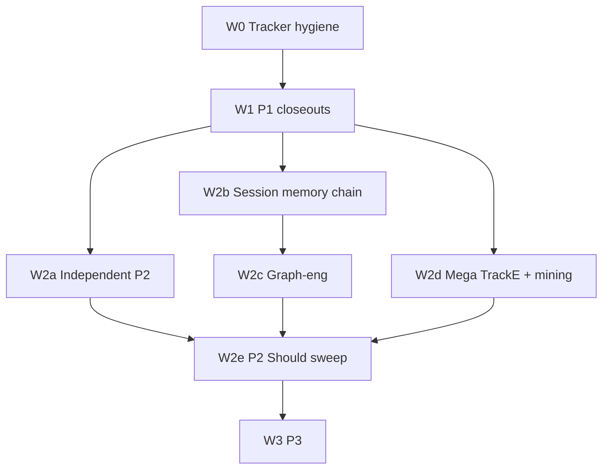

# All-Open PRD Implementation Campaign

**Date:** 2026-08-01  
**Status:** Ready to dispatch  
**Scope:** `all_open` — every open tracker row (~113 items)  
**Audience:** Parent campaign conductor + parallel Task/subagents in a fresh session  

| SoT | Path |
|-----|------|
| Narrative + ACs + HLD | [`docs/prd.md`](../prd.md) |
| Task inventory + status | [`docs/prd-task-tracker.md`](../prd-task-tracker.md) / [`prd-task-tracker.json`](../prd-task-tracker.json) |
| Dev workflow (docs → PR → Release Please) | [`docs/workflow-opencode-agent.md`](../workflow-opencode-agent.md) |
| Session-memory analysis | [`docs/analysis/tencentdb-agent-memory-vs-leankg-2026-07-31.md`](../analysis/tencentdb-agent-memory-vs-leankg-2026-07-31.md) |
| Graph-eng fit matrix | [`docs/analysis/graph-engineering-roadmap-vs-leankg-2026-07-21.md`](../analysis/graph-engineering-roadmap-vs-leankg-2026-07-21.md) |
| OnRender embeddings RCA | [`docs/reports/root_cause_onrender_embeddings_exit101-2026-08-01.md`](../reports/root_cause_onrender_embeddings_exit101-2026-08-01.md) |

> **Do not invent new FRs mid-campaign.** Close or implement existing IDs. Update tracker status after each merge.

---

## 1. Mission

Ship **all remaining open PRD work** in one coordinated campaign:

- Multi-subagent fan-out with **one PR per worktree**
- Mandatory **TDD** (red → green vertical slices)
- Coverage via **unit**, **TempDir/integration**, and **live** tests (REL evidence under `docs/reports/`)
- Conventional commits; **no AI attribution**; Release Please owns version bumps

### Snapshot at plan freeze (2026-08-01)

| Metric | Count |
|--------|------:|
| Total tracked | 539 |
| Open (`NOT_DONE` + `PENDING` + `PARTIAL` + `OPEN`) | ~113 |
| P1 open | ~8 |
| P2 open | ~93 |
| P3 open | ~12 |

**P1 CURRENT:** Wave 4 — `US-MG-02` / `FR-MG-03` (backend largely present; needs closeout + live proof).  
**P2 ordered queue (after Wave 4):** `US-SM-01` → `US-SM-02`/`US-GE-05` → `US-SM-03/04` → DOCJOIN polish → `US-GE-02..04` → `US-SM-05/06`.  
**Included mega:** Track E 3D (`graph-ui/`), conversation mining (`mine-conversations`).

---

## 2. How to run this in another session

### Parent (conductor) first message (copy-paste)

```text
You are the LeanKG all-open PRD campaign conductor.

Read and follow: docs/planning/2026-08-01-all-open-prd-campaign.md

Rules:
1. Do NOT implement everything yourself. Fan out Task subagents to worktrees.
2. Max 4–6 parallel subagents. Prefer independence (no shared hot-file edits).
3. Every PR: TDD, unit + integration, live smoke for REL/Must Have, update tracker.
4. Worktree path: .worktrees/prd/<slug>/
5. Docker MCP project path is /workspace (never host Mac paths). Health: curl -sf http://localhost:9699/health
6. No AI attribution in commits/PRs. No force-push to main.
7. Start with Wave 0 + Wave 1 only. After those PRs merge, launch the next wave.

First actions:
- git fetch origin && git status
- Confirm .gitignore covers .worktrees/
- Launch Wave 0 + Wave 1 subagents using the prompts in §8 of the campaign doc
```

### Per-wave conductor checklist

1. `git fetch origin && git checkout main && git pull --rebase`
2. Confirm no stale locks on MCP RocksDB if live tests will run
3. Launch eligible PRs in parallel (see wave matrix)
4. Wait for subagents; collect PASS/FAIL
5. Review PRs; merge green ones; rebase remaining worktrees onto `main`
6. Sync [`docs/prd-task-tracker.md`](../prd-task-tracker.md) + JSON
7. Open next wave

### Worktree bootstrap (every subagent)

```bash
SLUG="<pr-slug>"   # e.g. wave4-single-repo-expand
git fetch origin
git worktree add ".worktrees/prd/${SLUG}" -b "prd/${SLUG}" origin/main
cd ".worktrees/prd/${SLUG}"
```

After merge / abandon:

```bash
git worktree remove ".worktrees/prd/${SLUG}"
git branch -D "prd/${SLUG}"   # only if merged or abandoned
```

---

## 3. Quality protocol (non-negotiable)

Follow [`docs/workflow-opencode-agent.md`](../workflow-opencode-agent.md) + TDD:

| Step | Rule |
|------|------|
| Docs | Clarify ACs in PRD only if needed; always update tracker after merge |
| Seams | Before writing tests, list public seams in the PR body (CLI / MCP / REST / module API) |
| TDD | One failing test → minimal code → repeat. No bulk-tests-then-bulk-code |
| Unit | `#[cfg(test)]` or `tests/*`; `cargo test --lib` / targeted `--test` |
| Integration | `TempDir`, fake-gcs, in-process MCP handler |
| Live | Every `REL-*` and Must Have US → `docs/reports/<id>-YYYY-MM-DD.md`; Docker MCP `project=/workspace` when `:9699` healthy |
| Gates | `cargo fmt --all -- --check`; `cargo clippy --all -- -D warnings`; `cargo test --lib`; feature live smoke |
| Commits | `feat:` / `fix:` / `test:` / `docs:` / `ci:` / `chore:`; **no** Co-Authored-By / Generated-by |

### Build notes

- Always `--release` for runtime binaries (`cargo build --release`, `cargo run --release --`).
- Debug profile has `debug=false`; prefer release for serve/MCP smoke.
- Embeddings need `--features embeddings`.

### Hard-removed MCP tools (must stay gone)

`mcp_hello`, `mcp_impact`, `get_doc_for_file`, `find_clones`, `wake_up`, `search_by_environment`, `load_layer`, `get_doc_structure`.

Prefer-order overview: `get_overview_context` → `get_architecture` (not progressive `load_layer`).

---

## 4. Hot-file ownership (serialize these)

| File | Risk | Policy |
|------|------|--------|
| `src/mcp/handler.rs` | Extreme | Thin match-arm only; logic in new modules |
| `src/mcp/tools.rs` | Extreme | Add tool defs in dedicated PRs; rebase often |
| `src/db/models.rs` / `schema.rs` | High | One migration-owning PR at a time |
| `src/cli/mod.rs` | High | One new subcommand PR at a time |
| `docs/prd-task-tracker.md` + `.json` | High | Conductor updates after merge, or last commit in PR |
| `ui-v2/` | Medium | Parallel OK if different components; avoid App.tsx wars |
| `src/web/handlers.rs` | Medium | Wave 4 + layout API serialize |

**Prefer new modules** to reduce conflicts:

- `src/session/` — session memory
- `src/conversation_indexer/` — mining
- `src/mcp/token_budget.rs` (extend) — SEM budgets
- `graph-ui/` — Track E (new tree)
- `src/graph/layout3d.rs` — 3D layout

**Max parallel subagents:** 4–6 (CPU + RocksDB `LOCK` contention on Docker MCP).

---

## 5. Dependency graph



**Sequential chains (do not parallelize within chain):**

1. `PR-20 SM-01` → `PR-21 SM-02` → `PR-22 SM-03/04` → `PR-23 SM-05/06`
2. `PR-21` before `PR-30..32` GE (GE-05 closed by SM-02)
3. `PR-50` layout API → `PR-51..54` Track E UI
4. Optional `PR-09` token-budget helper → `PR-13` SEM → before heavy SM handler edits

---

## 6. Wave catalog

### Wave 0 — Tracker hygiene

| PR | Branch slug | IDs | Ownership | Done when |
|----|-------------|-----|-----------|-----------|
| **PR-00** | `prd-tracker-reconcile` | Stale US/PARTIAL where FR already DONE | `docs/prd-task-tracker.md` + `.json` | Open count = real work only |

Likely stale closes (verify evidence before flipping):

- `US-UI2-07` if `FR-UI2-09` / `REL-057` DONE
- `US-GF-14` if `FR-GF-22` DONE
- `US-GF-17` if `FR-GF-24` DONE
- `US-GF-04` if `FR-GF-07..09` / `REL-043` DONE
- `FR-COST-01` / `US-COST-01` PARTIAL → DONE if ROI brief + README link exist

---

### Wave 1 — P1 closeouts (parallel)

| PR | Branch slug | IDs | Ownership | Seams |
|----|-------------|-----|-----------|-------|
| **PR-01** | `wave4-single-repo-expand` | `US-MG-02`, `FR-MG-03` | `src/web/handlers.rs`, `ui-v2/` | `detect_single_repo`; `GET /api/graph/expand-service`; root double-click |
| **PR-02** | `ci-embeddings-docker-gate` | OnRender F2 (F3 optional) | `.github/workflows/`, Dockerfiles | CI builds `--features embeddings` on Dockerfile/Cargo.lock change |
| **PR-03** | `remote-source-live-closeouts` | `REL-SRC-01`, `REL-SRC-WATCH-01`, `REL-REFRESH-01` | `tests/sources_*`, refresh smoke | fake-gcs index; watch reindex; `refresh` → `semantic_search kind=docs` |

**PR-01 notes:** Backend already auto-sets `all_content` for single-repo root and has `fr_mg_03_tests` in `handlers.rs`. Closeout = integration/live + tracker DONE, not greenfield.

---

### Wave 2a — Independent P2 (after Wave 1; ≤6 parallel)

| PR | Branch slug | IDs | Ownership | TDD seams |
|----|-------------|-----|-----------|-----------|
| **PR-09** | `mcp-token-budget-helper` | (refactor enabler) | `src/mcp/token_budget.rs` | Extract dual accounting helper; no behavior change |
| **PR-10** | `docjoin-symbol-upgrade` | `FR-DOCJOIN-06` | doc join resolver | Unique `file::symbol` → function/class key |
| **PR-11** | `ui2-cluster-ops-panels` | `US-UI2-08/09`, `FR-UI2-10/11` | `ui-v2/` | Cluster legend filters; incidents/env/conflicts panels |
| **PR-12** | `god-node-scoring` | `FR-GF-10/12` | `src/graph/` + architecture | Degree/importance score; hotspots in `get_architecture` |
| **PR-13** | `sem-token-budgets` | `FR-SEM-01..03`, `US-SEM-01..03` | token_budget + thin handler | `_token_budget` envelope; tool max tokens; HTTP resilience docs/hygiene |
| **PR-14** | `wire-vue-svelte-sql` | `REL-032`, `US-08` partial | indexer walk | Index finds `.vue` / `.svelte` / `.sql` |
| **PR-15** | `cbm-a-smoke-polish` | `FR-A01..A06`, `FR-B50`, related US | docs + `scripts/mcp-smoke-tools.py` | Ontology + routing smoke gates |

---

### Wave 2b — Session memory (sequential)

Reference: PRD §1.3 / §3.28 / §5.32.

| PR | Branch slug | IDs | Module | Acceptance highlights |
|----|-------------|-----|--------|----------------------|
| **PR-20** | `session-offload` | `US-SM-01`, `FR-SM-01..03`, `REL-075` partial | `src/session/` | Offload to `.leankg/sessions/<id>/refs/<node_id>.md`; canvas; `session_recall`; ≥30% token drop fixture |
| **PR-21** | `session-auto-recall` | `US-SM-02`, `FR-SM-04..06`, closes `US-GE-05`/`FR-GE-05` | session + overview | Opt-in overview enrichment; timeout ≤5s; default off; dedup |
| **PR-22** | `session-provenance-rrf` | `US-SM-03/04`, `FR-SM-07..09` | session + search | Provenance fields; typed kinds; RRF `k=60` |
| **PR-23** | `session-heat-promote` | `US-SM-05/06`, `FR-SM-10/11` | session | `MEMORY_INDEX.md`; workflow **proposals** only (no silent YAML SoT) |

**Won't Do (SM):** chat-persona SoT; OpenClaw/Hermes binding; rename LeanKG L0–L3; Mermaid as primary graph store.

---

### Wave 2c — Graph engineering (after PR-21)

| PR | Branch slug | IDs | Notes |
|----|-------------|-----|-------|
| **PR-30** | `ge-planner` | `US-GE-02`, `FR-GE-02` | Goal → MCP DAG JSON; harness remains Cursor/Claude |
| **PR-31** | `ge-entity-resolve` | `US-GE-03`, `FR-GE-03` | Cross-alias beyond QN + typed_resolve |
| **PR-32** | `ge-cluster-first` | `US-GE-04`, `FR-GE-04` | Cluster-first nav; mega-safe (no `all_elements()`) |

---

### Wave 2d — Mega features (parallel to 2b after Wave 1)

#### Conversation mining

| PR | Branch slug | IDs |
|----|-------------|-----|
| **PR-40** | `conversation-mining` | `US-MP-03`, `FR-MP-09..13` |

- New `src/conversation_indexer/`
- Parsers: Claude / ChatGPT / Slack export JSON
- Types: `decision`, `preference`, `milestone`, `problem`
- Edge: `decided_about`
- CLI: `leankg mine-conversations --format … --project …`
- Follow-up PRs (after 40): `FR-MP-02` (valid_to soft-delete), `FR-MP-20`, `FR-MP-24..26`

#### Track E 3D

| PR | Branch slug | IDs |
|----|-------------|-----|
| **PR-50** | `track-e-layout-api` | `FR-E10..E14` |
| **PR-51** | `track-e-graph-ui-scaffold` | `FR-E01..E05`, `US-CBM-E1` start |
| **PR-52** | `track-e-scene-lod` | `FR-E20..E28`, `US-CBM-E3` |
| **PR-53** | `track-e-panels-serve` | `FR-E30..E43`, `US-CBM-E4` |
| **PR-54** | `track-e-rel-041-evidence` | `REL-041` |

Keep existing `ui/` and `ui-v2/` as 2D explorers. Do not block company ui-v2 on Track E.

---

### Wave 2e — Remaining P2 Should Have sweep

Batch into 1–2 PRs per theme after 2a/2b/2c/2d scaffolds exist:

| Batch | IDs (examples) |
|-------|----------------|
| GF install / ADR | `FR-GF-16`, `FR-GF-23`, `US-GF-15/16` |
| Platform C | `FR-C02..C11`, `US-CBM-C3` (Windows → P3) |
| LSP / dual-run | `FR-B06`, `FR-D04`, `US-CBM-D3` |
| Service / IaC | `FR-B13`, `FR-B16`, `FR-B40..B44`, `FR-B51` |
| REST | `REL-040` |
| MemPalace polish | `US-MP-02` PARTIAL (budgets; do **not** resurrect deleted tools), `US-MP-08` |
| CBM recipes | leftover `US-CBM-B12`, etc. |

---

### Wave 3 — P3 Could Have

| PR | Branch slug | IDs |
|----|-------------|-----|
| **PR-60** | `session-gc` | `US-SM-07`, `FR-SM-12` |
| **PR-61** | `ge-llm-pass2` | `US-GE-06`, `FR-GE-06` |
| **PR-62** | `sem-mmr-diversity` | `US-SEM-04`, `FR-SEM-05` |
| **PR-63** | `windows-smoke` | `US-CBM-C5` |
| **PR-64** | `mcp-resources-overview` | `US-GN-08` |
| **PR-65** | `lang-breadth-leftover` | `US-GF-10/12`; leave `FR-EMBED-R4` `OPEN` unless measured |

---

## 7. Test matrix (campaign-wide)

| Layer | Command / artifact | When required |
|-------|-------------------|---------------|
| Unit | `cargo test --lib` | Every PR |
| Targeted | `cargo test --test <name>` / `cargo test <filter>` | Feature PR |
| Clippy/fmt | `cargo fmt --all -- --check`; `cargo clippy --all -- -D warnings` | Every PR |
| ui-v2 | `cd ui-v2 && npm test` / project scripts | UI PRs |
| Live MCP | `curl http://localhost:9699/health`; tools with `project=/workspace` | REL + Must Have |
| Live REST | `cargo run --release -- serve` + curl expand-service / layout | Wave 4, Track E |
| Evidence | `docs/reports/<topic>-YYYY-MM-DD.md` | Every REL |

### Live report template

```markdown
# <ID> live evidence — YYYY-MM-DD

## Environment
- leankg version / commit:
- MCP: Docker :9699 / stdio:
- project=:

## Steps
1. …
2. …

## Results
- Command + output (trimmed)
- Pass/Fail vs AC

## Tracker
- Mark <IDs> DONE after merge
```

---

## 8. Subagent prompt templates

Replace `{{…}}` placeholders. Paste into Task tool / new Cursor agent with worktree cwd.

### Template A — generic feature PR

```text
You are implementing LeanKG PR {{PR_ID}} ({{BRANCH_SLUG}}).

Campaign doc: docs/planning/2026-08-01-all-open-prd-campaign.md
PRD ACs: docs/prd.md — search for {{ID_LIST}}
Tracker: docs/prd-task-tracker.md — mark DONE only after tests + evidence

Worktree:
  git fetch origin
  git worktree add .worktrees/prd/{{BRANCH_SLUG}} -b prd/{{BRANCH_SLUG}} origin/main
  cd .worktrees/prd/{{BRANCH_SLUG}}

IDs: {{ID_LIST}}
Seams under test: {{SEAMS}}
Allowed paths: {{ALLOWED_PATHS}}
Forbidden (do not edit unless unavoidable): src/mcp/handler.rs body (thin dispatch only), unrelated modules

Mandatory TDD:
1. Write failing tests for first seam
2. Implement minimal code to pass
3. Repeat per seam
4. Add TempDir/integration where FR touches files/DB
5. Live smoke + docs/reports/{{REPORT_SLUG}}-$(date +%Y-%m-%d).md for REL/Must Have

Gates before claiming done:
  cargo fmt --all -- --check
  cargo clippy --all -- -D warnings
  cargo test --lib
  {{EXTRA_TEST_CMDS}}

Commit: conventional message, NO AI attribution.
Push + open PR with gh when tests green (only if user/conductor asked for PR).
Return: PR URL, test output summary, tracker IDs ready to mark DONE.
```

### Template B — Wave 0 tracker reconcile

```text
PR-00 docs-only tracker reconcile.

Read docs/prd-task-tracker.md + docs/prd-task-tracker.json.
For each PENDING/PARTIAL user story whose matching FR/REL is DONE with evidence, mark US DONE.
Do not mark code FRs DONE without verifying files/reports exist.
Sync markdown + JSON.
Commit: chore: reconcile stale PRD tracker statuses
No Rust changes.
```

### Template C — Wave 4 single-repo expand

```text
PR-01 Wave 4 closeout: US-MG-02 / FR-MG-03.

Code already has detect_single_repo + root all_content in src/web/handlers.rs and fr_mg_03_tests.
Your job: TDD integration + live proof + tracker DONE.

Seams:
- detect_single_repo(single vs nested .git)
- GET /api/graph/expand-service on single-repo root returns nested content when all_content path engaged
- ui-v2 root expand uses expandService('.', true, …)

Allowed: src/web/handlers.rs tests, new tests under tests/, ui-v2 focused tests, docs/reports/
Live: serve + curl expand-service on this repo; write docs/reports/wave4-single-repo-expand-YYYY-MM-DD.md
```

### Template D — Session offload (PR-20)

```text
PR-20 US-SM-01 / FR-SM-01..03.

Read docs/prd.md §3.28 / §5.32 and docs/analysis/tencentdb-agent-memory-vs-leankg-2026-07-31.md.

Create src/session/ module:
- persist .leankg/sessions/<id>/refs/<node_id>.md
- canvas (Mermaid or compact JSON)
- session_recall MCP (thin handler dispatch)

TDD: offload trigger, bit-for-bit recall, ≥30% token drop fixture.
Do NOT implement auto-recall (that is PR-21).
Do NOT mutate ontology YAML as SoT.
Live start REL-075 report.
```

### Wave 0+1 launch set (conductor)

Launch **four** subagents in parallel with Templates B, C, plus:

1. **PR-02:** CI embeddings Docker gate from OnRender RCA F2  
2. **PR-03:** REL-SRC-01 / REL-SRC-WATCH-01 / REL-REFRESH-01 e2e closeouts  

---

## 9. PR body checklist (paste into every PR)

```markdown
## Summary
- IDs: …
- Seams: …

## Test plan
- [ ] Red→green TDD slices
- [ ] `cargo fmt --all -- --check`
- [ ] `cargo clippy --all -- -D warnings`
- [ ] `cargo test --lib`
- [ ] Integration / TempDir tests
- [ ] Live smoke + `docs/reports/…` (if REL / Must Have)
- [ ] Tracker rows listed for DONE after merge
- [ ] No resurrection of hard-deleted MCP tools
- [ ] No AI attribution
```

---

## 10. Definition of campaign done

- [ ] Tracker open work = 0 except intentional `OPEN` / `WONT_DO` (e.g. `FR-EMBED-R4` if still aspirational)
- [ ] Every Must/Should FR has unit coverage; RELs have live reports under `docs/reports/`
- [ ] `cargo test --lib` green on `main`
- [ ] Hard-removed MCP tools still absent from `tools.rs` / matrix
- [ ] Track E ships as `graph-ui/` without breaking ui-v2 default serve
- [ ] Session memory offload + auto-recall land; `US-GE-05` closed via `US-SM-02`
- [ ] This doc’s wave checkboxes can be marked complete in a follow-up commit

---

## 11. Progress log (conductor updates)

| Date | Wave | Merged PRs | Notes |
|------|------|------------|-------|
| 2026-08-01 | — | — | Campaign doc authored; ready to dispatch |
| | | | |

---

## 12. Quick ID → wave index

| Theme | Wave | PR range |
|-------|------|----------|
| Tracker hygiene | 0 | PR-00 |
| Wave 4 MG / OnRender CI / SRC RELs | 1 | PR-01..03 |
| DOCJOIN / UI2 / GF god / SEM / Vue-SQL / CBM A | 2a | PR-09..15 |
| Session memory SM | 2b | PR-20..23 |
| Graph eng GE-02..04 | 2c | PR-30..32 |
| Conversation mining | 2d | PR-40 (+ MP follow-ups) |
| Track E 3D | 2d | PR-50..54 |
| P2 Should sweep | 2e | theme batches |
| P3 Could | 3 | PR-60..65 |

---

*End of campaign plan. Start execution at Wave 0 + Wave 1 only.*
