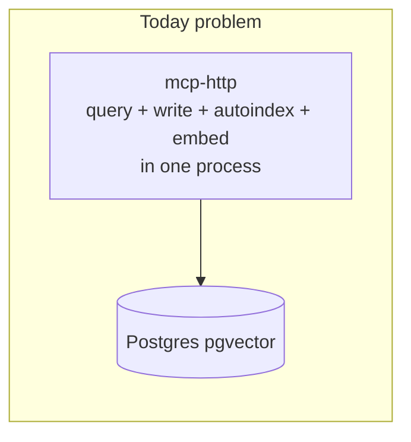
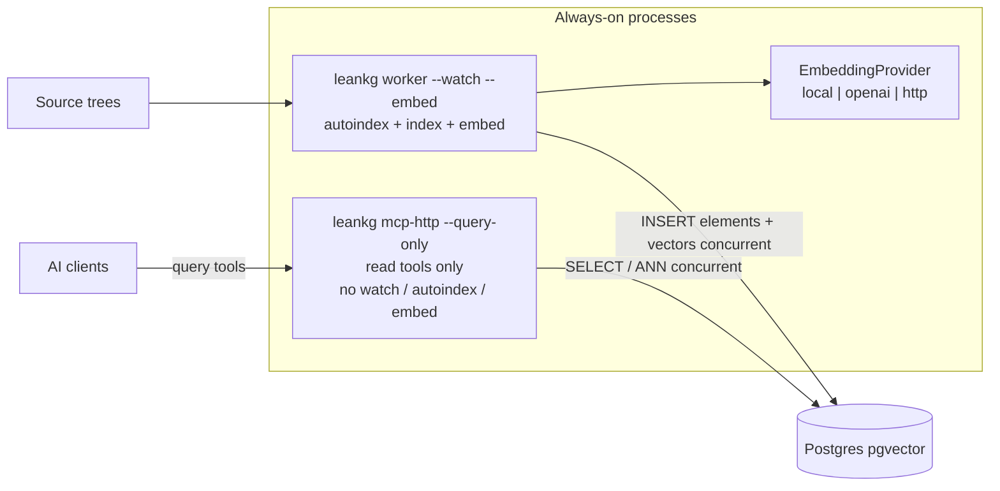

# Split LeanKG: Query MCP + Index/Embed Worker

**Date:** 2026-08-07  
**Status:** Planned (not implemented)  
**Decisions:** Same binary / two process modes; pluggable embed providers (`local` | `openai` | `http`); MCP and worker always concurrent (not cold-embed-then-serve)

## Overview

Split LeanKG into two long-lived process modes on the same binary:

1. **Query-only MCP** — serves read tools; no autoindex / watch / in-process embed
2. **Worker** — owns autoindex, watch, indexing, and embedding (local ONNX or API provider) into Postgres + pgvector

**Primary requirement:** `leankg-mcp` stays up and answers queries **while** `leankg-worker` is indexing and embedding. No “stop MCP → cold embed → start MCP” loop.

## Implementation todos

| ID | Task | Status |
|----|------|--------|
| docs-prd | Update PRD/tracker: query-only MCP + always-on worker + concurrent query-during-embed + EmbeddingProvider | pending |
| query-only-mcp | Harden `--query-only`: alias read-only, disable autoindex/watch/embed, filter tools/list, complete WRITE_TOOLS | pending |
| concurrent-reads | Guarantee MCP queries succeed during worker index/embed (no exclusive lockout; HNSW keep/online upsert) | pending |
| worker-cli | Add long-lived `leankg worker` (`--watch --embed` default) that indexes/embeds while MCP stays up | pending |
| embed-provider-trait | Add EmbeddingProvider trait + local/openai/http implementations with dim lock and env config | pending |
| compose-docs | Compose always runs MCP query-only + worker together; concurrent smoke while embed is in flight | pending |

## Current baseline (already true)

- **Postgres + pgvector is the only storage engine** (`LEANKG_PG_URL`; see `docker-compose.yml`, `README.md`). Concurrent connections already allow MCP reads while another process writes.
- MCP already has `--read-only` (`src/cli/mod.rs` `McpHttp`/`McpStdio`) that rejects `WRITE_TOOLS` and can open PG with `default_transaction_read_only=on` (`src/db/backend.rs`).
- Today MCP still owns autoindex / in-process embed, so heavy embed work competes with query latency inside the same process. Compose has a one-shot `leankg-embed` profile (`docker-compose.embed.yml`) — that cold/stop-start framing is **not** the target.
- Embed today is **local ONNX only** (`Embedder` / `DirectEmbedder` in `src/embeddings/models.rs`).



## Target architecture (concurrent by design)



**Defaults locked for this plan:**

- Same binary, two **long-lived** process modes (not two crates).
- Query MCP: `--query-only` aliases `--read-only`; force `LEANKG_AUTO_INDEX=0`, no `--watch`, no in-process embed; hide write tools from `tools/list`.
- Worker is the **default continuous** index/embed owner (`--watch --embed`). `--once` is only a convenience for CI/bootstrap, not the production topology.
- Concurrent AC: while worker is mid-embed, MCP `/health` and at least `search_code` / `semantic_search` / `mcp_status` must succeed (may return partial/freshness-lagging vectors, never hang or 5xx from exclusive DB lockout).
- Agent memory writes stay rejected on query MCP; operators use CLI / non-query MCP later if needed.
- Embed providers: trait + **local ONNX** (`embeddings` feature) + **OpenAI-compatible** + **generic HTTP**; `LEANKG_EMBED_PROVIDER`.

---

## Phase 0 — Docs first

Update `docs/prd.md` + `docs/prd-task-tracker.md` with:

- FR/US for query-only MCP process mode
- FR/US for continuous `leankg worker` (watch+embed) **alongside** live MCP
- FR/US for **concurrent query-during-embed** (must not take MCP offline)
- FR/US for pluggable `EmbeddingProvider`
- Deployment topology: always `postgres` + `leankg-mcp` + `leankg-worker` together

Rewrite `docs/deploy-server-with-cold-embed.md` title/narrative to **live concurrent worker** (retire “cold embed before serving” as the recommended path; keep `--once` as optional bootstrap only).

---

## Phase 1 — Harden query-only MCP

**Files:** `src/cli/mod.rs`, `src/main.rs`, `src/mcp/server.rs`, `src/mcp/tools.rs`

1. Add `--query-only` as alias of `--read-only` on `McpHttp` / `McpStdio` (and honor `LEANKG_MCP_QUERY_ONLY=1`).
2. When query-only:
   - Refuse `--watch`.
   - Force-disable autoindex / embed-on-boot / embed-background / embed auto-arm.
   - Open DB via `PostgresBackend::from_env_read_only()`.
3. Complete `WRITE_TOOLS` (`mcp_embed`, `mcp_install`, `index_prd`, …).
4. Filter `tools/list` when query-only.
5. Tests: write tools rejected + absent from list; autoindex not scheduled.

**Verify:** unit tests + query-only MCP answers while a separate worker process writes.

---

## Phase 2 — Concurrent safety (MCP stays queryable during embed)

**Files:** `src/embeddings/state.rs`, `src/embeddings/build.rs`, `src/db/write_bus.rs` (if present), worker module

Hard requirements while worker runs:

1. **No exclusive process lock** that blocks MCP from opening/querying PG (Postgres multi-connection is the shared store; do not reintroduce single-writer file locks for the query path).
2. **Online vector upserts:** default to keeping HNSW available during bulk upsert (`LEANKG_EMBED_KEEP_HNSW=1` or equivalent always-on for worker mode) so ANN queries do not fail mid-rebuild; document any brief recall degradation.
3. **Write isolation:** worker writes must not starve MCP reads (use existing write bus / connection pools; tune `statement_timeout` / pool sizes so long COPY/upsert does not pin all connections).
4. **Freshness semantics:** MCP may return pre-upsert or partial vectors mid-run; `mcp_status` / worker heartbeat expose `embed_in_progress` so clients can interpret lag.
5. Integration test / smoke: start MCP query-only → start long embed → loop `search_code` + `/health` every N seconds → assert success throughout.

---

## Phase 3 — `leankg worker` process manager

**Files:** `src/cli/mod.rs`, `src/main.rs`, new `src/worker/mod.rs`

```bash
# Production default — long-lived, concurrent with MCP
leankg worker --project /workspace --watch --embed --provider local

# Bootstrap / CI only
leankg worker --project /workspace --once --embed
```

Behavior:

1. Boot freshness autoindex (shared logic extracted from MCP `auto_index_if_needed`).
2. Index code + docs → Postgres.
3. Embed via provider → upsert `embedding_vectors` **without taking MCP down**.
4. Watch → incremental reindex → incremental embed.
5. Heartbeat `.leankg/worker_status.json` (PID, phase, last index/embed, provider, `in_progress`).

Compose (`docker-compose.yml`):

- `leankg-mcp`: always `mcp-http --query-only`, `restart: unless-stopped`
- `leankg-worker`: always `worker --watch --embed`, `restart: unless-stopped`
- Both `depends_on: postgres` healthy; **both start together** — never “embed profile then MCP”.

**Verify:** with worker mid-full-embed, MCP returns successful tool results continuously.

---

## Phase 4 — Pluggable embedding providers

**Files:** new `src/embeddings/provider.rs`; wire `src/embeddings/build.rs`, CLI env

```rust
pub trait EmbeddingProvider: Send + Sync {
    fn name(&self) -> &str;
    fn dim(&self) -> usize;
    fn embed_batch(&self, texts: &[String]) -> Result<Vec<Vec<f32>>, ProviderError>;
}
```

| Provider | Config | Notes |
|----------|--------|--------|
| `local` | `LEANKG_EMBED_PROVIDER=local` + existing model/FAST env | Behind `embeddings` feature |
| `openai` | API base/key/model | OpenAI-compatible `/embeddings` |
| `http` | `LEANKG_EMBED_HTTP_URL` + `{texts}` → `{embeddings}` | Generic POST |

Dim lock in PG metadata; refuse silent dim change without `--full`. `openai`/`http` compile without ONNX feature.

**Verify:** mock HTTP provider tests; local regression; dim mismatch refused; concurrent MCP still healthy under API-provider embed.

---

## Phase 5 — Ops wiring + docs polish

1. Default compose: postgres + mcp (query-only) + worker (watch+embed) always-on.
2. Document: agents talk only to query MCP; indexing/embed is invisible background process.
3. Keep `leankg index` / `embed` / `watch` as lower-level CLI; `worker` is the supported long-running entrypoint.
4. Smoke: `docker compose up -d` → while worker logs show embed batches, curl `/health` + MCP `semantic_search` succeed repeatedly.

---

## Out of scope (explicit)

- Splitting into two Cargo crates / slim query-only binary without ONNX (later).
- Moving agent knowledge/ontology writes onto the worker HTTP API.
- Requiring zero vector-recall change during HNSW maintenance (best-effort online; document lag).
- Changing vector table schema beyond dim / embed-in-progress metadata.

---

## Implementation order

1. PRD + tracker (include concurrent-query AC)
2. Query-only MCP harden
3. Concurrent safety (HNSW keep, pools, status flags)
4. `leankg worker` long-lived orchestration
5. EmbeddingProvider local/openai/http
6. Compose always-on + concurrent smoke
7. `cargo build --release` / `cargo test --lib` / feature-gated embed tests
