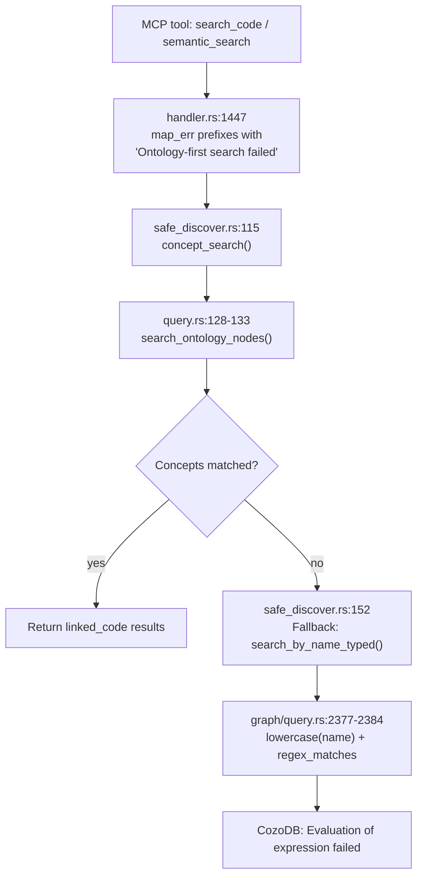

# Ontology-First Search: "Evaluation of expression failed" (2026-07-14)

## Summary

`search_code` and related MCP tools (`semantic_search`, `concept_search`) can fail with:

```
MCP error -32603: Ontology-first search failed: Evaluation of expression failed
```

The outer prefix `"Ontology-first search failed"` is applied at `src/mcp/handler.rs:1447`. The inner error `"Evaluation of expression failed"` originates from the **CozoDB 0.7.6 RocksDB engine** when a Datalog expression cannot be evaluated at runtime.

Root cause is most likely a **`lowercase()` function failure** on a row in the `code_elements` table whose `name` column contains a value incompatible with CozoDB's string coercion in RocksDB mode (non-UTF8 bytes, embedded nulls, or a mismatched DataValue variant). The error surfaces when the fallback name search scans that row.

## Error Call Chain



### File:line References

| Step | File | Line | Function | What Happens |
|------|------|------|----------|-------------|
| 1 | `src/mcp/handler.rs` | 1428 | `search_code` | Entry point. Checks `use_ontology` / mega-graph flag. |
| 2 | `src/mcp/handler.rs` | 1438-1447 | `search_code` | Calls `discover()`, wraps error with `"Ontology-first search failed: {}"`. |
| 3 | `src/ontology/safe_discover.rs` | 108-115 | `discover` | Creates `OntologyQueryEngine`, calls `concept_search()`. |
| 4 | `src/ontology/query.rs` | 361-393 | `concept_search` | Extracts keywords, calls `search_ontology_nodes()` per probe. |
| 5 | `src/ontology/query.rs` | 128-133 | `search_ontology_nodes` | Runs Datalog query filtering by element_type and `regex_matches(file_path, "ontology://")`. |
| 6 | `src/ontology/safe_discover.rs` | 150-152 | `discover` | **Fallback.** If no concepts matched, calls `search_by_name_typed()` per keyword probe. |

## Two Query Sites Where the Error Can Occur

### Site 1: `search_ontology_nodes` (less likely to fail)

`src/ontology/query.rs:128-131`:

```datalog
?[qualified_name, element_type, name, metadata]
:= *code_elements[qualified_name, element_type, name, file_path, line_start,
    line_end, language, parent_qualified, cluster_id, cluster_label,
    metadata, env, ontology_layer],
  element_type in ["domain_entity","service","api_endpoint","data_store",
    "environment","known_issue","playbook","team_knowledge","workflow",
    "workflow_step","decision_point","failure_mode","playbook_step"],
  regex_matches(file_path, "ontology://")
```

- The `element_type in [...]` list is hardcoded and targets **only ontology nodes**.
- `regex_matches(file_path, "ontology://")` filters to concept/workflow definitions only.
- This query is unlikely to fail because it only scans a small subset of rows.

### Site 2: `search_by_name_typed` (most probable failure site)

`src/graph/query.rs:2377-2384`:

```datalog
?[qualified_name, element_type, name, file_path, line_start, line_end,
   language, parent_qualified, cluster_id, cluster_label, metadata]
:= *code_elements[qualified_name, element_type, name, file_path, line_start,
    line_end, language, parent_qualified, cluster_id, cluster_label,
    metadata, env, ontology_layer],
  regex_matches(lowercase(name), "<escaped_query_pattern>")
:limit <N>
```

- This query runs when no concept matches. It scans **all non-ontology code elements**, which can be hundreds of thousands of rows on large workspaces.
- `lowercase(name)` is applied to **every scanned row**.
- If **any single row** has a `name` that CozoDB's RocksDB engine cannot coerce into a valid string for `lowercase()`, the entire query fails.

## Environment-Specific Factors

| Factor | Detail |
|--------|--------|
| CozoDB version | 0.7.6 (`Cargo.lock:739`) |
| Storage engine | RocksDB (confirmed: `storage_engine: rocksdb`) |
| Database path | `/data/leankg-rocksdb/projects/workspace-other-6917453a1780` |
| Project | `workspace-other` (secondary monorepo, potentially very large) |
| Mega-graph status | Likely a mega-graph (>50k elements); `ontology-first` is forced on |

CozoDB 0.7.6's RocksDB engine may handle string coercion and function evaluation differently from its SQLite engine. The `lowercase()` function relies on the underlying DataValue representation being a valid `Str` variant. If a row was indexed with a `name` serialized as a byte array or containing non-UTF8 content, the function evaluation fails at scan-time.

## Diagnostic Raw Queries

Run these against the affected database to isolate the problem:

### 1. Verify concept search (Site 1) works in isolation

```datalog
?[qualified_name, element_type, name, metadata]
:= *code_elements[qualified_name, element_type, name, file_path, line_start,
    line_end, language, parent_qualified, cluster_id, cluster_label,
    metadata, env, ontology_layer],
  element_type in ["domain_entity"],
  regex_matches(file_path, "ontology://")
:limit 5
```

If this succeeds, the error is in **Site 2 (fallback)**.

### 2. Test `lowercase(name)` across all elements

```datalog
?[name, lowercase(name)]
:= *code_elements[_, _, name, _, _, _, _, _, _, _, _, _, _],
  name != ""
:limit 100
```

If this fails, it confirms `lowercase()` cannot process some `name` values.

### 3. Test the fallback query directly with a safe keyword

```datalog
?[qualified_name, element_type, name, file_path, line_start, line_end,
   language, parent_qualified, cluster_id, cluster_label, metadata]
:= *code_elements[qualified_name, element_type, name, file_path, line_start,
    line_end, language, parent_qualified, cluster_id, cluster_label,
    metadata, env, ontology_layer],
  regex_matches(lowercase(name), "main")
:limit 5
```

### 4. Find rows with potentially problematic names

```datalog
?[name, file_path]
:= *code_elements[_, _, name, file_path, _, _, _, _, _, _, _, _, _],
  name != "",
  !regex_matches(name, "^[a-zA-Z0-9_./\\-]+$")
:limit 20
```

This surfaces names containing characters outside the typical identifier set.

## Potential Fixes

### Option A: Bypass `lowercase()` with case-insensitive regex (recommended)

Modify `search_by_name_typed` at `src/graph/query.rs:2370` and `2380` to use a case-insensitive regex flag instead of `lowercase()`:

The current query pattern is:

```datalog
regex_matches(lowercase(name), "<pattern>")
```

Replace with:

```datalog
regex_matches(name, "(?i)<pattern>")
```

CozoDB's `regex_matches` uses the Rust `regex` crate which supports the `(?i)` inline flag for case-insensitive matching. This eliminates the `lowercase()` call entirely.

**Code change** in `src/graph/query.rs`, function `search_by_name_typed` (lines 2366-2385):

```rust
// Before (line ~2361):
let lower_name = name.to_lowercase();
let safe_name = escape_datalog(&regex::escape(&lower_name));

// After:
let safe_name = escape_datalog(&regex::escape(name));

// In the format strings (lines 2370, 2380), change:
//   regex_matches(lowercase(name), "{pattern}")
// to:
//   regex_matches(name, "(?i){pattern}")
```

This is the simplest approach: no Datalog function call on the `name` column, so no per-row evaluation can fail.

### Option B: Normalize names at indexing time (robust)

In the indexer where `CodeElement.name` is populated, add a sanitization step:

```rust
fn sanitize_name(raw: &str) -> String {
    raw.chars()
        .filter(|c| c.is_ascii_graphic() || c == ' ')
        .take(512)
        .collect()
}
```

This prevents any content that could break `lowercase()` from entering the `name` column at index time.

### Option C: Guard `lowercase()` at the query level (requires CozoDB support)

Use a Datalog-level guard if CozoDB supports `is_string()` or similar type tests:

```datalog
regex_matches(lowercase(coalesce(name, "")), "<pattern>")
```

**Note**: verifying `coalesce` or type guards exist in CozoDB 0.7.6 is required before using this approach.

## Verification After Fix

1. Reproduce the failing query against the affected database.
2. Apply the fix and rebuild: `cargo build --release`
3. Re-deploy the MCP server.
4. Run the same `search_code` call that previously failed.
5. Run diagnostic query 2 (`lowercase(name)` across all elements) to confirm it now succeeds.
6. Run `kg_self_test` to confirm no regression in other ontology tools.

## Followups

1. Add a startup health check that runs `lowercase(name)` against a sample of indexed rows to catch this class of error before it reaches MCP clients.
2. Audit the indexer for all `CodeElement.name` assignments and add centralized sanitization in a single helper function.
3. Consider filing a CozoDB upstream issue for `lowercase()` providing a clearer error message when it encounters non-string DataValue variants.
