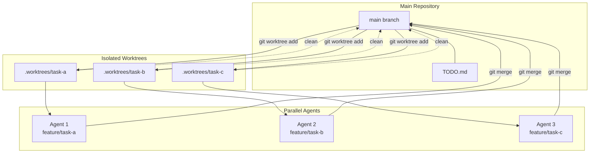
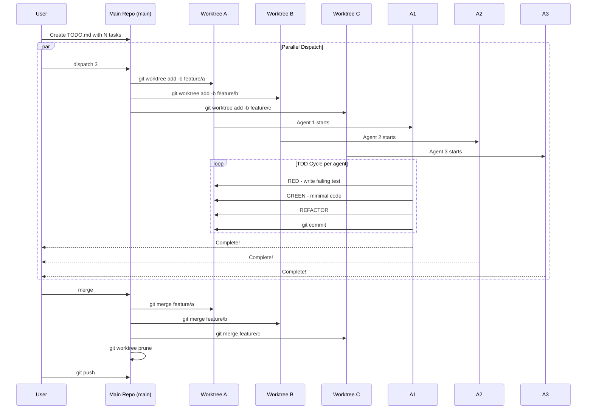

# LeanKG Parallel Subagent Workflow

## Overview

When facing 3+ independent tasks, LeanKG can dispatch parallel subagents, each working in an isolated Git worktree. This enables true parallelism where agents work independently without interference.

## When to Use

**YES - Use parallel workflow when:**
- 3+ test files failing with different root causes
- Multiple subsystems broken independently
- Each problem can be understood without context from others
- Tasks have no shared state dependencies

**NO - Avoid parallel workflow when:**
- Failures are related (fix one might fix others)
- Need to understand full system state
- Agents would interfere with each other

## Architecture



## Quick Start

### 1. Create TODO.md with parallel tasks

```bash
cat > TODO.md <<'EOF'
- [ ] Implement MCP tool: get_traceability
- [ ] Add tests for graph/query.rs
- [ ] Update documentation for indexer
- [ ] Fix CozoDB connection pooling
- [ ] Add performance benchmarks
EOF
```

### 2. Plan parallel tasks

```bash
./ship-parallel.sh plan 'mcp-traceability,graph-tests,docs-update'
# Or let it auto-detect from TODO.md:
./ship-parallel.sh dispatch 3
```

### 3. Dispatch agents (3 parallel)

```bash
# Dispatches 3 agents to 3 worktrees
./ship-parallel.sh dispatch 3

# Monitor logs
tail -f logs/ship-parallel-*.log
```

### 4. Check status

```bash
./ship-parallel.sh status
```

### 5. Merge when complete

```bash
./ship-parallel.sh merge
git push
```

## Command Reference

| Command | Description |
|---------|-------------|
| `./ship-parallel.sh plan <tasks>` | Plan N parallel tasks |
| `./ship-parallel.sh dispatch <N>` | Dispatch N parallel subagents |
| `./ship-parallel.sh status` | Show worktree status |
| `./ship-parallel.sh merge` | Merge all worktrees to main |
| `./ship-parallel.sh clean` | Remove all worktrees |

## Detailed Flow



## Integration with Superpowers

Each subagent runs with Superpowers skills enabled:

```bash
# In each worktree, agent uses:
1. brainstorming - Refine task understanding
2. writing-plans - Break into 2-5 min tasks  
3. using-git-worktrees - Already in worktree context
4. test-driven-development - RED-GREEN-REFACTOR
5. requesting-code-review - Self-review
6. finishing-a-development-branch - Commit
```

## Example: 3 Parallel Agents

```
┌─────────────────────────────────────────────────────────────┐
│                    Main Repository                         │
│                        main                                 │
│                     TODO.md (5 items)                       │
└─────────────────────────────────────────────────────────────┘
                              │
          ┌───────────────────┼───────────────────┐
          ▼                   ▼                   ▼
   ┌─────────────┐     ┌─────────────┐     ┌─────────────┐
   │ Worktree A  │     │ Worktree B  │     │ Worktree C  │
   │.worktrees/a │     │.worktrees/b │     │.worktrees/c │
   ├─────────────┤     ├─────────────┤     ├─────────────┤
   │ Agent 1     │     │ Agent 2     │     │ Agent 3     │
   │ TDD: auth  │     │ TDD: api    │     │ TDD: db    │
   │ Branch:    │     │ Branch:     │     │ Branch:    │
   │ feature/a  │     │ feature/b   │     │ feature/c   │
   └─────────────┘     └─────────────┘     └─────────────┘
          │                   │                   │
          └───────────────────┼───────────────────┘
                              ▼
                     ┌─────────────┐
                     │   merge     │
                     │  main       │
                     │  + push     │
                     └─────────────┘
```

## LeanKG First

Each agent is instructed to use LeanKG tools first:

```bash
# Agent prompt includes:
1. mcp_status  # Check LeanKG ready
2. search_code # Find code elements
3. find_function  # Locate functions
4. get_impact_radius  # Blast analysis
5. get_dependencies  # Import analysis

# Fallback: grep if LeanKG fails
```

## Environment

- **Model**: `opencode-go/minimax-m2.7` (primary), free models (fallback)
- **Skills**: Superpowers (brainstorming, TDD, worktrees, etc.)
- **Isolation**: Each agent in own worktree, own git branch
- **No shared state**: Files modified independently

## Troubleshooting

| Issue | Solution |
|-------|----------|
| Agent stuck | `./ship-parallel.sh status` to check |
| Merge conflict | Resolve manually in worktree, then merge |
| Need to restart | `git worktree remove <name>` then re-dispatch |
| Too many worktrees | `./ship-parallel.sh clean` |

## Files

| File | Purpose |
|------|---------|
| `ship-parallel.sh` | Parallel dispatch script |
| `.worktrees/` | Worktree directory (gitignored) |
| `logs/ship-parallel-*.log` | Per-agent logs |
