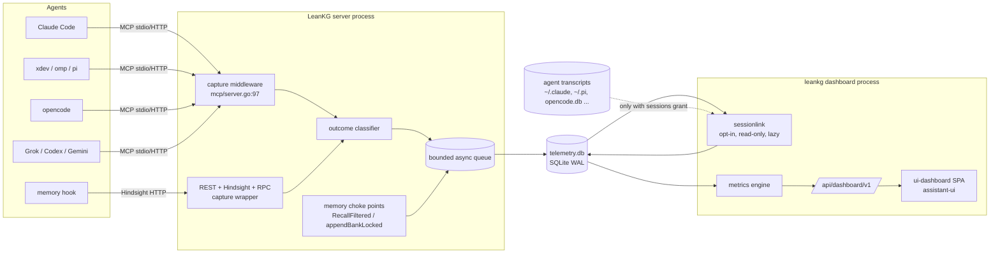

# Plan v4.15 — session telemetry, efficiency metrics and the web dashboard

**Status:** IMPLEMENTED on branch `feat/v4.15-dashboard` (2026-10-10), uncommitted pending owner review; see §8 for outcomes and deviations. · **Tracks:** `DS-01..DS-27` (added to [`prd-task-tracker.md`](prd-task-tracker.md) on approval) · **PRD entry:** v4.15.0 (added on approval)
**Source:** an owner request (2026-10-10) plus four parallel code and source surveys of `e34e1ce` (v0.34.0): the CLI, MCP, web and storage internals; the existing measurement code; the agent memory server; and the on-disk session formats of seven coding agents. Every "today" claim below cites the line it was read from.

This document is the working plan for one wave. When the wave lands, its outcome moves into the PRD changelog and this file is archived under `docs/archive/`.

**The request, restated.**
1. `leankg dashboard` starts a local Go HTTP server and opens a web dashboard built with [assistant-ui](https://github.com/assistant-ui/assistant-ui).
2. Every MCP call from any coding agent (Claude Code, xdev, opencode, omp, pi, Grok CLI, and later Codex and Gemini CLI) is captured: request, response, outcome, latency and client identity.
3. **Opt-in, off by default, owner-approved:** LeanKG reads the calling agent's own session transcript to recover the context bound to each call. That context is the prompt that led to the call, the turns around it, and what the agent did with the answer.
4. From those data, per-session metrics show how well LeanKG served the session: what failed and why, what succeeded, tokens saved, whether the context it gave was correct, and turns and time saved.
5. The same is done for the LeanKG **agent memory server**: recall, retain, injection and Hindsight-compatible traffic.

---

## 0. Summary

| ID | Phase | Problem (one line) | Today | Fix |
|----|-------|--------------------|-------|-----|
| DS-01 | P0 | no consent model for capture | nothing captured beyond `context_metrics` sizes | `telemetry` config: off by default, with levels `off`/`metadata`/`bodies` and a separate `sessions` grant per client |
| DS-02 | P0 | captured bodies can hold secrets and company code | n/a | redaction, size caps, retention and `purge` before anything is written |
| DS-03 | P1 | no store for call events | only `context_metrics` (`store_metrics.go:45-70`) | dedicated telemetry SQLite with an async batched writer that never blocks or fails a tool call |
| DS-04 | P1 | calls are counted, not captured | `recordMetric` stores sizes only and misses calls that fail before the engine runs (`mcp/server.go:252-275`, `:353-362`) | capture middleware chained at `mcp/server.go:97` for every method, including `initialize` |
| DS-05 | P1 | no client or session identity | nothing reads `ClientInfo`; HTTP is `Stateless: true` (`server.go:141`) | stdio: `InitializeParams` plus client env (`CLAUDE_CODE_SESSION_ID`); HTTP: `User-Agent` plus `X-LeanKG-Client`/`X-LeanKG-Session` headers written by `leankg setup` |
| DS-06 | P1 | each response's outcome is invisible | the signals exist but are not stored: `retrieval{rung,reason,confidence}`, `guidance`, `freshness`, `errs` codes (`core.go:725-985`, `errs.go:54-175`) | an outcome classifier produces one label plus a reason per call |
| DS-07 | P1 | `tokens_saved` is never filled on live calls | budget `Stats` are discarded (`server.go:337-347`); only `metrics --seed` writes savings (`metrics.go:175-177`) | keep `budget.Stats` and add a file-read counterfactual baseline per call |
| DS-08 | P1 | REST, Hindsight and ConnectRPC calls bypass MCP | `rest.go:50,62,158-275`, `hindsight.go:62-218`, `rpc/service.go:88` | one HTTP capture wrapper on `rest.Handler`/Hindsight plus an RPC interceptor |
| DS-09 | P1 | the memory server is unmeasured, and recall scores are thrown away | `RankedMemory.Score` is the constant 0.0 (`banks.go:575-594`); the replaced count is dropped in `RetainReplacing` (`banks.go:368`) | emit memory events from the choke points `RecallFiltered` (`banks.go:488`), `appendBankLocked` (`:443`), `rewriteBankLocked` (`:396`) and `AddLesson`; carry the real BM25/cosine/RRF score |
| DS-10 | P2 | no way to see what the agent did around a call | n/a | `internal/sessionlink`: read-only, consent-gated, lazy (batch) linking of calls to transcript entries |
| DS-11..15 | P2 | each agent stores sessions differently | §1.4 | one adapter per format: Claude Code, pi-family (pi, omp, xdev), opencode, Grok, Codex and Gemini |
| DS-16 | P2 | no per-session outcome metrics | `metrics --session` is a stub (`internal/metrics/metrics.go:124-128`) | session aggregates: success, failure reasons, latency, tokens delivered and saved |
| DS-17 | P2 | "correct context" is unmeasured | only offline judge scores (`benchmarks/cross_tool/score.py`) | transcript-derived context-use signals: used hits, fallback after LeanKG, re-query |
| DS-18 | P2 | turns and time saved are unmeasured in real use | only the offline A/B (`benchmarks/cross_tool/run_one.sh:243-281`) | an observational with/without comparison plus import of the controlled A/B results |
| DS-19 | P2 | no memory effectiveness metrics | none | recall hit rate, injected vs returned rows, age, write/skip/dedup, never-recalled share, reuse |
| DS-20 | P3 | `dashboard` prints text tables only | `cmdDashboard` (`cmd/leankg/metrics.go:63-88`, dispatch `main.go:99`) | `leankg dashboard` serves the web UI on loopback and opens the browser; `--format text\|json` keeps today's output |
| DS-21 | P3 | no dashboard API | n/a | `/api/dashboard/v1/*` read API over the telemetry store |
| DS-22 | P3 | no dashboard UI | `ui-v2` is the graph explorer (React 19.2, Vite 8, Tailwind 4, no shadcn or router) | new `ui-dashboard/` SPA: React 19 + Vite + Tailwind 4 + shadcn + assistant-ui |
| DS-23 | P3 | no way to read a session the way the agent experienced it | n/a | session replay on assistant-ui's read-only `useExternalStoreRuntime`, with custom LeanKG tool renderers |
| DS-24 | P3 | no in-product consent step | n/a | first-run consent screen and Settings page, mirrored by `leankg telemetry` |
| DS-25 | P3 | build and embed | `go-ui-assets` covers `ui-v2` only (`Makefile:45-49`) | `make go-ui-dashboard`, `go:embed` into `internal/dashboard/embed`, CI check |
| DS-26 | P4 (deferred) | "ask about my metrics" chat | n/a | assistant-ui `react-data-stream` runtime behind a Go endpoint; needs an LLM provider decision |
| DS-27 | P4 (deferred) | telemetry on PostgreSQL | n/a | a `telemetry.Store` PG implementation once the SQLite one is proven |

---

## 1. Baseline (what exists today)

### 1.1 CLI and web
- Verbs are a plain `switch os.Args[1]` (`cmd/leankg/main.go:56-170`), with stdlib `flag` and `parseInterspersed`.
- **`dashboard` already exists.** It prints the H10/FR-PLG-8 usage buckets as text or JSON (`cmd/leankg/metrics.go:58-88`, `internal/metrics/dashboard.go:86`). Changing its default is a CLI behavior change (decided: §6.1).
- The HTTP server pattern to copy is `serve --ui` (`main.go:503-554`) plus `serveHTTP` (`helpers.go:34`), which has graceful shutdown and a non-loopback warning. No verb opens a browser today.
- The SPA embed pattern is `//go:embed all:embed` with an `index.html` fallback (`internal/web/web.go:14-48`), and `make go-ui-assets` copies `ui-v2/dist` into it (`Makefile:45-49`).

### 1.2 MCP capture surface
- **One middleware sees every method on both transports:** `s.srv.AddReceivingMiddleware(resolveToolNames)` (`internal/mcp/server.go:97`, body `:106-117`). That covers `initialize`, `tools/call` and errors raised before a handler runs.
- `recordMetric` (`server.go:252-275`) writes `store.Metric` for each of the three tools (`:365,:384,:399`). It records tool name, project, `len(args)/4` input tokens, `len(json(out))/4` output tokens, element count, latency, `Success = err == nil`, and pattern/file/depth. It does not record args, the result body, error text, client identity or session.
- It also measures output **before** `enforceBudget` trims it (`server.go:327-348`), and the `budget.Stats` from that trimming are thrown away.
- HTTP MCP is `Stateless: true` (`server.go:141`): each POST gets a temporary session, so `InitializeParams` is not available on a later `tools/call`. The HTTP wrapper (`:143-150`) already resolves an `auth.Role` from the request, which is the natural place to also read the identity headers.

### 1.3 Measurement code we reuse
| Building block | Where | Reuse |
|---|---|---|
| `context_metrics` ledger with unused `BaselineTokens`, `TokensSaved`, `SavingsPercent`, `CorrectElements`, `F1Score` | `store_metrics.go:45-70`, migration 11 | keep writing it; fill the baseline and saved columns (DS-07) |
| `budget.Stats.SavedTokens/SavedPercent` | `budget/tokens.go:137-160` | per-call "trimmed by budget" |
| `compress.ReadResult.Tokens` vs `TotalTokens`; `CompressionStats` | `compress/reader.go:14-27,106-114`, `response.go:10-15` | "returned slice vs whole file" counterfactual |
| SLOC baseline (13 tok/line + 256/file) | `cmd/leankg/cost.go:42-46,146-178` | fallback baseline when file sizes are unknown |
| token estimate = bytes/4 | `budget/tokens.go:18,263`, `compress.EstimateTokens` | one estimator, labelled as an estimate everywhere |
| controlled A/B: `claude -p` with vs without LeanKG; turns, tokens, duration, tool and read counts, leak check | `benchmarks/cross_tool/run_one.sh:204-331`, `aggregate.py:204-272` | imported as the "controlled" evidence panel (DS-18) |
| pinned trials, ≥3 per arm, blind judge, pitfalls checklist | `benchmark/ab/harness.go:44-54,86-98,228,374-473` | same rules for anything the dashboard calls "measured" |
| typed judge | `internal/judge/judge.go:34-39` | optional relevance judging later; its graduation rule needs evidence first |

### 1.4 Coding-agent session stores (read-only survey; schema keys only)
| Client | Location | Format | Exact correlation available? |
|---|---|---|---|
| Claude Code | `~/.claude/projects/<cwd-slug>/<sessionId>.jsonl` (override `CLAUDE_CONFIG_DIR`); subagents under `<sessionId>/subagents/` | JSONL; `message.content[]` `tool_use{id,name,input}` / `tool_result{tool_use_id,is_error}`; `message.usage{input_tokens,output_tokens,cache_*}` | **yes**: the binary injects `CLAUDE_CODE_SESSION_ID` into stdio MCP children (to be confirmed live, DS-00) |
| xdev | `~/.xdev/agent/sessions/<cwd-slug>/<RFC3339>_<uuid>.jsonl` (`XDEV_AGENT_DIR`) | pi-style tree JSONL, v3 | not today: `internal/mcpclient` passes only `os.Environ()`. Needs a one-line xdev change in **another repo** (§5) |
| omp | `~/.omp/agent/sessions/<cwd-slug>/<ts>_<uuid>.jsonl` plus `agent.db` | pi-style tree JSONL | heuristic |
| pi | `~/.pi/agent/sessions/<cwd-slug>/<ts>_<uuid>.jsonl` (`PI_CODING_AGENT_DIR`) | tree JSONL; `toolCall{id,name,arguments}`, `usage{input,output,cacheRead,cacheWrite}` | maybe (`PI_SESSION_ID` is not reliably inherited) |
| opencode | `~/.local/share/opencode/opencode.db` (XDG) | SQLite (`session`, `message`, `part` with `callID` and `state{input,output,error,time}`) | heuristic; join on `callID` once known |
| Grok CLI | `$GROK_HOME/sessions/<url-encoded-cwd>/<id>/` (`updates.jsonl`, `summary.json`, `signals.json`) | JSONL + JSON (ACP updates) | heuristic; `--session-id` is client-chosen |
| Codex / Gemini CLI | `~/.codex/sessions/YYYY/MM/DD/rollout-*.jsonl` + `state_5.sqlite`; `~/.gemini/tmp/<hash>/chats/*.jsonl` | JSONL | heuristic; tool-call shapes unconfirmed |

**Heuristic fallback, used for every client:** match the call to an entry by `cwd`, plus a timestamp window ending at the server receive time, plus the normalized tool name, plus SHA-256 of the canonical args. Normalized names: `mcp__leankg__query` (Claude Code), `leankg_query` (opencode), bare or `server_tool` in the pi family.

### 1.5 Memory server
- **Entry points:**
  - MCP: `query action=memory` (`session_recall`, `memories`) at `core.go:611,1689-1714`; `import action=memory session_retain` at `:1010-1023`; `import action=session command=lesson` at `:1337`.
  - Native REST: `rest.go:157-275`, mounted with `--memory`.
  - Hindsight-compatible: `hindsight.go:62-218`, mounted with `--hindsight-compat`. omp, xdev and the Claude Code hook use this path.
  - ConnectRPC `MemoryRead`: `rpc/service.go:88`.
- **Every recall ends in `RecallFiltered`** (`banks.go:488`) and every write ends in `appendBankLocked` / `rewriteBankLocked` (`:443`, `:396`). Instrumenting those covers every transport.
- **The `<memories>` block Claude Code receives** comes from a user hook outside this repo (`~/.claude/hooks/leankg-memory`, `UserPromptSubmit`). It calls Hindsight recall and then drops and cuts rows on the client side. The server therefore sees more rows than were injected, and gets no session id unless the hook sends one.
- No memory metrics or logging exist today.

---

## 2. Target flow



**Design rules.**
1. **Capture is hot-path; linking is not.** The middleware records what the server saw and returns. Transcript reading happens later, in the dashboard process or `leankg telemetry link`, because the turns *after* a call are only written after the agent keeps going.
2. **Capture never changes behavior.** Response bytes are identical with telemetry on or off. A full queue drops the event and increments a counter; it never blocks a call, and a store error never fails one.
3. **Off means off.** With telemetry off, no file is created, no queue exists and no transcript path is touched. This is tested.
4. **Local only.** Nothing leaves the machine. The dashboard binds to `127.0.0.1` and refuses a non-loopback address unless given `--allow-remote` plus an auth token (same rule as RS-03).
5. **Estimates are labelled.** Every counterfactual number (tokens or turns saved) shows its method and an "estimate" badge. Only figures from the controlled A/B are called "measured".
6. **Isolation (owner rule).** The dashboard reads only the telemetry DB under its own `LEANKG_HOME`. It never touches another installation's ports, `~/.leankg` or servers.

---

## 3. Work items

### P0 — consent and safety

#### DS-00 Live client probe (pre-work, ~half a day)
- **Why:** the clientInfo names and the session-id env vars are inferred from binaries (§1.4), not seen on the wire.
- **Do:** a throwaway stdio MCP server under a sandbox `HOME` that logs `initialize` params, `os.Environ()` keys and HTTP headers. Run one call each from Claude Code, opencode, omp, pi and xdev (plus Grok, Codex and Gemini if installed).
- **Output:** a table in §7 that the adapters key on. Nothing is committed except the table.

#### DS-01 Telemetry configuration and consent
- **Fix:** a global config `$LEANKG_HOME/telemetry.yaml`, read once at server start and on SIGHUP, with these fields:
  - `capture`: `off` (default) \| `metadata` (outcome, sizes, latency, identity, arg *keys* and hashes) \| `bodies` (adds redacted args and response bodies, capped).
  - `sessions`: `{enabled: false, clients: []}`, an allowlist of clients whose transcripts may be read. It is granted per client, separately from `capture`.
  - `retention_days: 30` and `max_body_bytes: 16384`.
  - `consent: {granted_at, granted_by, version}`, written only by an explicit user action.
- **Overrides:** the env var `LEANKG_TELEMETRY=off|metadata|bodies` can only **lower** the level, never raise it above consent.
- **CLI:** `leankg telemetry status|enable [--bodies] [--sessions claude-code,pi,...]|disable|purge [--before 30d]|link`. `enable` prints exactly what will be read and from which paths, and asks y/N on a TTY. It refuses without a TTY unless `--yes` is passed.
- **Pattern:** follows the off-by-default `AutoIndexOnDBWrite` (`projectcfg.go:111,204-206`), but global, because sessions span projects.
- **Tests:** default config creates no file; env lowering; a non-TTY refusal; the consent version bump re-prompts.
- **Acceptance:** with `capture: off`, an end-to-end run leaves `$LEANKG_HOME/telemetry*` absent.

#### DS-02 Redaction, caps and retention
- **Fix:** before anything is queued, a redactor runs over args and bodies:
  - secret patterns: bearer/JWT, `sk-`/`ghp_`/`AKIA`-style keys, `password=`, and PEM blocks
  - absolute paths under `$HOME` rewritten to `~`
  - bodies over `max_body_bytes` cut with a marker
- Transcript excerpts (DS-10) pass the same redactor and are capped at N turns × M bytes.
- Retention is a daily sweep plus `purge`.
- **Tests:** a table of secret shapes; the cap; the sweep.
- **Acceptance:** none of the fixture secrets appear anywhere in `telemetry.db` (grep test).

### P1 — capture

#### DS-03 Telemetry store
- **Fix:** a new package `internal/telemetry` with a `Store` interface and a SQLite implementation (`modernc` like the main store, WAL, `busy_timeout`). Many MCP processes can write it (one stdio server per agent plus HTTP).
- **Writer:** a bounded channel (1024) and a single goroutine that batch-inserts every 250 ms or 64 events. A `dropped_events` counter is surfaced in `status` and the dashboard.
- **Tables** (own `schema_migrations`, separate from the graph store):
  - `calls`: id, ts, latency_ms, transport, method, tool, action, command, project, client_name, client_version, client_session_id, correlation (`exact`/`heuristic`/`none`), args_hash, args_redacted, outcome, outcome_reason, error_code, rung, confidence, freshness, hits, out_tokens_pre, out_tokens_post, budget_trimmed_tokens, baseline_tokens, baseline_method, body_redacted
  - `memory_events`
  - `sessions`
  - `session_links`
  - `ab_runs` (DS-18)
  - `meta`
- **Why not `store.Backend`:** sessions cross projects, and a multi-project HTTP server would scatter one session over many project stores. A per-user ledger matches the unit being measured. Rejected alternative: new tables in every project's backend, aggregated by walking the portfolio registry. That means N stores to open and dual-engine migrations for data that is not graph data. (Decided: §6.3.)
- **Tests:** concurrent writers from 4 processes; a crash mid-batch loses at most that batch; drop-on-full.

#### DS-04 MCP capture middleware
- **Fix:** add `capture(next)` to the middleware chain at `server.go:97`, before `resolveToolNames`, so it also sees name-resolution failures.
  - For `initialize` it records clientInfo per stdio session.
  - For `tools/call` it records request, result or error, and latency.
  - `recordMetric` stays for the existing text dashboard. It moves to post-budget output and keeps `budget.Stats` (DS-07).
- **Tests:** a golden parity test asserting byte-identical responses with capture on and off; one captured row per call for success, engine error, RBAC refusal, unknown tool and bad args.
- **Overhead gate:** added p95 under 0.5 ms at `metadata`, measured by a benchmark in the PR.

#### DS-05 Client and session identity
- **stdio:** read clientInfo from `ServerSession.InitializeParams()`. Read the session id from the process env: `CLAUDE_CODE_SESSION_ID`, `PI_SESSION_ID`, and the `XDEV_SESSION_ID` proposed in §5. Env vars are read once at start; a stdio server is one agent session.
- **HTTP:** stateless, so identity comes from headers on each request:
  - `X-LeanKG-Client` and `X-LeanKG-Session`, falling back to `User-Agent`
  - read in the wrapper at `server.go:143-150` next to the role
- **`leankg setup`:** writes those headers into each client's MCP config where the client supports header templating; the supported list comes from DS-00.
- **Correlation:** recorded as `exact` when a session id is present, else `heuristic` (§1.4).
- **Tests:** env and header extraction; a missing identity gives `client_name=unknown`, never an error.

#### DS-06 Outcome classifier
- **Labels** (one per call, plus a reason string):
  - `ok`
  - `ok_low_confidence`: `retrieval.confidence=low` (`core.go:968-985`)
  - `degraded`: L3→L2, ast-grep→L2 (`core.go:804-805,1450`)
  - `zero_hit`: empty hits with guidance (`core.go:784-813`)
  - `cold`: `L0`, no elements indexed (`core.go:740-742`)
  - `stale`: `freshness=possibly_stale`
  - `error:<ERRS_CODE>` (`errs.go:54-175`)
  - `refused` (RBAC or path confinement)
  - `timeout`
- **Tests:** a fixture response per label.
- **Acceptance:** 100% of captured calls carry a label; no `unknown` on the fixture suite.

#### DS-07 Token accounting that is honest
- **Fix:** record `out_tokens_pre` and `out_tokens_post` (around `enforceBudget`, `server.go:327`) and `budget_trimmed_tokens = Stats.SavedTokens()`.
- **`baseline_tokens`, with its method recorded in `baseline_method`:**
  - `file_read`: for responses that name files or lines, the sum of whole-file tokens of the distinct files referenced. Uses `compress.ReadResult.TotalTokens`, or on-disk size/4. It answers "the agent would have opened these files".
  - `sloc`: the `cost.go` SLOC rule when the file is not readable.
  - `none`: status, import and memory calls.
- **Derived:** `tokens_saved = max(0, baseline − out_tokens_post)`. The existing `context_metrics.baseline_tokens/tokens_saved` are filled the same way, so the text dashboard stops showing 0.
- **Rejected:** claiming savings for zero-hit or error calls. They count as cost, not savings.
- **Tests:** baseline method selection; a negative delta clamps to 0; error calls have no savings.

#### DS-08 REST, Hindsight and ConnectRPC capture
- **Fix:** one `http.Handler` wrapper around `rest.Handler` and the Hindsight mux (`main.go:476-487`, `hindsight.go:62`), and a Connect interceptor for `rpc/service.go`.
- They share the classifier and identity rules, with headers as in DS-05.
- **Tests:** one row per route family; the Hindsight recall row carries the bank and tag filter.

#### DS-09 Memory instrumentation
- **Events** emitted from the four choke points:
  - `recall`: banks, query hash, limit, returned ids, scores, ranks, which arm contributed (BM25 or dense), age of each row
  - `retain`: written, skipped (cursor), replaced (upsert), deduped (lesson)
  - `delete`
  - `inject`: rows and tokens returned by `InjectBlock`/`/inject`
- **Fixes the data loss:**
  - `recallIndexed` keeps the BM25/cosine/RRF score, and `RankEntries` stops writing 0.0 (`banks.go:575-594`). This is a wire change from a constant to a real value; omp ignores the field (comment at `:577-578`).
  - `RetainReplacing` returns the replaced count it currently throws away (`banks.go:368`).
- **Caller context:** the transport layer passes the session id and caller down through `context.Context`, so library events can be joined to calls.
- **Tests:** the event shape per verb; scores stay monotonic with rank order; the RS-07 written/skipped contract stays unchanged.

### P2 — session linking and metrics

#### DS-10 `internal/sessionlink` framework
- **Adapter interface:**
  ```go
  type Adapter interface {
      Client() string                                   // "claude-code", "pi", "opencode", ...
      Detect(home string) bool                          // store present
      Locate(c CallRef) (TranscriptRef, Confidence, error) // exact by session id, else heuristic
      Window(t TranscriptRef, c CallRef, n int) (Window, error)
  }
  ```
- **What a `Window` holds:**
  - the triggering user prompt (redacted, capped)
  - up to `n` turns before and after the call
  - the matched tool_use and tool_result entries
  - every tool call the agent made after the LeanKG call until the next user prompt (name, target file or symbol, success)
  - per-turn token usage and timestamps
- **Constraints:**
  - read-only opens (`os.Open`, SQLite `?mode=ro&immutable=0`)
  - never follows symlinks out of the client store
  - consent is checked per client on every run
  - fail-soft: an unknown schema version gives `link_status=unsupported_version`, never a crash
- **Runs:** in `leankg dashboard` (an incremental loop every 60 s for calls older than 2 min) and `leankg telemetry link`. It writes to `session_links` and `sessions`.
- **Tests:** synthetic fixture transcripts under `testdata/sessionlink/<client>/`, generated by the test with no real transcript committed; consent off means zero opens (an `fs` spy).

#### DS-11 Claude Code adapter
- exact `Locate` via the session id, then `<id>.jsonl` (honors `CLAUDE_CONFIG_DIR` and the cwd slug)
- subagent transcripts followed through `subagents/`
- tool name `mcp__<server>__<tool>`, matched to the call by args hash plus timestamp

#### DS-12 pi-family adapter (pi, omp, xdev)
- one tree-JSONL parser (`id`/`parentId`, `message`, `compaction`, `branch_summary`) with three path resolvers (`PI_CODING_AGENT_DIR`, `~/.omp/agent`, `XDEV_AGENT_DIR`)
- the active branch is followed from the leaf, so abandoned branches do not count as turns

#### DS-13 opencode adapter
- SQLite read-only over `session`, `message` and `part`, matching `part.state.input` to the args and joining on `callID`
- tolerates the WAL; never writes

#### DS-14 Grok CLI adapter
- `updates.jsonl` with `_meta.agentTimestampMs` and `tool_call_id`; tokens from `signals.json`
- **Gated on DS-00:** the local binary is missing, so the format comes from docs

#### DS-15 Codex and Gemini CLI adapters
- **Gated on DS-00.** If a local sample cannot be obtained they ship behind `sessions.clients` as `experimental` and are left out of the totals.

#### DS-16 Session outcome metrics
Each session is keyed by `(client, client_session_id)`, or a heuristic group by cwd and gap > 30 min.
- calls by tool and action; outcome mix; failure reasons ranked; p50/p95 latency
- tokens delivered (`out_tokens_post`), budget-trimmed, baseline and saved (estimate)
- cold, stale and degraded share, which points at index health rather than retrieval quality
- `leankg metrics --session <id>` replaces the stub at `internal/metrics/metrics.go:124-128`

#### DS-17 Context-use signals ("was the context correct?")
These come from linked windows only and are labelled *proxy* in the UI.
- **Used-hit precision:** hits whose file or symbol the agent later read, edited or cited before the next user prompt, divided by hits returned. Matching is by file path, then symbol name in edit diffs or assistant text.
- **Fallback-after-LeanKG:** within the next K = 5 tool calls the agent ran grep, glob or bash search, or read a file **not** in the hits, for the same task. This signals a miss or under-recall.
- **Re-query:** another LeanKG call within 2 turns whose args share ≥ 50% of terms. This signals a poor first answer.
- **Error recovery:** after an `error:*` or `zero_hit`, whether the agent followed the `guidance` (the next call matches the suggested action) or abandoned LeanKG for the rest of the turn.
- **Rejected:** an LLM judge on every call. It costs money, adds latency, and violates the `judge` graduation rule (`judge.go:34-39`). It can run later as an opt-in batch over a sample.

#### DS-18 Turns and time saved
There is no in-session counterfactual, so two clearly separated panels:
1. **Observational.** For the same client and repo, compare task segments (user prompt → next user prompt) that used LeanKG with segments that did not. The metrics are discovery tool calls before first edit, turns before first edit, wall time before first edit, and input tokens before first edit. Reported as medians with IQR and n, with a "confounded: not causal" note. Segments under 3 tool calls are excluded.
2. **Controlled.** `leankg telemetry import-ab <dir>` loads `benchmarks/cross_tool` results (`run_one.sh` envelopes, `aggregate.py` medians/IQR, `score.py` judge scores) and `benchmark/ab` trials. They are shown only when they pass the harness pitfalls checklist (`harness.go:473`). This is the only panel allowed to say "measured".

#### DS-19 Memory metrics
- **Per session:**
  - recall calls and hit rate (`count > 0`); first-turn recall empty rate
  - rows returned vs injected; injected tokens
  - score and rank distribution; dense-arm contribution share
  - median and max age of recalled rows
  - retain written, skipped, replaced and deleted; lesson dedup rate
- **Per bank over time:** entries, bytes and growth per day; tag coverage; untagged or global share of results; **never-recalled share**, from a per-id recall counter.
- **Effectiveness proxy** (needs DS-10): a recalled memory id or its distinctive terms appear in the agent's later output or tool args in that session.
- **Hook gap:** the "returned vs injected" figure needs the external hook to report which ids it kept. The repo ships a reference hook under `examples/hooks/leankg-memory` that sends `X-LeanKG-Session` and the injected ids. Swapping `~/.claude/hooks` is the owner's call (§5).

### P3 — the dashboard

#### DS-20 `leankg dashboard` web mode
- **Usage:** `leankg dashboard [--addr 127.0.0.1:9701] [--no-open] [--project DIR] [--since 7d] [--format text|json] [--allow-remote --token ...]`
- **Modes:**
  - with `--format`: today's text or JSON output, unchanged, so scripts keep working
  - without it: starts the server, opens the browser (`open` on macOS, `xdg-open` on Linux, `rundll32` on Windows, skipped with `--no-open` or when there is no display), and runs the linker loop (DS-10) when sessions are granted
- **Implementation:** reuses `serveHTTP` (`helpers.go:34`) and the loopback warning from `serve --ui`.
- **Tests:** flag routing (`--format` keeps the old path); a non-loopback address without `--allow-remote` is refused; the browser opener is injected and stubbed.

#### DS-21 Dashboard API (`/api/dashboard/v1`)
- **Routes:**
  - `GET overview?since=`: KPI tiles and daily series
  - `GET sessions?client=&project=&since=&outcome=`: paged
  - `GET sessions/{id}`: aggregates and calls
  - `GET sessions/{id}/transcript`: assistant-ui-ready messages, only when linked and consented
  - `GET calls/{id}`
  - `GET failures?group=reason|tool|client`
  - `GET memory?bank=&since=`
  - `GET tools`: per tool and action latency, outcome and rung mix
  - `GET evidence`: the observational and controlled panels (DS-18)
  - `GET|POST consent`
- **Rules:** JSON with no `null` lists (RS-09). Read-only except `consent`, which requires a same-origin POST with a CSRF token.
- **Tests:** a handler table and shape tests.

#### DS-22 `ui-dashboard/` SPA
- **Stack:**
  - React 19, Vite, TypeScript and Tailwind 4, matching `ui-v2`
  - shadcn components, added via its CLI
  - `@assistant-ui/react` pinned to `~0.15.26` (MIT, peers React 18/19; pre-1.0 churn, hence the minor pin)
  - charts follow the repo's palette and the dataviz rules
- **Pages:**
  - **Overview:** calls, success rate, tokens saved (estimate), p95 latency, sessions, top failure reasons, per-client split
  - **Sessions:** a filterable table with client icon, project, duration, calls and outcome mix
  - **Session detail:** KPIs, call timeline and replay (DS-23)
  - **Failures:** grouped by reason, with sample calls and the guidance that was returned
  - **Tools:** per tool and action latency, outcomes and rung mix
  - **Memory:** DS-19
  - **Evidence:** the observational and controlled panels from DS-18, labelled
  - **Settings:** consent (DS-24), retention, dropped events, store size
- **Why a new app rather than a route in `ui-v2`:** `ui-v2` has no router or shadcn, and its graph bundle is heavy. A separate app keeps the assistant-ui deps out of the graph explorer and lets `serve --ui` and `dashboard` ship independently. (Decided: §6.4.)
- **Tests:** Vitest for data mappers; a Playwright smoke run against a seeded telemetry DB.

#### DS-23 Session replay on assistant-ui
- **Runtime:** `useExternalStoreRuntime` over the `/transcript` messages with `isDisabled: true` and no `ComposerPrimitive` in the layout, so it is read-only. `LocalRuntime` is not used because it needs a model adapter.
- **Message mapping:** user and assistant turns become `ThreadMessageLike`; every tool call becomes a `tool-call` part (`toolName`, `toolCallId`, `args`, `result`, `isError`).
- **LeanKG renderer:** registered via `defineToolkit` (the non-deprecated API). It shows the outcome badge, rung, confidence, freshness, hits, tokens delivered vs baseline, latency, and the context-use signals (used, fallback, re-query) inline.
- **Other tool calls:** collapsed to one line, with the post-LeanKG fallback calls highlighted.
- **Session list:** a shadcn table, not `ThreadListPrimitive`, which is tied to a runtime thread adapter whose external-store backing is undocumented.
- **Without a sessions grant:** the replay shows only the captured LeanKG calls, as a call timeline.

#### DS-24 Consent UX
- **First run:** when capture is off, the dashboard opens on a consent screen. It shows what each level records, the exact transcript paths per client found on disk (`Detect`), and the retention.
- **Granting:** writes `telemetry.yaml` through the same code as `leankg telemetry enable`, with `granted_by=dashboard` and a timestamp.
- **Revoking:** one click, with an option to purge.
- **Tests:** the POST requires CSRF and same-origin; granting writes the expected YAML.

#### DS-25 Build and embed
- `make go-ui-dashboard` builds `ui-dashboard` and syncs it into `internal/dashboard/embed`, the same way as `go-ui-assets` (`Makefile:45-49`), with a `ui-build.json` revision stamp.
- CI fails when the embed is stale against `ui-dashboard/` sources.
- The `CGO_ENABLED=0` build is unchanged.

### P4 — deferred

#### DS-26 "Ask about my metrics" chat
- **Client:** `@assistant-ui/react-data-stream` posting to a Go `/api/dashboard/v1/chat`.
- **Server:** Go would hand-emit the AI SDK UI message stream (SSE).
- **Blockers:** needs an LLM provider decision and its cost model, and the wire format has to be verified first. Deferred until P0–P3 ship.

#### DS-27 PostgreSQL telemetry store
- Behind the same `telemetry.Store` interface, once SQLite usage shows it is needed.

---

## 4. Evaluation gate (before merge)
1. `make go-vet go-test`, `make go-build`, and `make dual-engine`. The graph store is untouched, but the gate runs anyway.
2. **Parity:** byte-identical MCP responses with telemetry `off`, `metadata` and `bodies` over the RS e2e script.
3. **Off means off:** under a sandbox `HOME`, a full e2e run with `capture: off` creates no `telemetry*` file and opens no transcript path (fs spy).
4. **Overhead:** the DS-04 benchmark gives added p95 under 0.5 ms at `metadata` and under 2 ms at `bodies`.
5. **Redaction:** zero fixture secrets in `telemetry.db`.
6. **Linking accuracy:** on synthetic fixtures, Claude Code is 100% exact; pi-family and opencode heuristics are ≥ 95% correct, with no false link above the confidence threshold.
7. **Live smoke on the owner's machine,** after approval and with the owner's consent:
   - one session each from Claude Code, opencode, omp and xdev against a sandbox-`HOME` server on a non-default port
   - the dashboard shows each session, its outcomes and its replay
   - this never touches any running `leankg` the session did not start

## 5. Delivery
- **Branch:** `feat/v4.15-dashboard` in a worktree, following the docs-first, TDD loop. Three PRs:
  1. P0 + P1: capture, store, identity, classifier, honest tokens, memory events
  2. P2: sessionlink, adapters and metrics
  3. P3: dashboard
- **Subagent fan-out for the build:**
  - after PR 1's interfaces (`telemetry.Store`, `CallRef`, `Window`, the API JSON shapes) are frozen, the adapters DS-11..15 run as parallel agents (separate packages, no shared files)
  - the UI (DS-22..24, against a seeded DB) and the backend metrics (DS-16..19) also run in parallel
  - DS-04/05/06/07 stay with one agent, since they edit `internal/mcp/server.go`
- **Version:** bump `cmd/leankg/VERSION` and the pinned copy in `internal/mcp/server.go` together.
- **Docs:** add a `docs/telemetry.md` covering what is recorded, where it is stored, consent and purge. Update AGENTS.md's CLI reference.
- **Changes outside this repo, reported, not made (owner rule 10):**
  1. **xdev** (`FreePeak/xdev`, `internal/mcpclient/mcp.go`): set `XDEV_SESSION_ID` in the MCP child env and send the `X-LeanKG-Session` header on HTTP. This gives exact correlation for xdev.
  2. **`~/.claude/hooks/leankg-memory`:** send `X-LeanKG-Session` and the kept ids. The repo ships the reference version in `examples/hooks/`.

## 6. Decisions (owner, 2026-10-10)
1. **`leankg dashboard` default:** starts the web server and opens the browser. `--format text|json` keeps today's output.
2. **Capture default:** everything is off until consent is given through `leankg telemetry enable` or the dashboard consent screen. The owner enables it on their own machine.
3. **Telemetry storage:** a dedicated per-user SQLite `telemetry.db` under `$LEANKG_HOME`, behind a `telemetry.Store` interface (PG later, DS-27).
4. **UI location:** a new `ui-dashboard/` app embedded in `internal/dashboard/embed`.

## 7. Risks
| Risk | Mitigation |
|---|---|
| Transcripts hold secrets, company code and private prompts | off by default; per-client grants; redaction and caps; local only; loopback; purge; nothing from transcripts stored beyond the capped window |
| Agent transcript formats drift without notice | versioned adapters, fail-soft `unsupported_version`, fixture tests per version, DS-00 probe |
| Counterfactual numbers read as fact | method stored per row; "estimate" and "proxy" badges; only the controlled A/B is "measured" |
| assistant-ui pre-1.0 API churn | pin `~0.15.x`; use only `useExternalStoreRuntime` and `defineToolkit`; the session list is plain shadcn |
| Multi-process SQLite contention | WAL plus busy_timeout, async batches, drop counter; PG later (DS-27) |
| Stateless HTTP MCP hides client identity | headers written by `leankg setup`; heuristic correlation labelled as such |
| Server sees more memory rows than were injected | reference hook reports kept ids; until then the dashboard shows "returned", not "injected" |
| Mixing installations on one machine | the dashboard reads only its own `LEANKG_HOME`; tests run under a sandbox `HOME` on a non-default port |

## 8. Outcome (2026-10-10)

### Built
DS-01..DS-25 as specified. The work was split into eight parallel agents with disjoint file ownership after the contracts were frozen (`internal/telemetry/types.go`, `hash.go`, `report/report.go`, `internal/sessionlink/types.go`, and the stub signatures), then a DRY pass merged the duplicated window code of the Turn-based adapters into `internal/sessionlink/turns.go` (-420 lines, same 70 tests).

### Gate results
| Gate (§4) | Result |
|---|---|
| gofmt / `go vet ./...` | clean |
| `go test ./... -count=1` (sandbox HOME) | 61 packages ok |
| `-race` on telemetry, sessionlink, dashboard, mcp, rest, rpc, memory, session | 16 packages ok |
| `CGO_ENABLED=0` build | ok |
| ui-dashboard typecheck / vitest / build | ok / 45 of 45 / ok |
| `make go-ui-dashboard-check` | embed matches sources |
| Parity (capture on vs off) | `internal/mcp` and `internal/rest` parity tests green |
| Off means off | sandbox `serve` + calls with no consent: no `telemetry*` file |
| Overhead | capture middleware at Metadata within run-to-run noise of Off (about 135 us per status call either way; 0 allocs in the Off middleware path) |
| Redaction | fake `sk-ant-...` key sent in a query: 0 occurrences in `telemetry.db*` |
| Linking accuracy | 40 synthetic Claude Code sessions: 100% exact, 100% heuristic, no false link; consent off opens nothing (spy) |
| Live smoke | sandbox HOME, random loopback ports: 8 MCP calls + 2 Hindsight calls captured with exact correlation, linked to a synthetic Claude Code transcript, every API route 200, CSRF-less consent POST 403, replay rendered by the embedded SPA with no console errors |
| `make dual-engine` | NOT RUN: no local `leankg-pg-phase0` container; `internal/store` is untouched by this wave |

### Defects found by the smoke and fixed (test first)
1. Session upsert dropped `transcript_path` / `link_status` on conflict, so linked sessions looked unlinked and the replay was empty.
2. The transcript path is stored redacted (`~/...`); the dashboard now expands it (`telemetry.ExpandHome`) before reopening.
3. A linked session whose transcript yields no turns now falls back to the labelled synthetic timeline.
4. MCP handshake rows counted as tool calls; `CallEvent.IsHandshake` keeps them out of every metric through one loader.
5. `UnlinkedCalls` returned handshake and REST rows that can never link; it now returns `tools/call` rows only.
6. The replay's LeanKG card lacked the DS-17 signals the session detail showed; both now use `rowWithSignals`.

### Deviations
- **DS-00 (live client probe)** not run. Adapters rely on the binary/source survey; Grok, Codex and Gemini ship marked experimental.
- **Version** not bumped: release-please owns `cmd/leankg/VERSION` (the v4.14 feature PR did not bump it either).
- **SIGHUP config reload** not implemented: servers read consent at start; the dashboard re-reads it per request.
- **SLOC baseline fallback** not wired: `Baseline` sees file names only, so an unreadable hit file counts as `none` rather than a guess.
- **Reference memory hook** (`examples/hooks/leankg-memory`, DS-19) not shipped; "returned vs injected" stays "returned" until the hook reports kept ids.
- **`leankg metrics --session`** keeps `--session` as a boolean (latest session) and adds `--session-id ID`, rather than changing the flag type.
- **Remote dashboard mode** requires the bearer on every request, including the SPA; a browser needs a header-injecting proxy.
- **Embed staleness stamp** is a content hash of `ui-dashboard` sources, not a commit id, so uncommitted edits count and source + embed can land in one commit.

### Reported, not changed (outside scope)
- `internal/errs` audit walks `.worktrees/`, so it fails in the main checkout whenever a worktree carries new `LEANKG_ERROR_` literals.
- `main.go` discards the return of `restauto.RegisterAutoConfig`, so `/api/v1/mcp/auto-config` is never mounted.
- `ui-dashboard` dev dependency `vitest` 3.x carries an advisory via `tinypool` (same range as `ui-v2`); the fix is a major upgrade.
- Changes needed in other repos (owner rule 10): xdev should export `XDEV_SESSION_ID` to MCP children and send `X-LeanKG-Session`; the Claude Code memory hook should send `X-LeanKG-Session`.
