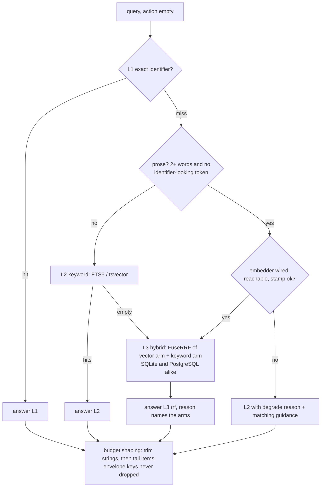

# Plan v4.14 — retrieval quality + safety fixes

**Status:** IMPLEMENTED on branch `fix/v4.14-retrieval-safety` (2026-10-08) — see §7 for outcomes, measurements and deviations · **Tracks:** `RS-01..RS-26` in [`prd-task-tracker.md`](prd-task-tracker.md) · **PRD entry:** [`prd.md` v4.14.0](prd.md)
**Source:** an isolated end-to-end validation of `14e165b` (v0.34.0) on 2026-10-08 — 241 scripted checks over MCP (HTTP + stdio), REST, ConnectRPC, dashboard and a read-only reader, plus fault injection (sidecar down/up, stamp drift, live index+embed, delete). Result: 210 pass, 19 notes, 12 fail, collapsing to the defects below. Every root cause here was traced to code and, where marked *reproduced*, re-run against a live server.

This document is the working plan for one wave. When the wave lands, its outcome moves into the PRD changelog and this file is archived under `docs/archive/`.

---

## 0. Summary

| ID | Phase | Problem (one line) | Root cause | Fix |
|----|-------|--------------------|------------|-----|
| RS-01 | P0 | `import read` / `query compress` / `query lsp` read any file (`/etc/hosts` returned) | only relative paths are anchored; absolute and `..` pass through (`core.go:1314`, `:1233-1237`) | one confinement helper on `os.Root` for every path-taking arg |
| RS-02 | P0 | `import repo\|dir` of a non-project root wipes the project index (`deleted_files: 48`); `/private/tmp` ran away to 2.2 GB | guard refuses subtrees only (`core.go:1497-1519`); reconcile deletes every stored path missing from the walk (`index.go:231-246`); handler ctx is detached from the HTTP request (go-sdk) | refuse any root other than the project root; persist the index root and refuse reconciles against another; propagate cancellation |
| RS-03 | P0 | MCP/REST bind all interfaces by default and run open (Admin) with no tokens | default `--http :9699` (`main.go:449`); no tokens = Admin (`auth.go:141-145`) | loopback default + loud warning when non-loopback and ungated |
| RS-04 | P0 | MCP token budget deletes the whole payload (`hits`, `result`) | `protectedKeys` ported from Rust (`results`), not the Go keys (`tokens.go:297-305`); arrays are trimmed to the *whole* budget, then siblings are deleted alphabetically (`:315-345`) | shape-aware budget: trim strings → trim tail items → never delete envelope keys |
| RS-05 | P1 | deleted code keeps coming back as a top semantic hit until `leankg gc` | `DeleteByFile` does not own vectors (`backend.go:39-46`); `SearchVectors` LEFT JOINs (`vectors.go:275-290`); `embed run` only *counts* orphans (`run.go:214-220`) | INNER JOIN at query time + orphan sweep at the end of index and embed runs |
| RS-06 | P1 | `memory rename` with the advertised top-level `new_path` fails ("empty path") | `ImportRequest` has no `NewPath`; `withFlatArgs` does not fold it (`core.go:158-207`, `:809`) | add the field + a schema↔struct parity test |
| RS-07 | P1 | native REST retain answers `{"ok":true,"retained":N}` for writes it skipped | `Retain` returns nil on a cursor skip (`banks.go:329`); handler reports `len(entries)` (`rest.go:182-186`); absent cursor = 0 = skip on a fresh bank | return written/skipped; absent cursor means "no gate" |
| RS-08 | P1 | `import docs` with a relative path resolves against the server cwd | `docs` is the only import action not anchored (`core.go:215-219`) | route through the RS-01 helper |
| RS-09 | P1 | several empty lists serialize as `null` (memory search `hits`, `callers`, ontology lists) | Go nil slices | normalize at the shaping layer + a no-`null` shape test |
| RS-10 | P2 | doc comments are invisible to L2 and L3 | extractors start content at the declaration line | capture the leading comment block into element content |
| RS-11 | P2 | NL queries return types/docs, almost never functions (1% of top-8 vs 78% of corpus) | embedded text = raw `Content` only (`read.go:25`, `run.go:189`) | embedding document = header (kind, name, path) + content; `ChunkerVersion` 3 |
| RS-12 | P2 | the ladder never reaches L3 for natural-language questions (0/16) | L2 FTS5 ORs every term (`elements.go:322`) so it is never empty; SQLite has no hybrid rung (`core.go:730`) | SQLite `HybridSearch` via the existing `FuseRRF`; route prose queries to hybrid |
| RS-13 | P2 | FTS5 cannot match `RotateStagingCredentials` from "rotate staging credentials" | `unicode61` does not split camelCase (`schema.go:56-58`) | identifier-split terms column in both FTS backends |
| RS-14 | P2 | stamp is `local/local:local` for any GGUF; text budget is a 1000-rune guess | local provider identity comes from env only (`env.go:176-195`); `maxLocalTextChars` (`provider.go:41`) | fingerprint the served model from llama-server `/props`; size the budget from its `n_ctx` |
| RS-15 | P2 | long queries degrade to L2; `status` says healthy with the embedder down; ladder guidance blames the wrong thing | no query-side truncation; no liveness probe in status; stale guidance kept by `withEmptyHint` | truncate query text; cached reachability probe; overwrite guidance on degrade |
| RS-16 | P2 (eval-gated) | BGE query instruction not applied | catalog row has no `QueryPrefix` for bge-small | add it once RS-14 maps a fingerprint to the catalog row; keep only if the eval improves |
| RS-17 | P2 (deferred) | 61/63 doc sections exceed the embed window; only their first 1000 runes are embedded | one vector per element | multi-vector chunks with max-sim collapse — only if RS-10..13 leave docs under-recalled |
| RS-18 | P3 | memory recall has no ranking model: stopwords outrank content, no stemming, no accent folding | bank recall = raw token overlap (`banks.go:522-600`); file search = per-line AND (`search.go:121-135`) | one BM25 index (FTS5 `porter unicode61 remove_diacritics 2`) over files *and* bank rows |
| RS-19 | P3 (deferred) | no dense recall for memory | memory package has no embedder | fuse a vector arm via `FuseRRF` when a query embedder is wired |
| RS-20 | P3 | every retain re-reads every bank file to find cursors | `sessionCursor` / `bankCursor` scan JSONL (`banks.go:289-320`, `:482-497`) | keep cursors in the RS-18 index DB |
| RS-21 | P3 | MCP cannot `view` a memory file or read the snapshot | only ConnectRPC calls `MemoryRead(view\|snapshot)` | expose `query action=memory args.command=view\|snapshot` |
| RS-22 | P4 | dead legacy alias code | `ToolAliases` / `ResolveEnvelope` have no non-test caller (`core.go:46`, `:137`) | delete; keep the "superseded" text in descriptions |
| RS-23 | P4 | error messages and responses leak absolute server paths | raw `os` errors and `session offload` path returned verbatim | report project-relative paths |
| RS-24 | P4 | dashboard `/api/query` ignores `params.limit` | `limit` lands in `Args`, not `QueryRequest.Limit` (`web/api.go:285-305`) | map it |
| RS-25 | P4 | `freshness: fresh` while elements are un-embedded | freshness tracks the index watermark only | add `embedding_coverage` to `status` |
| RS-26 | P4 | `memory create` silently overwrites | memory-tool contract ("create or overwrite") | say so in the tool description |

Two local follow-ups that are **not** repo changes: the gitignored `.mcp.json` still launches the removed Rust test binary (`mcp-stdio --watch`; Go form is `leankg serve --stdio`), and the validation run left one stale row in `~/.leankg/portfolio.db` (`leankg projects --forget <scratch fixture path>`).

---

## 1. Baseline (what "better" is measured against)

Fixture: 48-file copy of this repo's `internal/{core,memory,embed,graph,store}` + `docs/prd.md` → 654 elements (52% method, 26% function, 12% type, 10% doc). Model: `bge-small-en-v1.5` f16 via `llama-server` (512-token window).

| Metric | Value |
|--------|-------|
| Pinned semantic, 12 judged NL queries | hit@1 1/12 · hit@10 4/12 · MRR 0.19 |
| FTS5 keyword / ladder, same queries | hit@1 4/12 · hit@10 6/12 · MRR 0.39 |
| Ladder rung for 16 NL questions | L2: 16, L3: 0 |
| Element-type share of semantic top-8 (28 NL queries, 224 hits) | type 50% · doc 49% · function+method 1% |
| Server L3 ranking vs independent numpy brute force | identical 12/12 (retrieval math is correct) |
| Offline ablation — function+method share of top-8 | content only 1% → +name/path 35% → +doc comment 61% |
| Offline ablation — MRR on judged set | 0.23 → 0.28 → 0.60 (0.65 with BGE query prefix) |
| Freshly added `RotateStagingCredentials`: query "rotate staging credentials" | semantic rank 1; FTS5 miss |
| Same symbol, query = paraphrase of its doc comment | cosine rank 225 / 698 |
| Latency | L3 p50 ~12 ms; 64 concurrent in 0.35 s |

**Bias warning:** the 12 judged queries were written after reading the code, so the doc-comment gain is inflated. The 16 extra queries and the element-type composition metric were not tuned to the code, which is why §4 gates on composition as well as MRR.

---

## 2. Target retrieval flow



Today the `SHAPE` and `H`-on-SQLite boxes do not exist: any query that shares one word with any element stops at L2 (`core.go:569-577`), and SQLite's L3 is plain cosine.

---

## 3. Work items

Each item lists **evidence → root cause → fix (and the rejected alternative) → tests (written failing first) → acceptance → compatibility**. Storage changes land on both backends and pass `make dual-engine`.

### P0 — safety and data loss

#### RS-01 Confine every path-taking argument to the project roots

- **Evidence (reproduced):** `import read path=/etc/hosts` and `path=../../../../../../etc/hosts` return the file; `query action=compress query=/etc/hosts` returns it too. `query` is open to every role (`auth.go:155-160` gates only `import`), so even a Viewer token can read arbitrary files, and with no tokens configured every caller is Admin.
- **Root cause:** `compressRead` anchors a path only when it is relative (`core.go:1306-1314`) and never checks the result stays inside the project; `query compress` funnels into it; `query lsp args.path` is passed straight to the language server (`core.go:1233-1237`). The dashboard already has a correct resolver (`web/api_file.go:169-199`, `resolveReadableFile`) and the memory layer has its own (`memory.go:119-160`) — three call sites, three policies.
- **Fix:** new `internal/pathguard` with `Resolve(roots []string, p string) (abs string, rel string, err error)` built on **`os.Root`** (Go 1.24+, module is on 1.25): open each allowed root (`projectDir` + `LEANKG_PROJECT_DIRS` extras) as an `os.Root`, and open files *through* it, so `..`, absolute paths and symlinks that escape are rejected by the runtime rather than by string checks. Return a catalog error `PATH_OUTSIDE_PROJECT` naming the allowed roots (project-relative, see RS-23). Callers: `compressRead`, `compressRun`, `lspQuery document`, `import docs|prd|ontology` (RS-08), and the dashboard resolver (replace its body, keep its error envelope). Memory keeps its stricter whitelist resolver (it is correct and has symlink tests).
- **Rejected:** `strings.HasPrefix(filepath.Clean(p), root)` — TOCTOU and symlink escapes; this is the class of bug `os.Root` exists for.
- **Tests:** table test over `/etc/hosts`, `../…/etc/hosts`, a symlink inside the project pointing outside, a dangling symlink, an allowed relative path, an allowed extra-root path — for each of the four entry points; MCP-level test that `query compress /etc/hosts` is an error for every role.
- **Acceptance:** no tool, REST, RPC or dashboard path reads a file outside the registered roots; inside-root reads are unchanged (`import read` mode matrix still passes).
- **Compatibility:** behavior change for anyone using `import read` on files outside the project — intended.

#### RS-02 Refuse foreign index roots; make destructive reconciles impossible by accident

- **Evidence (reproduced):** `import repo path=<sibling dir>` → `{"deleted_files": 48, "elements": 1}`: the project's whole index was replaced by the other directory. `import dir path=../../..` was accepted. `import repo path=/private/tmp` walked a 29 GB tree, grew the store to 2.2 GB in ~4 min at ~87% CPU, and kept running after the client timed out.
- **Root cause (three layers):**
  1. `resolveIndexTarget` refuses only a *subtree* of the project (`core.go:1497-1519`); siblings, ancestors and unrelated roots pass. Its own comment documents the hazard for subtrees ("cost 4,525 elements"); the same reconcile hits every other non-root.
  2. Stored file paths are relative to the walk root, and the reconcile deletes every stored path absent from the new walk (`index.go:231-246`) — a different root reads as "everything was deleted".
  3. go-sdk v1.7.0 detaches tool-handler contexts from the HTTP request for protocol versions before 2026-07-28, and for newer ones only when `StreamableHTTPOptions.PropagateRequestCancellation` is set (`go-sdk mcp/streamable.go:211-220`, `:431`); LeanKG sets only `Stateless` (`internal/mcp/server.go:109-112`). The walk checks `ctx.Err()` (`index.go:179`) but its ctx never cancels.
- **Fix:**
  - `resolveIndexTarget`: when the engine has a project dir, the target must resolve (after `EvalSymlinks`) to exactly the project root; anything else is refused with guidance — "index it as its own project (`leankg index <dir>`), or select it with `project=` on a multi-project server". Engines without a project dir (standalone `--db`) keep today's behavior.
  - Store-level tripwire (defense in depth, also protects the CLI): persist `index_root` in store metadata on the first index; `IndexDir` refuses to reconcile when `dir` differs from it (explicit `--rebase-root` flag for a deliberate move).
  - Set `PropagateRequestCancellation: true` so new-protocol clients cancel abandoned imports; document that older-protocol clients cannot cancel and rely on the root guard.
- **Rejected:** a "mass-delete threshold" (refuse when >N% of files vanish) — it misfires on legitimate large deletions and still passes a small foreign tree that deletes a small project.
- **Tests:** sibling, ancestor, unrelated, `../../..`, symlink-to-sibling targets all refused with the store untouched (element count unchanged); project root and `"."` accepted; CLI `leankg index <other>` against a store with a different `index_root` refused; cancellation test with a new-protocol client aborting mid-walk.
- **Acceptance:** no import call can delete elements of files that still exist on disk under the project root.

#### RS-03 Safe network defaults

- **Evidence:** `leankg serve` with no address binds `:9699` (all interfaces, `cmd/leankg/main.go:449`); with no tokens configured every caller is Admin (`auth.go:141-145`). Combined with RS-01/RS-02 that is unauthenticated file read and index destruction from the network. The dashboard already warns on a non-loopback bind (`main.go:529-535`); MCP and REST do not.
- **Fix:** default `--http` to `127.0.0.1:9699`; when MCP or REST binds a non-loopback address **and** the auth gate is disabled, log a warning naming the risk and the `LEANKG_TOKEN_*` / `leankg auth token create` fix. Explicit `--http :9699` keeps working (the self-host runbook and existing deployments are unaffected apart from the warning). The Docker image passes `--ui :${PORT}` explicitly and installers use stdio, so neither changes.
- **Tests:** default-address test; warning emitted for `:PORT` with no tokens and suppressed with a token or a loopback bind.

#### RS-04 Token budget that never empties the payload

- **Evidence (reproduced):** pinned `semantic` at the default limit returned no `hits` for 1 of 12 judged queries (`_token_budget {max 2000, actual 59, pre_truncation 2211}`); the same query kept its hits at limit ≤ 8 and lost all of them at 10 and 20, and `limit=100000` returned zero hits. `ontology concept_search` returned only the marker. The ladder (envelope key `query`, uncapped) returned the same hits untrimmed; REST/RPC are unbudgeted.
- **Root cause:** `protectedKeys` and their tests were ported verbatim from Rust in #370 and protect `results` (`tokens.go:297-305`, `tokens_test.go:166-187`); the Go engine's primary keys are `hits`, `result`, `memories`, `callers`, `callees`, `requirements`, `refs`, … `truncateObject` first trims each child array to the **whole** budget, then deletes non-protected keys in alphabetical order until the object fits (`tokens.go:315-345`) — `freshness` goes first, `hits` second. Caps also disagree with each other: `semantic` 2000 vs `fuzzy`/`search` 4000 vs ladder uncapped (`:44`, `:52`, `:74`) for the same hit shape.
- **Fix:** replace key-name protection with shape-aware shaping, in order:
  1. shorten long string fields inside array items (`content` 400 → 200 → 120 runes, with `…`);
  2. drop tail items of the largest array, never below one, budgeting against `max − size(siblings) − marker`;
  3. only then drop keys from an explicit **diagnostic deny-list** (`debug`, `stats`, `languages`, …); envelope keys (`query`, `retrieval`, `freshness`, `guidance`, `action`, `resolved_query`) and primary arrays are never deleted.
  The marker gains `items_returned` / `items_available`, and `guidance` says "lower `limit`" when items were cut. Caps: one cap per response *shape* — ladder and pinned rungs share the `search` cap; MCP-only by design (REST/RPC are programmatic clients), stated in `docs/mcp-tool-contract.md`.
- **Tests:** a golden test that runs **real engine responses** for every query action at limit 10, 20 and 100 through `Apply` and asserts: primary array non-empty, envelope keys present, final size ≤ cap. Port the existing tests from `results` to the Go keys.
- **Acceptance:** zero responses with a dropped primary payload across the action × limit matrix.

### P1 — correctness

#### RS-05 No ghost vectors

- **Evidence (reproduced):** after deleting a file and re-indexing, the deleted `RotateStagingCredentials` stayed the rank-1 semantic hit, hydrated with empty type, file and content; `leankg-embed run` reported `Orphans: 1` and left it; only `leankg gc` removed it.
- **Root cause:** vectors are keyed by qualified name and nobody owns their deletion except `gc` (contract text in `store/backend.go:39-46`); `DeleteByFile` removes elements, FTS rows and edges only (`store/elements.go:180-199`); `SearchVectors` LEFT JOINs and falls back to the QN for "docs, memory blobs" (`store/vectors.go:275-290`) — but `DeleteOrphanVectors` already defines any vector without an element as an orphan, and the NDJSON import skips non-live QNs (`embed/ndjson.go:157`), so that fallback serves only ghosts.
- **Fix:** (a) INNER JOIN in both backends' `SearchVectors` (SQLite `vectors.go:290` and PostgreSQL `store_pg.go:761` both LEFT JOIN today; the PostgreSQL `HybridSearch` vector arm calls the latter, `pg_fts.go:427`) — closes the window immediately at zero cost; (b) call `DeleteOrphanVectors` at the end of `IndexDir` when `DeletedFiles > 0` or any file was re-extracted, and at the end of `leankg-embed run`, so `Orphans` reads 0 after a run; `gc` stays as the manual repair.
- **Rejected:** cascading vector deletion inside `DeleteByFile` — every changed file would lose the vectors of its *unchanged* elements and force their re-embedding.
- **Tests:** delete-file → index → semantic query must not return the deleted QN (both backends); embed run after a deletion reports `Orphans: 0`.

#### RS-06 `rename` honors the advertised schema

- **Evidence (reproduced):** `import action=memory command=rename path=… new_path=…` → `invalid memory path: empty path`; `args.new_path` works.
- **Root cause:** the MCP schema advertises a top-level `new_path` (`internal/mcp/server.go:177`) but `ImportRequest` has no such field and `withFlatArgs` does not fold it (`core.go:158-207`); `memoryWrite` reads only `Args["new_path"]` (`core.go:809`). This is the second instance of the class #443 fixed for `content`.
- **Fix:** add `NewPath` to `ImportRequest` and the fold list. **Prevent the class:** a parity test that parses each tool's `inputSchema` and asserts every property is either a field of the request struct or explicitly folded into `Args`.
- **Tests:** rename via both shapes; the parity test fails today on `new_path`.

#### RS-07 Retain acknowledgements tell the truth

- **Evidence (reproduced):** `POST /api/v1/memory/banks/{bank}/memories` without `through_user_turn` on a fresh bank → `{"ok":true,"retained":1}`, recall finds nothing; a second batch at the same cursor → same answer, nothing written.
- **Root cause:** `Retain` returns nil when `throughUserTurn <= bankCursor(bank)` (`memory/banks.go:329`), and `bankCursor` is 0 for an empty bank (`:482-497`), so an omitted cursor (0) always skips; the handler reports `len(body.Entries)` regardless (`rest/rest.go:182-186`).
- **Fix:** `Retain` returns `RetainResult{Written, Skipped, RetainedThroughUserTurn}` like `SessionRetain`; the handler answers `{ok, retained: written, skipped, retained_through_user_turn}`. Decode `through_user_turn` as `*int`: **absent = no cursor gate** (append, the `RetainRaw` semantics the Hindsight mount already uses); explicit ≤ stored = skipped and reported, still HTTP 200 (idempotent retries must succeed).
- **Tests:** fresh bank without cursor writes; same cursor twice reports `skipped`; existing cursor-resume tests unchanged.

#### RS-08 `import docs` anchors like every other import action

- **Root cause:** `docindex.IndexDocs(ctx, e.st, req.Path)` receives the raw path (`core.go:215-219`); `prd`, `read` and `repo|dir` all anchor to the project.
- **Fix:** resolve through `pathguard` (RS-01). **Test:** `import docs path=docs` succeeds when the server cwd is elsewhere.

#### RS-09 Empty lists are `[]`, never `null`

- **Evidence:** memory search with no match returned `"hits": null` (crashed a client doing `len(hits)`); unknown-seed `callers: null`; ontology `matches: null`, `steps: null`.
- **Fix:** initialize result slices at the producers named above (`core.go:847-851`, `:1004-1023`, `ontology` reads) and add a shape test that marshals each action's empty result and fails on `null` for list-typed fields.

### P2 — semantic quality

The order matters: RS-10 and RS-11 change what is embedded (one full rebuild), RS-12 and RS-13 change how it is retrieved, RS-14 changes the identity (a second rebuild if shipped separately — **ship RS-10, RS-11 and RS-14 in the same release** so users rebuild once).

#### RS-10 Doc comments become part of element content

- **Evidence:** 0 of 591 Go symbols' stored content starts with a comment; a paraphrase of `RotateStagingCredentials`'s own doc comment ranks it 225/698.
- **Root cause:** the regex extractors (`internal/index/extract.go`) start an element at the declaration line; the comment block above it belongs to no element.
- **Fix:** per-language leading-comment capture: walk upward from the declaration over contiguous comment lines and attached attributes/annotations/decorators (`//`, `///`, `/** */`, `#`, `--`, `;`, `@Annotation`, `#[attr]`), stop at a blank line; prepend that block to `Content`. Keep `line_start` = declaration line (navigation, LSP enrich and graph consumers depend on it); record `metadata.doc_line_start`. Python docstrings already sit inside the body; Elixir `@doc`/`@moduledoc` attributes precede the `def` and are captured as attributes. Because `Content` changes, the content hash changes and incremental embedding picks it up with no extra mechanism; FTS gains the comments too.
- **Rejected:** a separate `doc` column — needs migrations on both backends, the FTS schema and the NDJSON resume key, for the same retrieval effect.
- **Verify before merging:** every consumer that assumes `Content` equals source lines `[line_start, line_end]` (compress reader, `explain`, obsidian export, LSP enrich merge) — grep for `LineStart` + `Content` pairs.
- **Tests:** extractor goldens per language (Go, TS, Python, Rust, Java, Kotlin at minimum) with and without comments, blank-line separation, annotations.

#### RS-11 Embed a document, not a code fragment

- **Evidence:** offline ablation on the same model — adding `"<name> (<path>)"` alone moves function+method share of top-8 from 1% to 35%; with RS-10 content, 61%.
- **Root cause:** both embed paths send raw `Content`: `run.go:189` and, separately, `ndjson.go:51`.
- **Fix:** one `embedDocument(e store.Element) string` = `"<element_type> <name> — <file_path>\n" + content`, used by `run`, `full` and NDJSON export (one builder, so offsite batches and local runs cannot drift). Bump `ChunkerVersion` to 3: the existing stamp guard makes incremental writers hard-fail with the `leankg-embed full` directive and the read path degrade with the rebuild hint — no new migration machinery. The header is derived from fields that are part of the element's identity, so the content-hash dirty rule stays correct.
- **Tests:** stamp-bump test (v2 collection + v3 binary → incremental refuses, full rebuilds); NDJSON export text equals run text.

#### RS-12 Hybrid L3 on SQLite and prose-aware routing

- **Evidence:** 16/16 NL questions answered at L2; SQLite L3 is cosine-only while PostgreSQL already fuses (`core.go:730-747`, `store/pg_fts.go:397`).
- **Root cause:** the ladder escalates only when L2 is *empty* (`core.go:569-584`), and `ftsQuery` ORs every term (`store/elements.go:304-322`), so L2 is empty only for gibberish. `*Store` does not implement `FTSBackend`, so SQLite never takes the fusion branch.
- **Fix:**
  - Split a narrow `HybridSearcher` interface out of `FTSBackend` (`HybridSearch` only); implement it on `*Store` with the existing engine-agnostic `FuseRRF` (k = 60, window `hybridWindow(limit)`) over `SearchVectors` + `FindFuzzy`. Reason string `rrf(vector+fts5)`.
  - Ladder: after an L1 miss, a **prose** query (≥ 2 words and no identifier-shaped token per `NLRoute`/`looksLikeIdentifier`, `core.go:893-927`) goes to hybrid L3 when the embedder is wired, reachable and stamp-matched; otherwise L2 with the degrade reason. Identifier-shaped queries keep L1 → L2 → L3. The Noul confidence gate (`core.go:578-583`) still applies.
- **Rejected:** AND-ing FTS terms so L2 empties more often — trades a recall problem for a precision problem and still never fuses.
- **Tests:** ladder routing table (identifier / prose / gibberish × embedder present / absent / stamp drift); SQLite hybrid returns fused ranks; PG unchanged.

#### RS-13 Identifier-aware keyword index

- **Evidence:** `RotateStagingCredentials` is invisible to FTS5 for "rotate staging credentials" (semantic found it at rank 1).
- **Fix:** add a `terms` column holding the split identifier (`rotate staging credentials` from camelCase/PascalCase/snake_case/kebab-case of `name`) — SQLite: migration recreating `elements_fts(name, qualified_name, content, terms)` + rebuild; PostgreSQL: add `terms` to the migration-012 tsvector expression. Populated in `UpsertElements` on both backends.
- **Tests:** FTS hit for split terms; migration rebuild test on an existing store.

#### RS-14 Fingerprint the served local model and size its budget from it

- **Evidence:** the stamp is `model_id=local, revision=local:local` for any GGUF, so swapping the model behind the sidecar port is not detected (`env.go:176-195`, by design per its comment); the 1000-rune budget is a heuristic (`provider.go:41`).
- **Measured:** llama-server exposes `GET /props` with `model_path` (for `-hf` downloads it contains the HF snapshot commit, e.g. `…/snapshots/d32f8c04…/bge-small-en-v1.5-f16.gguf`) and the effective `n_ctx` (512 here), plus `GET /v1/models` with the model id.
- **Fix:** `newLocalProvider` probes `/props` once: revision = `local:<gguf basename>@<snapshot sha>` (or `@<model id>` when no snapshot segment); when `/props` is absent (another OpenAI-compatible server), keep today's revision and surface `identity: unverified` in `status`. Derive the text budget from `n_ctx` (≈ 2 runes/token conservative, minus header) instead of the constant.
- **Compatibility:** existing collections stamped `local:local` degrade with the rebuild hint until one `leankg-embed full` — ship together with RS-11 (see the P2 note).

#### RS-15 Query-side hygiene

- Truncate the query text to the provider budget in `providerEmbedder.EmbedQuery` (today a 962-token query degrades to L2 with a 500 from the sidecar).
- `status.query_embedder.reachable` from a cached probe (reuse `probeEmbeddings`, `sidecar.go:273`, 30 s TTL); today `status` says `healthy` with the provider down.
- On an L3 degrade inside the ladder, overwrite the guidance set by the earlier L2 pass (today it says "No keyword match…" while the cause is a provider outage).

#### RS-16 BGE query instruction (eval-gated)

BGE-small v1.5's card recommends `"Represent this sentence for searching relevant passages: "` for short queries; the ablation measured +0.03–0.06 MRR. Add it to the catalog row only after RS-14 can map a fingerprint to that row (otherwise a local GGUF never gets it), and keep it only if §4 improves. Prefix changes are already part of the stamp.

#### RS-17 Long-element chunking (deferred, eval-gated)

61 of 63 doc sections exceed the budget and only their head is embedded. Multi-vector chunks need a schema change (`chunk` in the vector key, max-sim collapse per element, orphan rules). Docs are already over-represented in results, so do this only if §4 shows doc recall falling behind after RS-10..13. Cheaper alternative to evaluate first: split oversized sections at paragraph boundaries in `docindex`.

**Explicit non-goal:** a cosine similarity floor. bge-small scores are not calibrated (an out-of-domain query scored 0.51 vs 0.66 in-domain, with overlap across queries); RRF fusion plus the keyword arm is the better "no answer" signal.

### P3 — memory recall

#### RS-18 One BM25 index for memory files and bank rows

- **Evidence (reproduced):** "what is the plan" ranks a stopword-only row first; "embedding" does not find "embeddings"; Vietnamese without diacritics finds nothing; a stopword-free paraphrase finds nothing; a paraphrase that does hit matched on "we"/"for".
- **Root cause:** two unrelated lexical engines. Bank recall counts raw unique-token overlap with no IDF, no stemming, no folding (`banks.go:522-600`, `tokenize` `:696-700`) and re-reads every JSONL per query. File search uses FTS5 `unicode61`, one row per *line*, and ANDs every term (`search.go:30`, `:121-135`), so a multi-word query must fit in one line.
- **Fix:** keep JSONL banks and Markdown files as the source of truth; make `index.db` the single derived ranking index: rows for file sections and for bank entries (`kind`, `bank`, `id`, `tags`, `body`), tokenizer `porter unicode61 remove_diacritics 2`, OR query ranked by `bm25()`. Recall = FTS candidates (wide window) → tag/eligibility filter (`RecallFiltered` contract: filter before limit) → limit. Insert on retain/write; rebuild on open when an index version marker is behind. `RankedMemory.Score` carries the real BM25 score instead of the constant 0. Output contracts (OMP `RankedMemory`, Hindsight rows, `<memories>` block) unchanged.
- **Known limit:** `remove_diacritics` does not fold `đ` → `d`; acceptable, noted in the docs.
- **Tests:** the five evidence cases above as failing-first tests; existing Hindsight tag-matrix and filter-before-limit tests unchanged; rebuild-from-JSONL test.

#### RS-19 Dense memory recall (deferred)

When `serve` has a query embedder, embed bank rows at retain time and fuse a vector arm with BM25 via `FuseRRF`. Needs a vector home for memory rows and a stamp; defer until RS-18 is measured.

#### RS-20 Cursors without full scans

`sessionCursor` reads every bank file per retain and `bankCursor` the bank file (`banks.go:289-320`, `:482-497`). Store `(session_id → cursor)` and `(bank → cursor)` in the RS-18 index DB, rebuilt from JSONL like the rest.

#### RS-21 MCP can read memory

`MemoryRead(view|snapshot)` exists (`core.go:826-855`) but only ConnectRPC calls it. Add `query action=memory args.command=view` (`args.path`) and `=snapshot`.

### P4 — hygiene

- **RS-22:** delete `ToolAliases` and `ResolveEnvelope` (no non-test caller; the deprecation window has passed); keep the "superseded" sentence in tool descriptions.
- **RS-23:** client-facing errors and payloads report project-relative paths (`memory delete` missing file, `import read` missing file, `session offload` returns an absolute path).
- **RS-24:** dashboard `/api/query` maps `params.limit` to `QueryRequest.Limit`.
- **RS-25:** `status` adds `embedding_coverage` (covered / elements per model); `freshness` keeps meaning "index vs disk".
- **RS-26:** the `import` description states that `memory create` overwrites an existing file.

---

## 4. Evaluation gate (P2/P3 acceptance)

Promote the validation harness into `benchmark/retrieval/` (a local/nightly tool per the test-layer policy — never in CI): a judged query set over this repository's own store (the self-host corpus), split into **identifier**, **prose** and **held-out** queries (held-out written from issue titles and PRD sentences, not from reading the code), run against a live sidecar gated on `LEANKG_TEST_EMBED_URL`.

| Gate | Baseline | Target |
|------|----------|--------|
| Function+method share of top-8, prose + held-out queries | 1% | ≥ 40% |
| MRR@10, held-out queries | (measure first) | ≥ 1.5× baseline |
| Ladder answers prose queries from hybrid L3 | 0/16 | ≥ 90% |
| Identifier queries hit@1 (L1/L2) | (measure first) | no regression |
| Memory recall, the five RS-18 cases | 0/5 | 5/5 |
| L3 p50 latency at 10k elements, SQLite | ~12 ms at 654 | ≤ 50 ms |

---

## 5. Delivery

One feature per commit; main is PR-only. Proposed PR order (each green on `make go-build go-test go-vet`; storage PRs also on `make dual-engine`):

| PR | Items | Release |
|----|-------|---------|
| 1 | RS-01 + RS-08 (`pathguard`) | patch |
| 2 | RS-02 (root guard, `index_root` tripwire, cancellation) | patch |
| 3 | RS-03 (bind default + warning) | patch — note the default change |
| 4 | RS-04 (budget shaping) | patch |
| 5 | RS-05 (ghost vectors) | patch |
| 6 | RS-06 + RS-07 + RS-09 (API correctness) | patch |
| 7 | RS-10 + RS-11 + RS-14 (one rebuild) | **minor** — release note: run `leankg-embed full` once |
| 8 | RS-12 + RS-13 (hybrid + identifier FTS, migration) | minor (same as 7 if ready) |
| 9 | RS-15, then RS-16 if the gate improves | patch |
| 10 | RS-18 + RS-20 + RS-21 (memory index) | minor |
| 11 | RS-22..26 (hygiene) | patch |

P0 (PRs 1–4) ships first and independently. RS-17 and RS-19 stay deferred until the §4 gate is measured after PR 8 and PR 10.

## 6. Risks

- **Rebuild cost (PR 7):** every collection re-embeds once; at ~80–110 vectors/s on a local sidecar a 10k-element store takes ~2 min, a 100k+ store tens of minutes. The stamp guard keeps serving L2 meanwhile — never mixed vectors.
- **Content change (RS-10):** consumers assuming `Content` = source lines; covered by the verify-before-merge step.
- **Default bind (RS-03):** anyone reaching `leankg serve` (no address) from another host must now pass `--http :9699`; called out in the release note.
- **Root guard (RS-02):** a workflow that intentionally re-pointed a store at a moved checkout needs `--rebase-root`.

---

## 7. Outcome (2026-10-08)

All gates green on the branch: `go build`, `go vet`, `go test ./...` (default and `-tags tstree`), and `make dual-engine` against a fresh pgvector 17 container (the gate script itself was repaired, see deviations).

| ID | Status | Where |
|----|--------|-------|
| RS-01 | DONE | `internal/pathguard` (`os.Root`, plus a resolved-target check for in-tree absolute symlinks, which `os.Root` refuses outright); wired into `import read`, `query compress`, `query lsp document`, `import docs/prd/ontology` and `POST /api/v1/ontology/match`; `LEANKG_ERROR_PATH_OUTSIDE_PROJECT` |
| RS-02 | DONE | `resolveIndexTarget` accepts only the project root (`LEANKG_ERROR_INDEX_ROOT_MISMATCH`); store-level `index_root` tripwire in `internal/index` + `leankg index --rebase-root`; `PropagateRequestCancellation` |
| RS-03 | DONE | default `--http 127.0.0.1:9699`; exposure warning for MCP/REST; MCP now honors DB-minted tokens (`SetAuthStore`) — before, a `leankg auth token create` token gated REST but left MCP open as Admin |
| RS-04 | DONE | `internal/budget` shrinks (item strings → tail items → strings → non-envelope keys), never drops lists or envelope keys; caps unified (`semantic` = `search` = 4000, ladder carries the search cap, `read`/`compress` 8000); golden over real engine answers |
| RS-05 | DONE | INNER JOIN on both backends; orphan sweep after index runs that changed files and after every `leankg-embed run` |
| RS-06 | DONE | `ImportRequest.NewPath` + schema↔struct parity test |
| RS-07 | DONE | `Retain` returns `RetainResult`; REST reports `retained`/`skipped`; absent cursor = no gate |
| RS-08 | DONE | via `pathguard` + `docindex.IndexDocsUnder` (see deviations) |
| RS-09 | DONE | `emptyLists` normalizer at the `Engine.Query` boundary + service-context lists; no-`null` shape test |
| RS-10 | DONE | leading comment/attribute block prepended to element content (30+ languages); doc prose excluded from call-edge detection |
| RS-11 | DONE | `documentText` (header + content) shared by run/full/NDJSON export; `ChunkerVersion` 3 |
| RS-12 | DONE | `store.HybridSearcher` on SQLite via `FuseRRF`; prose routing in the ladder |
| RS-13 | DONE | SQLite: split terms in `ftsContent` + one-time backfill on `Migrate`; PostgreSQL: migration 16 |
| RS-14 | DONE | local provider fingerprints `/props` (`local:<gguf>@<snapshot>`), text budget from `n_ctx`; operator pins win |
| RS-15 | DONE | query truncation (`embed.TextCap`), `status.query_embedder.{reachable,revision,error}`, ladder guidance reset before L3 |
| RS-16 | REJECTED (measured) | BGE query prefix lifts the vector arm alone (MRR 0.597 → 0.653) but not the fused rung that ships (0.722 → 0.711) |
| RS-17 | REJECTED (measured, three variants) | doc-tail queries (15 sentences from the second half of long PRD sections): head-only + hybrid median rank 18; mean-pooled chunks 21 but judged code MRR 0.597 → 0.531; max-sim over chunks (≡ splitting sections into paragraph elements) judged MRR → 0.468. Every variant trades code-question quality for doc-tail recall; the keyword arm already finds 9/15 tails in its top 10 (`action=fuzzy`) |
| RS-18 | DONE | one FTS5 index (`porter unicode61 remove_diacritics 2`, bm25, query stopwords) over memory files and bank rows; derived, rebuilt from sources on version change |
| RS-19 | DONE | dense memory recall: rows embedded lazily into `index.db` (`memory_vectors`, keyed by vector space), fused with BM25 by RRF; meaning-only matches admitted above the calibrated noise floor, and only for questions of 3+ words (one-word queries embed close to everything). Live: paraphrase recall top-3 2/8 → 7/8, unrelated questions recalling anything 0/8 → 1/8 ("recipe for vietnamese pho" → the Vietnamese-language memory) |
| RS-20 | DONE | `memory_cursors` table maintained on append, recomputed on rewrite and rebuild |
| RS-21 | DONE | `query action=memory args.command=view|snapshot` |
| RS-22 | DONE (changed) | aliasing was intentionally retired (a wire test pins the refusal); the dead map became `supersededTools`, and a `tools/call` middleware returns the catalog error naming the replacement |
| RS-23 | DONE | project-relative paths in errors (`scrubPaths`) and session refs |
| RS-24 | DONE | dashboard `params.limit` → `QueryRequest.Limit` |
| RS-25 | DONE | `embeddings[].coverage` in `status` |
| RS-26 | DONE | `import` description states that `create` overwrites |

### Calibrated "no answer" signal (added after the first outcome pass)

Every embed run measures the collection's noise floor — the best similarity twelve fixed off-topic probe sentences reach (`internal/embed/calibrate.go`, bound to the collection identity). L3 answers whose best vector hit does not beat it carry `retrieval.confidence: "low"` and guidance; hits are still returned. A raw fixed floor would be model-specific, and relative statistics (z-score, top-1 gap) did not separate on-topic from unrelated questions at all. On the fixture (floor 0.585, probes disjoint from the test set): in-domain questions flagged 0/28, unrelated 14/15.

### Measurements (same 52-file corpus, same `bge-small-en-v1.5` sidecar; old = `main@14e165b`)

| Metric | Old | New |
|--------|-----|-----|
| Pinned semantic, 12 judged queries: hit@1 / hit@10 / MRR | 1/12 · 4/12 · 0.188 | 6/12 · 11/12 · 0.679 |
| Ladder (action empty), same queries: rung · MRR | L2 for 12/12 · 0.375 | L3 hybrid for 12/12 · 0.679 |
| Keyword rung alone, same queries: MRR | 0.375 | 0.753 (doc comments now in content) |
| Function+method share of semantic top-8, 16 held-out queries (corpus 79%) | 1% | 72% |
| Validation harness (MCP/REST/RPC/UI/read-only/memory) | 210 pass · 12 fail · 19 notes (241 checks) | 244 pass · 0 fail · 0 notes (244 checks) |

The keyword rung alone scores above the fused rung on the judged set (0.753 vs 0.722 offline); those queries paraphrase doc comments, which favours keywords. Fusion stays the default for prose because it is the robust choice when a question shares no words with the code.

### Deviations from the plan

- **Dashboard resolver kept:** `/api/file` already refused every traversal probe; RS-01 confines the core paths instead of rewriting it.
- **`import docs` was a second foreign-root bug:** `docindex` keyed files relative to the walked directory and deleted every other `.md` record, and `leankg refresh` did this on every run via its `<project>/docs` default. Fixed with `IndexDocsUnder(root, dir)`; the refresh test that had pinned the duplicate now pins "no re-keyed copy".
- **`import read` lost its content:** the budget's 1000-token default deleted `content` from any full read over ~4 KB (masked during validation by the session cache stub). Fixed with RS-04.
- **Graph `callees` listing types:** a name used only in a declaration's signature (a parameter, return or receiver type) is now a `references` edge; names in the body stay `calls` (Python `Greeter()` construction). `Engine.Query` no longer "calls" `Engine`; `impact` follows both edge types; grammar-derived call edges suppress the heuristic for the same pair.
- **`memory create`:** still create-or-overwrite (the memory-tool contract), but the answer reports `overwrote: true|false`.
- **`path` errors** now name the unknown endpoint.
- **Hindsight `tags_match`** rejects unknown values with 400 instead of silently reading them as `any`.
- **`make dual-engine` was unrunnable:** it `cd`'d into the removed `go/` directory, and with `LEANKG_TEST_PG_URL` exported its "sqlite" stage ran every package's PG tests in parallel against one database. Both fixed in `scripts/test-dual-engine.sh`. Its hint about `docker-compose.500mb.yml` names a file that no longer exists.
- **Local config (not in the repo):** the gitignored `.mcp.json` launched a removed Rust test binary; it now points at the running self-host over HTTP (`http://127.0.0.1:9699/mcp`) instead of spawning a second process on the same store. The stale `portfolio.db` row from the first validation run was removed with `leankg projects --forget`.
- **A unit test touched a live service:** the local-provider test attached to the fixed port `127.0.0.1:9101`, which a real sidecar on the developer machine answered once fingerprinting existed. It now uses `httptest`.

### Larger evaluation (independent query sets, whole repository)

Corpus: this repository at `14e165b` (834 files, 9,449 elements), indexed and embedded identically by the old build and this branch. Query sets not written from the code: **29 commit subjects** (written by the developers; a hit is any file the commit changed), and **40 functions sampled at random** (seeded) whose doc comment was paraphrased into a question without the function's name.

| | old ladder | old semantic | new ladder | new semantic |
|---|---|---|---|---|
| doc paraphrase: exact element in top 10 · MRR | 8/40 · 0.096 | 0/40 · 0.000 | 37/40 · 0.758 | 37/40 · 0.758 |
| commit subjects: changed file in top 10 · MRR | 14/29 · 0.271 | 4/29 · 0.083 | 16/29 · 0.322 | 17/29 · 0.389 |
| in-domain questions flagged low-confidence | — | — | 0/40 | 0/40 |
| unrelated questions flagged low-confidence | — | — | 15/15 | — |

Acronyms (JSON, RPC, XML) no longer count as code-shaped, so every prose question reaches the fused rung.

### Cross-repository check (two more of the owner's repositories)

Same protocol on `xdev` (10,307 elements) and `onegw` (3,223 elements), 120 developer-written commit subjects each, scored two ways: a hit on any file the commit changed ("all"), and on its implementation files only ("impl"). This exposed a ranking shift the single-corpus numbers hid: with identifiers split (RS-13), descriptive test names (`TestDockEndsWithMCPThenTrajectory`) match a question word for word and outranked the implementation. Fixed with **test-file demotion** (`internal/core/testrank.go`): unless the query mentions tests, a test-file hit counts 2 positions lower, ranked over twice the requested window. The value was swept over 0/2/3/5; 2 is the only one that beats the old ladder on both scores in both repositories.

| Ladder MRR (impl / all) | xdev | onegw | leankg commits |
|---|---|---|---|
| old build | 0.603 / 0.842 | 0.558 / 0.756 | 0.271 (impl) |
| new, no demotion | 0.479 / 0.876 | 0.529 / 0.774 | 0.322 |
| **new, demotion 2 (shipped)** | **0.607 / 0.850** | **0.651 / 0.763** | **0.357** |

Pinned `semantic` on the same queries (impl): xdev 0.203 → 0.474 (before demotion), onegw 0.191 → 0.496; leankg 0.083 → 0.425. Doc-paraphrase recall on leankg stays 37/40 (MRR 0.752).

Memory recall, 24 facts each with a paraphrased question sharing no content words, plus 24 unrelated questions: lexical-only recall top-3 5/24 (top-1 2/24); with the dense arm 16/24 (9/24). Unrelated questions recalling anything: 2/24 in both (shared words, not the dense arm).

### Self-host upgrade rehearsal (a copy of the live store, not the live service)

The dogfood self-host (FR-SELF-01) is not upgraded by this branch: a multi-project `serve` migrates every registered store on first use and each project needs a re-embed, so the upgrade is the operator's deployment. It was rehearsed on an online backup of this repository's own `.leankg` store (9,282 elements, two collections, 267 bank rows):

1. The new build opens it cleanly; the memory index rebuilds from the JSONL banks (267/267 rows); prose queries degrade to L2 with the stamp-drift reason until re-embedded.
2. **Found during the rehearsal:** an existing store never received the RS-10 doc-comment content, because unchanged files are skipped. Fixed with an `extractor_version` marker: a store indexed by an older extractor re-extracts every file once (`TestExtractorVersionReextractsOnce`).
3. `leankg index` (re-extracts 834 files once, then skips them) + `leankg-embed run` (2,624 dirty elements, 0 failed, coverage 1; a cold `full` takes ~72 s for 9,282 elements) → on the copy: 37/40 · MRR 0.758, identical to a fresh index.
4. Rollback: the old binary on the upgraded store starts healthy and serves L1/L2 and memory recall; only L3 waits for a re-embed by the old build.

**Runbook (operator):**

```sh
make go-build                                    # in the merged checkout
cp "$(command -v leankg)" "$(command -v leankg).prev"   # rollback copy
install bin/leankg bin/leankg-embed "$(dirname "$(command -v leankg)")"/
# restart the serve and writer processes however they are supervised
# (the writer re-extracts each project once on its next pass)
leankg-embed full --project <each registered project>  # chunker v3 + model fingerprint
```

Until a project is re-embedded its prose queries are answered from L2 with the stamp-drift reason; nothing is served from mixed vector spaces.
