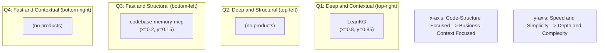

# PRD: LeanKG vs codebase-memory-mcp — Comparison & Structural Parity

**Project:** FreePeak/LeanKG  
**Document:** `docs/requirement/prd-structural-parity-cbm.md`  
**Version:** 2.1  
**Status:** In Progress  
**Date:** 2026-07-10  
**Owner:** Product / Engineering  
**LeanKG baseline:** 0.17.8  
**codebase-memory-mcp (CBM) baseline:** 0.9.0  
**Last implementation:** 2026-07-10 (Phase 1 partial: FR-B01/B02/20/21/23 done, PR #67)  

**Related:** [prd-leankg.md](./prd-leankg.md) · [../roadmap.md](../roadmap.md) · [../architecture.md](../architecture.md) · [DeusData/codebase-memory-mcp](https://github.com/DeusData/codebase-memory-mcp) · [arXiv:2603.27277](https://arxiv.org/abs/2603.27277)

This document is the **single source of truth**: competitive deep comparison **and** the product requirements to close gaps without abandoning LeanKG’s moat.

---

## Table of Contents

**Part I — Competitive comparison**
1. [Executive summary](#1-executive-summary)
2. [Architecture](#2-architecture)
3. [Language support](#3-language-support)
4. [MCP tools](#4-mcp-tools)
5. [Knowledge graph depth](#5-knowledge-graph-depth)
6. [Semantic search](#6-semantic-search)
7. [Performance](#7-performance)
8. [Distribution and deployment](#8-distribution-and-deployment)
9. [LeanKG exclusive features](#9-leankg-exclusive-features)
10. [CBM exclusive features](#10-cbm-exclusive-features)
11. [Strategic positioning](#11-strategic-positioning)
12. [Where each wins](#12-where-each-wins)

**Part II — Product requirements**
13. [Problem, goals, metrics](#13-problem-goals-and-metrics)
14. [Personas and user stories](#14-personas-and-user-stories)
15. [Functional requirements](#15-functional-requirements)
16. [Acceptance criteria](#16-acceptance-criteria)
17. [Non-functional requirements](#17-non-functional-requirements)
18. [Phasing and MVP matrix](#18-phasing-and-mvp-matrix)
19. [Out of scope, dependencies, risks](#19-out-of-scope-dependencies-risks)
20. [Open questions](#20-open-questions)
21. [Docs, rollout, appendices](#21-docs-rollout-appendices)
22. [Changelog](#22-changelog)

---

# Part I — Competitive Comparison

## 1. Executive Summary

| Dimension | LeanKG | codebase-memory-mcp |
|-----------|--------|---------------------|
| **Language** | Rust | Pure C (88.3%) + C++ (9.8%) |
| **Version** | v0.17.8 | v0.9.0 |
| **License** | Apache-2.0 / MIT | MIT |
| **Stars** | Smaller, growing | ~29.2k stars, 2.2k forks |
| **Maturity** | More iterations (0.17.x) | Newer but explosive growth |
| **Core premise** | Knowledge graph + ontology + business context for AI agents | Fastest code intelligence engine, maximum language coverage |

Both are **local-first MCP servers that index codebases into a knowledge graph for AI coding agents**. They share tree-sitter → graph storage → MCP tools, but diverge in philosophy:

- **CBM** optimizes for **raw speed, language breadth, and zero-dependency distribution**.
- **LeanKG** optimizes for **semantic depth, business-domain context, and developer workflow integration**.

**Product rule for this PRD:** Lean into business-context depth; close structural gaps that erode agent trust; do **not** chase Pure-C / 158-language parity as the primary strategy.

### Four delivery tracks

| Track | Intent |
|-------|--------|
| **A — Activate** | Fix freepeak/ops gaps so existing LeanKG capabilities are online |
| **B — Build (structural)** | Typed calls, routes, architecture, clones, cross-repo edges, … |
| **C — Build (platform)** | Embeddings default, query latency, selective languages, Windows, scale benchmarks, security signals |
| **D — Borrow** | Optionally dual-run CBM for workloads we will not copy soon |

---

## 2. Architecture

### LeanKG (Rust)

```
src/
  main.rs                     Entry: CLI + MCP + REST API
  mcp/                        62 tools, stdio + HTTP/SSE + REST
  db/                         CozoDB (SQLite or RocksDB); 67+ relationship types
  graph/                      Query, traversal, clustering, context, cache
  indexer/                    tree-sitter + Android (11 modules), microservice, terraform, cicd
  ontology/                   Domain + procedural ontology
  compress/                   RTK token compression
  embeddings/                 Optional semantic search (fastembed)
  retrieval/                  Rerank pipeline
  obsidian/, hooks/, web/, api/
```

### CBM (C)

```
src/
  main.c                      MCP stdio + CLI + install
  mcp/                        14 tools, JSON-RPC 2.0
  store/                      SQLite graph + Louvain
  pipeline/                   Multi-pass: structure → defs → calls → HTTP → config → tests
  cypher/                     Custom Cypher (lexer/parser/planner/executor)
  discover/, watcher/, traces/, ui/
internal/cbm/                 158 vendored tree-sitter grammars + AST engine
```

### Key differences

| Aspect | LeanKG | CBM |
|--------|--------|-----|
| **Storage** | CozoDB (Datalog + Cypher-like) | Custom SQLite graph + custom Cypher |
| **Binary** | Rust + Cargo deps | Single static C binary, zero runtime deps |
| **MCP transport** | stdio + HTTP/SSE + REST | stdio only |
| **Indexing** | Single-pass tree-sitter + post-processing | Multi-pass pipeline |
| **Call resolve (today)** | Name + file-hint (`resolve_call_edges`) | Hybrid LSP Tier 1/2/3 for 10 language families |

### Live freepeak evidence (2026-07-10)

| Area | Observed | Implication |
|------|----------|-------------|
| Call resolve | Name/`callee_file_hint` only | Not type-aware vs CBM Hybrid LSP |
| Cross-service | `service_calls` via k8s DNS/gRPC regex | No app-framework Route / HTTP_CALLS |
| IaC | terraform + cicd extractors | No Dockerfile/K8s/Kustomize first-class graph |
| Ontology on disk | 13 concepts / 4 workflows | Not synced (`kg_ontology_status` empty) |
| MCP routing | `.mcp.json` → `/workspace-freepeak` | Live status hit `/workspace-be` |

---

## 3. Language Support

| Metric | LeanKG | CBM |
|--------|--------|-----|
| **tree-sitter languages** | 13 (Go, TS/JS, Python, Rust, Java, Bash, Ruby, PHP, Perl, R, Elixir, Dart, Kotlin) | 158 (vendored in binary) |
| **Hybrid LSP** | No | Yes — 10 families (Python, TS/JS/JSX/TSX, PHP, C#, Go, C/C++, Java, Kotlin, Rust) |
| **Per-language benchmarks** | Not formal | 64 repos / 63 langs, Excellent/Good/Functional tiers |
| **Non-code depth** | Markdown docs, Android XML/nav, YAML, Terraform | Broad config/markup via 158 grammars |

**Verdict:** CBM has ~12× language breadth + Hybrid LSP. LeanKG compensates with **deeper per-language analysis** (especially Android/Kotlin: Hilt, Room, Jetpack Navigation, WorkManager, ViewBinding).

**PRD stance:** Selective language expansion (Should). Full 158 chase = Won’t Have.

---

## 4. MCP Tools

### LeanKG: 62 tools (by category)

| Category | Count | Examples |
|----------|-------|----------|
| Core/Indexing | 7 | mcp_init, mcp_index, mcp_status, mcp_impact |
| Code Navigation | 18 | search_code, get_call_graph, get_impact_radius, detect_changes, orchestrate, ctx_read |
| Doc/Traceability | 9 | get_traceability, search_by_requirement, find_related_docs |
| Clustering | 2 | get_clusters, get_cluster_context |
| Android/Nav | 4 | get_nav_graph, find_route, get_screen_args |
| Microservice | 1 | get_service_graph |
| Knowledge Base | 12 | add/search knowledge, incidents, env promote, annotations |
| Raw Query | 1 | run_raw_query |
| Semantic/Ontology | 8 | semantic_search, kg_context, kg_ontology_status, concept_search |

### CBM: 14 tools

`index_repository`, `search_graph` (incl. semantic), `trace_path`, `query_graph` (Cypher), `get_code_snippet`, `search_code`, `list_directory`, `get_graph_schema`, `detect_changes`, `get_architecture`, `manage_adr`, `get_semantic_matches`, `find_clones`, `get_cross_repo`

### Tool philosophy

| LeanKG | CBM |
|--------|-----|
| “Give the agent everything” — full knowledge lifecycle | “Give the essentials, fast” — lean surface + Cypher |

**PRD stance:** Keep specialized tools; add high-leverage aggregators (`get_architecture`, `get_graph_schema`). Do **not** shrink to 14 tools.

---

## 5. Knowledge Graph Depth

| Metric | LeanKG | CBM |
|--------|--------|-----|
| **Relationship types** | 67+ (incl. Android/domain) | ~10–15 structural + semantic/cross-service |
| **Domain-specific** | Hilt, Room, Nav, ViewBinding, resources, … | HTTP routes, gRPC/GraphQL/tRPC, pub/sub |
| **Semantic edges** | Optional (embeddings / concept tools) | Built-in SEMANTICALLY_RELATED, SIMILAR_TO (MinHash+LSH) |
| **Ontology** | Concept + Workflow + FailureMode | No |
| **Knowledge base** | CRUD (business/domain/architecture/debugging/…) | No (ADR closest) |
| **Environment / incidents** | Yes | No |
| **Requirement traceability** | Yes | No |

**Verdict:** LeanKG has a far richer **business-semantic layer**. CBM focuses on **code structure and cross-service topology**.

---

## 6. Semantic Search

| Aspect | LeanKG | CBM |
|--------|--------|-----|
| **Model** | BGE-small-en-v1.5 (384-d) via fastembed/ONNX | nomic-embed-code (768-d), in binary |
| **Reranker** | bge-reranker-v2-m3 | 11-signal scoring (no separate reranker) |
| **Storage** | CozoDB HNSW | Bundled local |
| **Default** | Off (`embeddings` feature, ~2.3 GB download) | Always on |
| **Pipeline** | Retrieve → Rerank → Graph traverse | Integrated into search_graph |
| **Clone detection** | No | Yes — MinHash + LSH |

**PRD stance:** Docker default-on embeddings (Should). Clone detection (Should). Keep LeanKG’s rerank+traverse sophistication where possible.

---

## 7. Performance

| Metric | LeanKG | CBM |
|--------|--------|-----|
| **Indexing** | ~57,618 elements/sec insert | Linux kernel 28M LOC / 75K files in ~3 min → 4.81M nodes |
| **Query latency** | Simple ~20ms; impact ~8.9s | Sub-1ms Cypher |
| **Token savings** | ~30% input; 3× tokens/result vs grep | ~120× on 5 structural queries; 10× fewer tokens, 2.1× fewer tool calls (arXiv) |
| **Cache** | 345–461× cold→warm | RAM-first + LZ4 |
| **Scale tested** | ~100K nodes | 4.81M nodes |

**Note:** Token methodologies differ — Phase 3 must pin fixtures and CBM version for fair comparison.

**PRD stance:** Hot-path cache + honest scale ceiling (Should). Do not promise kernel-scale C pipeline parity.

---

## 8. Distribution and Deployment

| Aspect | LeanKG | CBM |
|--------|--------|-----|
| **Install** | cargo, source, one-line script, Docker | Static binary + npm/PyPI/Homebrew/Scoop/Winget/Chocolatey/AUR/go install |
| **Platforms** | macOS, Linux | macOS, Linux, **Windows** |
| **Agents** | 6 (OpenCode, Cursor, Claude, Gemini, Kilo, Antigravity) | 11 (+ Codex, Zed, Aider, VS Code, OpenClaw, Kiro, …) |
| **Transport** | stdio + HTTP/SSE + REST + Web UI | stdio only |
| **Team** | Docker + RocksDB + multi-repo registry + API auth | Binary-first; optional `graph.db.zst` artifact |
| **Security signals** | Local-first; SafeSkill notes | SLSA 3, VirusTotal, Sigstore, CodeQL |

**LeanKG advantages:** HTTP/SSE, Docker/RocksDB teams, REST auth, multi-repo registry.  
**CBM advantages:** Windows, package managers, zero-dep binary, broader agent install.

---

## 9. LeanKG Exclusive Features

| Feature | Value |
|---------|-------|
| Ontology (concepts, workflows, failure modes) | Domain knowledge, not just code |
| Business knowledge base | CRUD for business/domain/architecture/debugging |
| Environment tracking | production/staging/dev/upcoming + promote |
| Incident management | query_incidents, env conflicts, caused/resolved edges |
| Requirement traceability | search_by_requirement, link to stories/features |
| Android deep indexing (11 modules) | Hilt, Room, Navigation, WorkManager, ViewBinding, … |
| Obsidian vault sync | Bi-directional notes |
| RTK token compression | Adaptive/full/signatures/diff/… |
| Claude Code lifecycle hooks | Setup → Stop full lifecycle |
| REST API with auth | Backend mode |
| Multi-repo registry | Manage many repos |
| Session caching | Token-budget-aware |
| Unified A/B benchmark suite | Automated Markdown export |
| Pre-commit risk analysis | detect_changes critical/high/medium/low |
| Microservice gRPC extraction | service_calls via DNS analysis |
| IaC indexing (partial) | Terraform, CI/CD |

**These are defensible strengths.** Protect them while closing structural gaps.

---

## 10. CBM Exclusive Features

| Feature | Value |
|---------|-------|
| 158 language support | ~12× breadth |
| Hybrid LSP type resolution | 10 language families without language servers |
| Always-on embeddings (nomic-embed-code) | Zero setup |
| Clone/duplicate detection | MinHash + LSH → SIMILAR_TO |
| Cross-repo intelligence | CROSS_* edges, multi-galaxy UI |
| 3D graph visualization | Embedded UI |
| Runtime trace ingestion | Validate HTTP_CALLS |
| Custom Cypher engine | Full C implementation |
| arXiv paper | arXiv:2603.27277 |
| SLSA Level 3 + VirusTotal + Sigstore | Release trust |
| Large test suite | ~5,604 passing tests (claimed) |
| Background auto-sync | Git polling, adaptive |
| HTTP route extraction | Route ↔ call-site |
| Pub/sub channel detection | EMITS / LISTENS_ON |
| Dead code detection | Graph-based unreachable |
| Data-flow analysis | Track data through codebase |
| Multi-package distribution | 8+ channels |
| Windows support | Full cross-platform |

---

## 11. Strategic Positioning




**Positioning data:**

| Tool | x (Code-Structure → Business-Context) | y (Speed → Depth) | Quadrant |
|------|---------------------------------------|-------------------|----------|
| **LeanKG** | 0.8 (Business-Context Focused) | 0.85 (Depth and Complexity) | Q1: Deep and Contextual |
| **codebase-memory-mcp** | 0.2 (Code-Structure Focused) | 0.15 (Speed and Simplicity) | Q3: Fast and Structural |

- **LeanKG:** business-aware knowledge graph + workflow-integrated tool. Best when agents must know *why* code exists, *which env*, and *what incidents*.
- **CBM:** fastest code intelligence + zero-friction install. Best for max language coverage, raw performance, instant setup.

---

## 12. Where Each Wins

### LeanKG wins

1. Semantic depth (ontology, knowledge, env, incidents)  
2. Tool surface for full knowledge lifecycle (62 tools)  
3. Transport flexibility (stdio + HTTP/SSE + REST)  
4. Team deployment (Docker + RocksDB + registry + API auth)  
5. Android ecosystem depth  
6. Workflow integration (Claude hooks, Obsidian, RTK)  
7. Documentation ↔ code traceability  
8. Pre-commit risk classification  

### CBM wins

1. Raw performance (sub-1ms, multi-million nodes)  
2. Language coverage (158)  
3. Hybrid LSP  
4. Clone detection  
5. Cross-repo CROSS_*  
6. Distribution friction (static binary, package managers)  
7. Windows  
8. Security pedigree (SLSA / VirusTotal / Sigstore)  
9. Formal per-language benchmarking + arXiv  
10. Community scale  
11. Always-on semantic search  

### Decision matrix

| If you need… | Choose |
|--------------|--------|
| Max languages / sub-1ms at huge scale / zero-dep binary / clones / CROSS_* | CBM |
| Ontology, knowledge, env/incidents, req↔code, Android depth, HTTP/SSE/REST, Docker+RocksDB, Obsidian, Claude hooks, RTK | **LeanKG** |

### Analysis → PRD takeaways

| # | Takeaway | Track / priority |
|---|----------|------------------|
| 1 | Selective language expansion | C — Should |
| 2 | Query latency / hot-path cache | C — Should |
| 3 | Clone detection (MinHash + LSH) | B — Should |
| 4 | Cross-repo CROSS_* (use registry) | B — Should |
| 5 | Windows support | C — Could |
| 6 | Always-on embeddings | C — Should (Docker) |
| 7 | Benchmark at large scale | C — Should |
| 8 | Formal per-language quality tiers | B/C — Must Go/TS; Should expand |

---

# Part II — Product Requirements

## 13. Problem, Goals, and Metrics

### 13.1 Problems

1. **Structural trust gap** — Call graphs, HTTP topology, clones, cross-repo links weaker than CBM → grep fallback → token burn.  
2. **Activation gap** — freepeak ontology + routing offline → moat unused.  
3. **Friction gap** — Optional embeddings, slower queries, fewer installs, no Windows → CBM feels plug-and-play.  
4. **Moat risk** — Chasing Pure-C / 158 langs could starve ontology, knowledge, Android, HTTP-SSE.

### 13.2 Goals

1. Measured Go/TS call-edge precision vs CBM.  
2. HTTP routes + HTTP_CALLS for primary web stacks.  
3. `get_architecture` + `get_graph_schema` to cut tool fan-out.  
4. Clones + cross-repo edges on the multi-repo registry.  
5. Activate ontology + correct project routing on freepeak.  
6. Reduce friction (Docker embeddings, latency, selective langs).  
7. LeanKG-first skills; CBM escape hatch only.  
8. Protect and showcase the business-context moat.

### 13.3 Success metrics

| Metric | Baseline | Target |
|--------|----------|--------|
| Call resolve rate (Go/TS) | Many unresolved / name collisions | ≥ 90% non-unresolved; ≥ 70% `typed` on MVP langs |
| Call precision (50-edge sample) | Unknown | ≥ 85%; publish delta vs CBM |
| HTTP_CALLS | ≈ none for app frameworks | ≥ 2 frameworks each for Go and TS |
| Architecture overview | 3+ tools | 1 `get_architecture` call |
| Graph schema | Agent guesses Cozo shape | `get_graph_schema` with counts |
| Clones | None | `find_clones` / similarity edges on fixture |
| Cross-repo | Registry only | Queryable CROSS_* (or equiv) across ≥ 2 repos |
| Ontology (freepeak) | 0 hits | `concept_search` ≥ 1 on domain queries |
| MCP routing | freepeak → be | freepeak → freepeak RocksDB |
| Embeddings friction | Feature-flag + 2.3 GB | Docker: semantic tools OOTB |
| Simple query P50 | ~20ms | ≤ 10ms warm (stretch ≤ 5ms) |
| Scale signal | 100K load test | ≥ 1M-node report or documented ceiling |
| Per-language tiers | Informal | Go/TS published; template for more |
| Moat health | Often offline | Ontology + knowledge green in smoke |

### 13.4 Non-goals

- Full 158-language parity  
- Pure-C rewrite / CBM SQLite-only backend  
- Full openCypher engine parity  
- Full Hybrid LSP for all 10 CBM families in one release  
- Dual-index every repo by default  
- Kernel-scale (28M LOC / 3 min) guarantees  
- Dropping HTTP/SSE/REST or Docker team path  
- Replacing ontology/docs/knowledge/Android with structural-only model  

---

## 14. Personas and User Stories

### Personas

| Persona | Need |
|---------|------|
| AI coding agent | Accurate structural answers, few tools, discoverable schema |
| Staff engineer | Trust blast-radius, HTTP topology, clones, cross-repo |
| Enterprise team lead | Ontology / incidents / env stay first-class |
| LeanKG maintainer | Clear MVP; no language chase |
| freepeak operator | Ontology + multi-project Docker work |
| Windows / polyglot indie | Lower install friction (Could) |

### Must Have

- **US-A1** Correct MCP project routing (freepeak ≠ be)  
- **US-A2** Ontology online (`kg_ontology_status`, `concept_search`)  
- **US-A3** Default call resolution on index for Go/TS  
- **US-A4** Moat smoke tests (ontology + routing) gate Phase 1  
- **US-B1** Typed call resolution Go + TypeScript MVP  
- **US-B2** HTTP Route nodes + HTTP_CALLS  
- **US-B3** `get_architecture`  
- **US-B4** `get_graph_schema`  

### Should Have

- **US-B5** Dead code detection  
- **US-B6** Event channel edges (EMITS / LISTENS_ON or equiv)  
- **US-B7** Clone / near-duplicate detection  
- **US-B8** Cross-repo edges on multi-repo registry  
- **US-B9** Embeddings on by default (Docker)  
- **US-B10** `run_raw_query` recipes (≥ 10)  
- **US-C1** Query latency hot path  
- **US-C2** Selective language expansion  
- **US-C3** Large-scale + per-language benchmarks  

### Could Have

- IaC Resource/Module (Dockerfile/K8s/Kustomize)  
- ADR CRUD / `knowledge_type=adr`  
- Commitable graph snapshot (zstd)  
- Typed resolve Python + Rust  
- Data-flow edges; runtime trace ingestion  
- Windows builds; Homebrew/npm; SLSA/attestations  
- Thin openCypher→Cozo translator  

### Won’t Have

- Full 158-language parity  
- Full Hybrid LSP for all CBM langs in one go  
- Replace LeanKG MCP with CBM as default  
- Pure-C rewrite / abandon Cozo+RocksDB team path  

---

## 15. Functional Requirements

### Track A — Activate

| ID | Requirement | Priority |
|----|-------------|----------|
| FR-A01 | MCP `project` resolves to correct RocksDB project for freepeak mounts | Must |
| FR-A02 | Automate/document ontology sync for concepts + workflows YAML | Must |
| FR-A03 | Verify ontology/knowledge tools against freepeak after sync | Must |
| FR-A04 | Index freepeak per `leankg.yaml`; expose counts | Must |
| FR-A05 | Default call-edge resolution for Go/TS on index | Must |
| FR-A06 | Smoke: ontology + routing must pass before Phase 1 “done” | Must |
| FR-A07 | Agent operating-model note: LeanKG-first; moat tools mandatory | Must |

### Track B — Structural

#### B0 — Call resolution

| ID | Requirement | Priority |
|----|-------------|----------|
| FR-B01 | `resolution_method`: unresolved \| name \| name_file_hint \| typed | Must |
| FR-B02 | Numeric `confidence` consistent with method | Must |
| FR-B03 | Go typed resolve MVP (imports, receivers, basic interfaces) | Must |
| FR-B04 | TS/TSX typed resolve MVP (imports/exports, receivers, simple generics) | Must |
| FR-B05 | Benchmark harness vs CBM (50-edge samples) | Must |
| FR-B06 | Python + Rust typed resolve | Could |
| FR-B07 | Fail soft: fall back to name resolve; never block index | Must |
| FR-B08 | Feature flag `typed_resolve=off\|go,ts\|all` | Must |

#### B1 — Routes / events / traces

| ID | Requirement | Priority |
|----|-------------|----------|
| FR-B10 | `route` element type (method, path, handler, framework) | Must |
| FR-B11 | ≥ 2 Go + ≥ 2 TS framework extractors | Must |
| FR-B12 | `http_calls` edges call-site → route with confidence | Must |
| FR-B13 | Extend `service_calls` beyond k8s DNS regex | Should |
| FR-B14 | Routes searchable; included in `get_architecture` | Must |
| FR-B15 | EMITS / LISTENS_ON (or LeanKG names) for Go/TS | Should |
| FR-B16 | Runtime trace ingestion to validate HTTP_CALLS | Could |

#### B2 — Architecture / schema / dead code

| ID | Requirement | Priority |
|----|-------------|----------|
| FR-B20 | `get_architecture` (langs, packages, entry points, routes, hotspots, clusters, knowledge/ADR counts) | Must |
| FR-B21 | `get_graph_schema` (label/edge counts, patterns) | Must |
| FR-B22 | Honor token budgets / truncation | Must |
| FR-B23 | `find_dead_code` (zero callers; exclude entry points) | Should |

#### B3 — Clones / cross-repo

| ID | Requirement | Priority |
|----|-------------|----------|
| FR-B30 | Near-clone detection → similarity edges | Should |
| FR-B31 | `find_clones` MCP (thresholded) | Should |
| FR-B32 | Cross-repo edges across multi-repo registry | Should |
| FR-B33 | Cross-repo summary in tool or architecture | Should |

#### B4 — IaC / ADR / artifacts / data-flow

| ID | Requirement | Priority |
|----|-------------|----------|
| FR-B40 | Dockerfile / K8s / Kustomize Resource/Module nodes | Could |
| FR-B41 | Fold terraform/cicd into same Resource model | Could |
| FR-B42 | ADR tool or `knowledge_type=adr` | Could |
| FR-B43 | Compressed graph snapshot export/import | Could |
| FR-B44 | DATA_FLOWS-style edges for Go/TS | Could |

#### B5 — Query ergonomics

| ID | Requirement | Priority |
|----|-------------|----------|
| FR-B50 | ≥ 10 `run_raw_query` recipes in skills/docs | Should |
| FR-B51 | Optional openCypher→Cozo subset | Could |

### Track C — Platform / friction

| ID | Requirement | Priority |
|----|-------------|----------|
| FR-C01 | Docker image: embeddings enabled / semantic tools OOTB | Should |
| FR-C02 | Document smaller-model / batch-size options | Should |
| FR-C03 | Hot-path cache for search/schema/architecture/find_function | Should |
| FR-C04 | Profile impact-radius latency (stretch &lt;2s P50 mid-size) | Should |
| FR-C05 | Incremental languages (C/C++, C#, Swift, Scala, Zig candidates) with tier notes | Should |
| FR-C06 | Per-language quality tier template; Go/TS first | Must (Go/TS) |
| FR-C07 | Large-repo benchmark (≥ 1M nodes or documented ceiling) | Should |
| FR-C08 | Windows build + smoke | Could |
| FR-C09 | Extra distribution channel (Homebrew or npm) | Could |
| FR-C10 | Release checksums; evaluate SLSA/attestations | Could |
| FR-C11 | Expand agent install targets where hooks/skills exist | Could |

### Track D — Dual-run

| ID | Requirement | Priority |
|----|-------------|----------|
| FR-D01 | Skills remain LeanKG-first | Must |
| FR-D02 | Documented CBM escape hatch when confidence low / lang unsupported | Should |
| FR-D03 | No auto-install CBM into default freepeak `.mcp.json` | Must |
| FR-D04 | Re-evaluate dual-run after Phase 3 | Must |

---

## 16. Acceptance Criteria

### US-A1 — Project routing

- **Given** freepeak mounted and registered  
- **When** `mcp_status` with freepeak project path  
- **Then** DB path is freepeak, not `workspace-be`

### US-A2 — Ontology

- **Given** ontology YAML on disk  
- **When** ontology sync runs  
- **Then** `kg_ontology_status` non-zero; `concept_search("knowledge graph")` matches concepts

### US-B1 — Typed calls (Go)

- **Given** typed receiver call `svc.Process` → `repo.Save`  
- **When** indexed with typed resolve  
- **Then** CALLS edge with `resolution_method=typed`, confidence ≥ 0.85

### US-B2 — HTTP_CALLS

- **Given** supported-framework `GET /orders/{id}` + client call  
- **When** indexed  
- **Then** Route node + `http_calls` edge (or documented confidence)

### US-B3 / US-B4 — Architecture & schema

- **When** `get_architecture` / `get_graph_schema` called  
- **Then** single overview / label+edge counts within token budget

### US-B7 — Clones

- **Given** fixture with near-duplicate functions  
- **When** clone detection runs  
- **Then** similarity edge above threshold via `find_clones`

### US-B8 — Cross-repo

- **Given** two registered repos with A→B symbol use  
- **When** cross-repo linking runs  
- **Then** cross-repo edge queryable

### US-C1 / US-C3 — Latency & benchmarks

- **When** warm `get_graph_schema` / `find_function`  
- **Then** P50 ≤ 10ms (stretch ≤ 5ms)  
- **When** Phase 3 completes  
- **Then** published Go/TS vs CBM report + scale ceiling

---

## 17. Non-Functional Requirements

| ID | Requirement |
|----|-------------|
| NFR-01 | Typed resolve ≤ 2× index time on mid-size Go/TS fixture |
| NFR-02 | Typed resolve / embeddings RSS tunable for Docker |
| NFR-03 | New MCP tools honor token budgets |
| NFR-04 | Local-first; no cloud LLM for structural features |
| NFR-05 | Feature flags: typed resolve, clones, cross-repo |
| NFR-06 | Backward-compatible graph (new metadata optional) |
| NFR-07 | Docs-first: AGENTS.md, cli-reference, mcp-tools |
| NFR-08 | Do not regress ontology/knowledge/Android/HTTP-SSE |
| NFR-09 | Benchmark methodology documented (fixtures, CBM version pinned) |
| NFR-10 | New languages document quality tier before “supported” |

---

## 18. Phasing and MVP Matrix

### Phase 0 — Activate + protect moat (≤ 1 week)

FR-A01–A07 · freepeak green · operating-model note

### Phase 1 — Quick structural wins (1–2 weeks)

FR-B01–B02, B08 · FR-B20–B23 · default name resolve · FR-C06 Go/TS tier template

### Phase 2 — Routes, events, clones, cross-repo (3–5 weeks)

FR-B10–B15 · FR-B30–B33 · FR-B50 · FR-C01–C03

### Phase 3 — Hybrid typed resolve MVP (1 quarter)

FR-B03–B05 · FR-C04, C07 · FR-D04 · public CBM comparison report

### Phase 4 — Expand (backlog)

Selective languages · Python/Rust typed · data-flow/traces · IaC/ADR/snapshot · Windows/pkg/SLSA · Cypher subset

### MVP Feature Matrix

| Feature | MoSCoW | Size | Phase | Takeaway # |
|---------|--------|------|-------|------------|
| Project routing + ontology smoke | Must | S | 0 | — |
| CALLS metadata + default name resolve | Must | S | 1 | — |
| `get_architecture` / `get_graph_schema` | Must | S | 1 | — |
| Dead code | Should | S | 1 | — |
| Route + HTTP_CALLS | Must | M | 2 | — |
| Event edges | Should | M | 2 | — |
| Clone detection | Should | M | 2 | 3 |
| Cross-repo edges | Should | M | 2 | 4 |
| Embeddings Docker default | Should | M | 2 | 6 |
| Query hot-path cache | Should | M | 2 | 2 |
| Typed resolve Go/TS | Must | L | 3 | Hybrid LSP |
| CBM comparison + scale report | Must/Should | M | 3 | 7–8 |
| Selective languages | Should | M each | 4 | 1 |
| Windows / pkg / SLSA | Could | M–L | 4 | 5 |
| 158-language chase | Won’t | — | — | Rejected |

---

## 19. Out of Scope, Dependencies, Risks

### Out of scope

- Replace RocksDB/Cozo with CBM SQLite as only backend  
- Vendor CBM binary inside LeanKG releases  
- Full Hybrid LSP for all CBM languages this program  
- Structural-only model replacing ontology/docs/knowledge  
- Kernel-scale index time guarantees  
- Drop HTTP/SSE/REST or Docker team deployment  

### Dependencies

| Dependency | Notes |
|------------|-------|
| Docker / OrbStack mounts | FR-A01 |
| tree-sitter extractors | Typed resolve foundation |
| Multi-repo registry | CROSS_* prerequisite |
| Benchmark fixtures | Pin CBM 0.9.x for comparison |
| Docs-first workflow | Before code |
| Optional CBM install | Track D only |

### Risks

| Risk | Impact | Mitigation |
|------|--------|------------|
| Typed resolve multi-year sink | High | Cap Go+TS; flag; measure early |
| 158-language chase | High | Selective only; Won’t full parity |
| Abandon moat for speed | High | Phase 0 smoke; NFR-08 |
| Name-resolve regressions | Medium | Keep unresolved; never drop |
| HTTP / clone false positives | Medium | Confidence + thresholds |
| Cross-repo edge explosion | Medium | Registry-only; pagination |
| Dual-run confusion | Medium | LeanKG-first; narrow escape hatch |
| freepeak still → be | High | Phase 0 gate |
| Embeddings image size | Medium | Smaller model / volume cache |
| Cozo latency ceiling | Medium | Cache; document limits honestly |

---

## 20. Open Questions

1. Go frameworks for Phase 2 (chi / Gin / Echo / stdlib)?  
2. TS stacks (Express / Next / Fastify / Hono)?  
3. Typed resolve inline vs post-pass?  
4. New `http_calls` vs overload `service_calls`?  
5. Clone edge naming (`similar_to` vs other)?  
6. Cross-repo storage: shared meta-project vs per-project external refs?  
7. Cypher in 12 months vs Cozo recipes enough?  
8. Dual-run: Phase 3 only or permanent optional MCP?  
9. Selective language priority (C/C++ vs C# vs Swift)?  
10. Target LeanKG versions for Phase 1 / 2 / 3?  
11. Keep BGE+reranker or evaluate code-specialized embed model (nomic-like)?  

---

## 21. Docs, Rollout, Appendices

### Documentation deliverables

| Doc | Update |
|-----|--------|
| `docs/mcp-tools.md` | New tools |
| `docs/cli-reference.md` | Flags |
| `AGENTS.md` / skills | LeanKG-first + moat + CBM escape hatch |
| `docs/roadmap.md` | Phase 0–4 status |
| `docs/architecture.md` | Routes, resolution_method, HTTP_CALLS, clones, CROSS_* |
| Benchmark reports | Phase 3 CBM comparison; scale; language tiers |

### Rollout gates

1. **Phase 0:** freepeak routing + ontology green; operating-model note  
2. **Phase 1:** new tools + tests + docs; moat smoke still green  
3. **Phase 2:** routes + clones + cross-repo fixtures; Docker embeddings  
4. **Phase 3:** published vs CBM; latency/scale notes; Track D decision  
5. **Phase 4:** demand-driven backlog only  

### Appendix A — Build vs borrow vs protect

| Capability | Action |
|------------|--------|
| Hybrid LSP typed CALLS | **Build** (Go/TS MVP) |
| 158 languages | **Won’t** full; **Should** selective |
| HTTP_CALLS / Routes | **Build** |
| EMITS / LISTENS_ON | **Should build** |
| Clones / SIMILAR_TO | **Should build** |
| CROSS_* | **Should build** (use registry) |
| Dead code | **Should build** |
| `get_architecture` / `get_graph_schema` | **Build** |
| Custom Cypher | **Recipes first**; Cypher Could |
| Always-on embeddings | **Should** (Docker) |
| Data-flow / runtime traces | **Could** |
| IaC K8s/Docker | **Could** |
| ADR | **Could** |
| graph.db.zst | **Could** |
| Sub-1ms / kernel-scale C pipeline | **Borrow/document limits** |
| Windows / package managers / SLSA | **Could** |
| Ontology / knowledge / env / incidents | **Protect** |
| Req↔code / Android depth | **Protect** |
| HTTP/SSE + REST + Docker/RocksDB | **Protect** |
| Obsidian + RTK + Claude hooks | **Protect** |
| 67+ domain relationship types | **Protect** |

### Appendix B — Sources

- [LeanKG GitHub](https://github.com/FreePeak/LeanKG)  
- [codebase-memory-mcp GitHub](https://github.com/DeusData/codebase-memory-mcp)  
- [arXiv:2603.27277](https://arxiv.org/abs/2603.27277)  
- [CBM BENCHMARK.md](https://github.com/DeusData/codebase-memory-mcp/blob/main/docs/BENCHMARK.md)  
- Live freepeak MCP status / ontology checks (2026-07-10)  

---

## 22. Changelog

| Date | Change |
|------|--------|
| 2026-07-10 | v1.0 Initial structural-parity PRD |
| 2026-07-10 | v1.1 Expanded from separate analysis doc |
| 2026-07-10 | **v2.0 Merged** competitive analysis + PRD into this single file; analysis doc retired to redirect stub |
