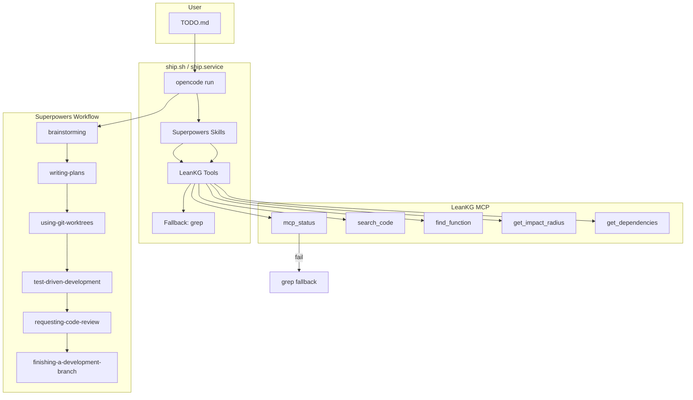
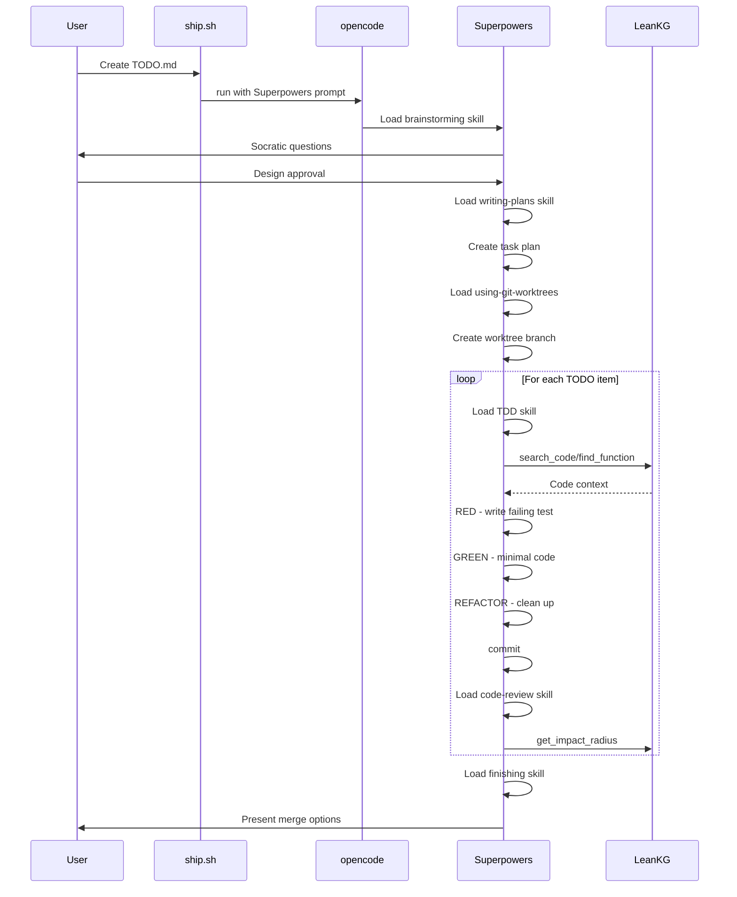

# LeanKG Automated Ship Flow

## Overview

LeanKG uses a fully automated shipping workflow powered by **Superpowers** skills and **LeanKG** tools. You only create `TODO.md`, and the system runs continuously until all tasks are complete.

## Architecture



## Superpowers Skills

| Skill | Purpose |
|-------|---------|
| `brainstorming` | Refines ideas through Socratic questions, validates design |
| `writing-plans` | Breaks work into 2-5 min tasks with exact file paths |
| `using-git-worktrees` | Creates isolated workspace on new branch |
| `test-driven-development` | RED-GREEN-REFACTOR cycle |
| `requesting-code-review` | Reviews against plan, blocks on critical issues |
| `finishing-a-development-branch` | Merge/PR decision, cleanup |

## Model Priority

1. **Primary**: `opencode-go/minimax-m2.7` (MiniMax coding plan)
2. **Fallback**: `minimax-m2.5-free` → `mimo-v2-pro-free` → `big-pickle`

## Quick Start

### 1. Install Dependencies

```bash
# Superpowers auto-installs via plugin
# Verify in ~/.config/opencode/opencode.json:
cat ~/.config/opencode/opencode.json | grep superpowers
```

### 2. Create TODO.md

```bash
opencode run "Interview me to create docs/PRD.md"
# OR manually:
cat > TODO.md <<'EOF'
- [ ] Implement new MCP tool
- [ ] Add tests for query engine
- [ ] Update documentation
EOF
```

### 3. Start Shipping

```bash
# Manual
./ship.sh

# Background (survives terminal close)
nohup ./ship.sh &
tail -f logs/ship.log

# Systemd (auto-restart on crash)
sudo cp ship.service /etc/systemd/system/
sudo systemctl enable --now ship
journalctl -fu ship
```

## Workflow Detail



## File Reference

| File | Purpose |
|------|---------|
| `TODO.md` | Task list (user creates) |
| `ship.sh` | Automation script |
| `ship.service` | systemd unit file |
| `logs/ship.log` | Execution log |

## TODO.md Format

```markdown
- [ ] Implement user authentication
- [ ] Add unit tests for auth module
- [ ] Update API documentation
```

## Systemd Service

```bash
# Install
sudo cp ship.service /etc/systemd/system/
sudo systemctl daemon-reload
sudo systemctl enable ship

# Control
sudo systemctl start ship      # Start
sudo systemctl stop ship       # Stop
sudo systemctl restart ship    # Restart if stuck
journalctl -fu ship            # Watch logs
```

## LeanKG Integration

LeanKG is used FIRST for all code search. Only falls back to grep if LeanKG fails.

```bash
# Check LeanKG status first
mcp_status

# Then use LeanKG tools
search_code "function name"
find_function "McpConfig"
get_impact_radius "src/main.rs"
get_dependencies "src/lib.rs"
```

## Parallel Subagent Workflow

For 3+ independent tasks, use `ship-parallel.sh`:

```bash
# Create TODO.md with independent tasks
cat > TODO.md <<'EOF'
- [ ] Implement MCP tool: get_traceability
- [ ] Add tests for graph/query.rs
- [ ] Update documentation for indexer
EOF

# Dispatch 3 parallel agents
./ship-parallel.sh dispatch 3

# Monitor
tail -f logs/ship-parallel-*.log

# Check status
./ship-parallel.sh status

# Merge when done
./ship-parallel.sh merge
git push
```

See [parallel-workflow.md](./parallel-workflow.md) for full details.

## Troubleshooting

| Issue | Solution |
|-------|----------|
| Service won't start | `sudo journalctl -xe` |
| Stuck on item | `sudo systemctl restart ship` |
| No progress | `tail -f logs/ship.log` |
| Rate limited | Wait or check Zen quota |
| Superpowers not found | Restart opencode to load plugin |
