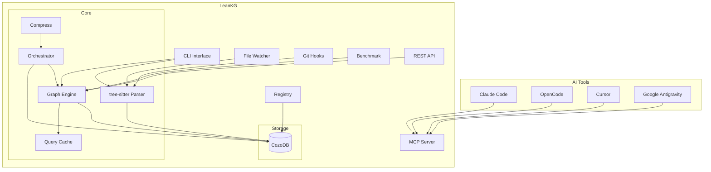

# Tech Stack

| Component | Technology |
|-----------|------------|
| Language | Rust |
| Database | CozoDB (embedded relational-graph, Datalog queries) |
| Parsing | tree-sitter |
| CLI | Clap |
| Web Server | Axum |

# Project Structure

```
src/
  main.rs       - CLI entry point (28+ commands)
  lib.rs        - Library exports
  cli/          - CLI commands (Clap)
  config/       - Project configuration
  db/           - CozoDB persistence layer (models, schema, operations)
  doc/          - Documentation generator + wiki generation
  doc_indexer/  - Documentation indexer (docs/ → documented_by edges)
  graph/        - Graph query engine (queries, traversal, context, clustering, cache, export)
  indexer/      - Code parser (tree-sitter, 13 parsers, extractors, git analysis, Terraform, CI/CD)
  mcp/          - MCP protocol handler (35 tools, rmcp)
  orchestrator/ - Query orchestration with intent parsing and persistent cache
  compress/     - RTK-style compression (8 read modes, response/shell/cargo/git compressors, entropy)
  web/          - Web UI server (Axum, 20+ routes)
  api/          - REST API handlers, auth middleware
  watcher/      - File change watcher (notify)
  hooks/        - Git hooks (pre-commit, post-commit, post-checkout, GitWatcher)
  benchmark/    - Benchmark runner (vs OpenCode, Gemini, Kilo)
  registry.rs   - Global repository registry (multi-repo)
  runtime.rs    - Tokio runtime utilities

docs/
  prd.md        - Product Requirements Document
  erd.md        - Engineering Requirements / High Level Design
  mcp-tools.md  - MCP tools reference
  cli-reference.md - CLI commands reference
  roadmap.md    - Feature roadmap
  analysis/     - Analysis documents
```

# Supported Languages

LeanKG supports indexing and analysis for the following languages:

| Language | Extensions | Support Level |
|----------|------------|---------------|
| Go | `.go` | Full - functions, structs, interfaces, imports, calls |
| TypeScript | `.ts`, `.tsx` | Full - functions, classes, imports, calls |
| JavaScript | `.js`, `.jsx` | Full - functions, classes, imports, calls |
| Python | `.py` | Full - functions, classes, imports, calls |
| Rust | `.rs` | Full - functions, structs, traits, imports, calls |
| Java | `.java` | Full - classes, interfaces, methods, constructors, enums, imports, calls |
| Kotlin | `.kt`, `.kts` | Full - classes, objects, companion objects, functions, constructors, imports, calls |
| Terraform | `.tf` | Full - resources, variables, outputs, modules |
| YAML | `.yaml`, `.yml` | Full - CI/CD pipelines, configurations |
| Markdown | `.md` | Full - documentation sections, code references |
| C/C++ | `.cpp`, `.cxx`, `.cc`, `.hpp`, `.h`, `.c` | Full - functions, classes, structs, imports, calls |
| C# | `.cs` | Full - classes, methods, imports, calls |
| Ruby | `.rb` | Full - classes, modules, methods, imports, calls |
| PHP | `.php` | Full - classes, functions, imports, calls |
| Dart | `.dart` | Parser only (no extraction) |
| Swift | `.swift` | Parser only (no extraction) |

# Architecture


