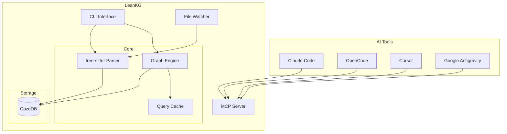

# Tech Stack

| Component | Technology |
|-----------|------------|
| Language | Rust |
| Database | CozoDB (embedded relational-graph, Datalog queries) |
| Parsing | tree-sitter |
| CLI | Clap |
| Web Server | Axum |

# Project Structure

```
src/
  cli/         - CLI commands (Clap)
  config/      - Project configuration
  db/          - CozoDB persistence layer
  doc/         - Documentation generator
  graph/       - Graph query engine
  indexer/     - Code parser (tree-sitter)
  doc_indexer/ - Documentation indexer
  mcp/         - MCP protocol handler
  watcher/     - File change watcher
  web/         - Web server (Axum)

docs/
  planning/    - Planning documents
  requirement/ - Requirements documents (PRD)
  analysis/    - Analysis documents
  design/      - Design documents (HLD)
  business/    - Business logic documents
```

# Supported Languages

LeanKG supports indexing and analysis for the following languages, with
**quality tiers** (US-CBM-C3 — honest per-language tier, no 158-language
parity chase). Tiers reflect what the index walk actually produces today
(`find_files_sync` + `extract_elements_for_file`, `src/indexer/mod.rs`).

| Tier | Meaning |
|------|---------|
| **T1 — Full** | tree-sitter parse: entities + call edges + imports, wired into bulk + incremental index |
| **T2 — Entity+Call** | regex entities + tree-sitter (or regex) call edges, wired into bulk + incremental index |
| **T3 — Entity only** | regex/config extractor, entities without deep call-graph resolution |
| **T4 — Config/file only** | manifest / config parsing, no code elements |

| Language | Extensions | Tier | Coverage |
|----------|------------|------|----------|
| Go | `.go` | T1 | functions, structs, interfaces, imports, calls; hybrid typed resolve (`typed_resolve=go`) |
| TypeScript | `.ts`, `.tsx` | T1 | functions, classes, imports, calls; hybrid typed resolve (`typed_resolve=ts`) |
| JavaScript | `.js`, `.jsx` | T1 | functions, classes, imports, calls (TS grammar path) |
| Python | `.py` | T1 | functions, classes, imports, calls; hybrid typed resolve (`typed_resolve=python`) since FR-B06 |
| Rust | `.rs` | T1 | functions, structs, traits, imports, calls; hybrid typed resolve (`typed_resolve=rust`) since FR-B06 |
| Java | `.java` | T1 | classes, interfaces, methods, constructors, enums, imports, calls |
| Kotlin | `.kt`, `.kts` | T1 | classes, objects, companion objects, functions, constructors, imports, calls + Android extractors (Room/Hilt/nav/WorkManager) |
| Dart | `.dart` | T1 | functions, classes, imports, calls |
| Swift | `.swift` | T2 | classes, structs, protocols, methods, imports, heritage, calls (regex entities + tree-sitter calls) |
| Objective-C | `.m`, `.mm`, `.h` | T2 | interfaces, methods, heritage, imports, message-send calls (regex + tree-sitter); `.h` sniff |
| Terraform | `.tf` | T3 | resources, variables, outputs, modules (regex) |
| Vue | `.vue` | T3 | single-file components (regex, `src/indexer/sfc.rs`) |
| Svelte | `.svelte` | T3 | single-file components (regex, `src/indexer/sfc.rs`) |
| SQL | `.sql` | T3 | DDL entities (regex, `src/indexer/sql.rs`) |
| XML | `.xml` | T3 | Android manifests / resources / navigation + generic XML |
| YAML | `.yaml`, `.yml` | T4 | CI/CD pipelines, configurations (config files incl. `package.json`, `tsconfig.json`, `Cargo.toml`, `go.mod`, Gradle, Maven) |

**Not indexed today** (do not claim): Ruby, PHP, Perl, R, Elixir, C/C++
(pure headers skipped), Markdown code elements (docs handled by
`mcp_index_docs`, not the code walk).

**Quality guardrails** (US-CBM-C3):

- Extensions are wired into `find_files_sync` **before** a tier is claimed —
  an extractor that exists as a module but is not in the walk is not
  "supported".
- T2/T3 languages land only after live smoke, not parser PR alone.
- `leankg index --lang <csv>` filters by extension; the filter applies to
  the T1–T4 sets above.

# Architecture


```mermaid
graph TB
    subgraph "AI Tools"
        Claude[Claude Code]
        Open[OpenCode]
        Cursor[Cursor]
        Antigravity[Google Antigravity]
    end

    subgraph "LeanKG"
        CLI[CLI Interface]
        MCP[MCP Server]
        Watcher[File Watcher]

        subgraph "Core"
            Indexer[tree-sitter Parser]
            Graph[Graph Engine]
            Cache[Query Cache]
        end

        subgraph "Storage"
            CozoDB[(CozoDB)]
        end
    end

    Claude --> MCP
    Open --> MCP
    Cursor --> MCP
    Antigravity --> MCP
    CLI --> Indexer
    CLI --> Graph
    Watcher --> Indexer
    Indexer --> CozoDB
    Graph --> CozoDB
    Graph --> Cache
```
