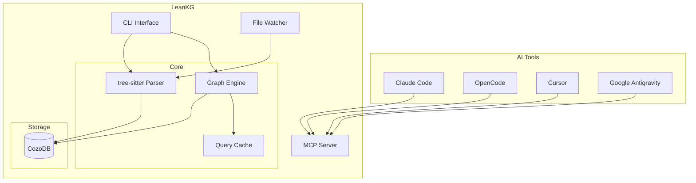

# Tech Stack

| Component | Technology |
|-----------|------------|
| Language | Rust |
| Database | CozoDB (embedded relational-graph, Datalog queries) |
| Parsing | tree-sitter |
| CLI | Clap |
| Web Server | Axum |

# Project Structure

```
src/
  cli/         - CLI commands (Clap)
  config/      - Project configuration
  db/          - CozoDB persistence layer
  doc/         - Documentation generator
  graph/       - Graph query engine
  indexer/     - Code parser (tree-sitter)
  doc_indexer/ - Documentation indexer
  mcp/         - MCP protocol handler
  watcher/     - File change watcher
  web/         - Web server (Axum)

docs/
  planning/    - Planning documents
  requirement/ - Requirements documents (PRD)
  analysis/    - Analysis documents
  design/      - Design documents (HLD)
  business/    - Business logic documents
```

# Supported Languages

LeanKG supports indexing and analysis for the following languages.
Tiers follow the per-language quality template (FR-C06 / US-CBM-C3):

- **Tier 1** — full walk: entities, imports, calls, routes (Go/TS),
  heritage + typed resolve where supported.
- **Tier 2** — indexed walk: entities + calls; some depth (Swift/ObjC
  regex entities + tree-sitter calls; Vue/Svelte/SQL regex).
- **Tier 3** — parser present, **not wired** into the index walk
  (`find_files_sync` / `get_language`).

| Language | Extensions | Tier | Support Level |
|----------|------------|------|---------------|
| Go | `.go` | 1 | Full - functions, structs, interfaces, imports, calls, routes, typed resolve (`typed_resolve=go`) |
| TypeScript | `.ts`, `.tsx` | 1 | Full - functions, classes, imports, calls, routes, typed resolve (`typed_resolve=ts`) |
| JavaScript | `.js`, `.jsx` | 1 | Full - functions, classes, imports, calls |
| Python | `.py` | 1 | Full - functions, classes, imports, calls, typed resolve (`typed_resolve=py`) |
| Rust | `.rs` | 1 | Full - functions, structs, traits, imports, calls, typed resolve (`typed_resolve=rs`) |
| Java | `.java` | 1 | Full - classes, interfaces, methods, constructors, enums, imports, calls |
| Kotlin | `.kt`, `.kts` | 1 | Full - classes, objects, companion objects, functions, constructors, imports, calls + Android depth |
| Swift | `.swift` | 2 | Full-ish - classes, structs, protocols, methods, imports, heritage, calls (regex entities + tree-sitter calls) + typed resolve |
| Objective-C | `.m`, `.mm`, `.h` | 2 | Full-ish - interfaces, methods, heritage, imports, message-send calls (regex + tree-sitter); `.h` sniff + typed resolve |
| Vue (SFC) | `.vue` | 2 | Regex extractor wired into walk (REL-032) |
| Svelte (SFC) | `.svelte` | 2 | Regex extractor wired into walk (REL-032) |
| SQL DDL | `.sql` | 2 | Regex extractor wired into walk (REL-032) |
| Terraform | `.tf` | 2 | Full - resources, variables, outputs, modules |
| YAML | `.yaml`, `.yml` | 2 | Full - CI/CD pipelines, configurations |
| Markdown | `.md` | 2 | Full - documentation sections, code references |
| Ruby | `.rb` | 3 | Parser present; not in index walk |
| PHP | `.php` | 3 | Parser present; not in index walk |
| C/C++ | `.cpp`, `.cxx`, `.cc`, `.hpp`, `.h`, `.c` | 3 | Parser present; not in `find_files_sync` extensions |
| C# | `.cs` | 3 | Parser present; not in index walk |
| Perl | `.pl`, `.pm` | 3 | Parser present; not in index walk |
| R | `.r`, `.R` | 3 | Parser present; not in index walk |
| Elixir | `.ex`, `.exs` | 3 | Parser present; not in index walk |

See [`docs/language-tiers.md`](language-tiers.md) for the tier template
and the Go/TS reference entries (FR-C06).

# Architecture


```mermaid
graph TB
    subgraph "AI Tools"
        Claude[Claude Code]
        Open[OpenCode]
        Cursor[Cursor]
        Antigravity[Google Antigravity]
    end

    subgraph "LeanKG"
        CLI[CLI Interface]
        MCP[MCP Server]
        Watcher[File Watcher]

        subgraph "Core"
            Indexer[tree-sitter Parser]
            Graph[Graph Engine]
            Cache[Query Cache]
        end

        subgraph "Storage"
            CozoDB[(CozoDB)]
        end
    end

    Claude --> MCP
    Open --> MCP
    Cursor --> MCP
    Antigravity --> MCP
    CLI --> Indexer
    CLI --> Graph
    Watcher --> Indexer
    Indexer --> CozoDB
    Graph --> CozoDB
    Graph --> Cache
```
