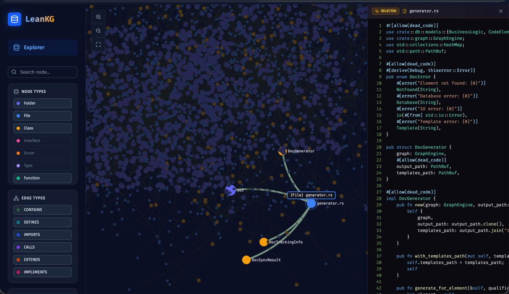
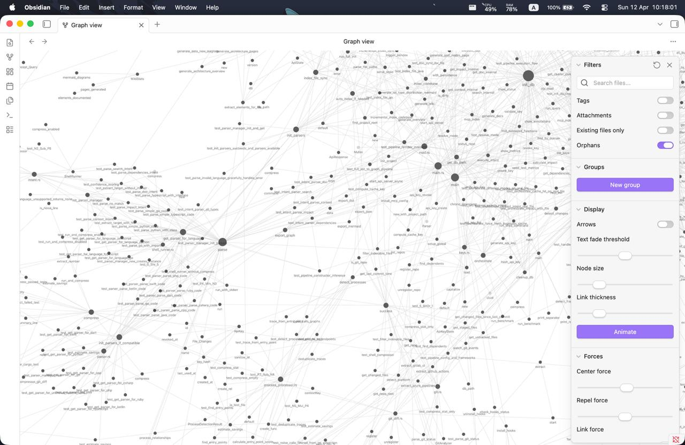

# Web UI

The LeanKG Web UI is a Vite + React + TailwindCSS frontend with a Rust axum backend. The built UI is bundled in the binary.

## Start Web UI

```bash
# Start the web server (default port: 8080)
leankg web

# Or specify a custom port
leankg web --port 9000
```

Open **http://localhost:8080** in your browser.

## Features

### Graph Viewer & Code Inspector




### Core Features

- **Force-Directed Graph:** Sigma.js with ForceAtlas2 renders a balanced, centered dependency map.
- **WebGL Rendering:** Fast WebGL-based node and edge filtering without React re-renders.
- **Community Clustering:** Louvain algorithms group related modules, functions, and classes.
- **Code Inspector:** Click any node to view code in a resizable pane.

## Auto-Indexing

LeanKG watches your codebase and automatically keeps the knowledge graph up-to-date. When you modify, create, or delete files, LeanKG incrementally updates the index.

```bash
# Watch mode - auto-index on file changes
leankg watch --path ./src
```
